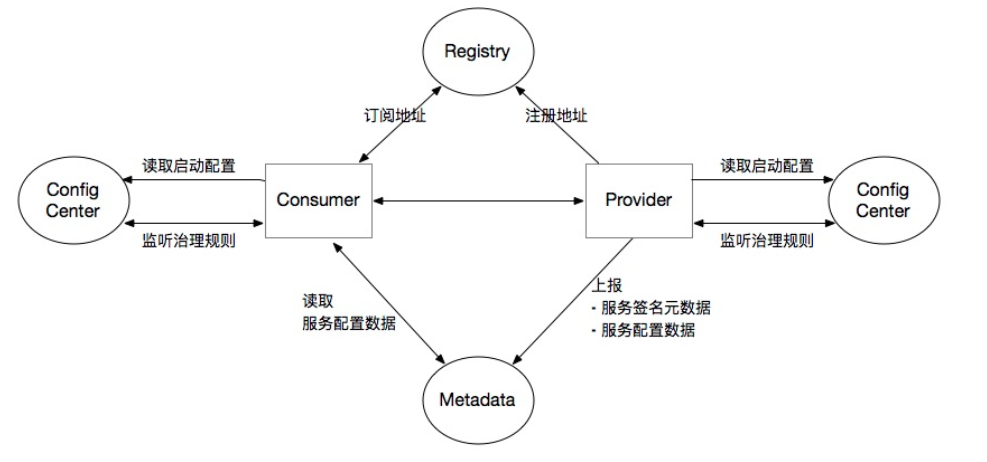

Dubbo定义了一些中心化组件（并非都是必要的）

* 注册中心

  协调Consumer和Provider之间的地址注册与发现

* 配置中心

  * 存储Dubbo启动阶段的全局配置，保证配置的跨环境共享与全局一致性
  * 负责服务治理规则(路由规则，动态配置等)的存储与推送

* 元数据中心

  * 接受Provider上报的服务接口元数据，为Admin等控制台提供运维能力
  * 作为服务发现机制的补充，提供额外的接口/方法级别配置信息的同步能力，相当于注册中心的额外拓展