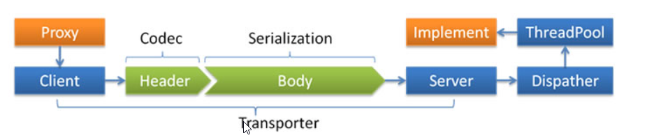

[toc]

- [1. 启动时检查——check](#1-启动时检查check)
- [2. 重试次数配置——retries](#2-重试次数配置retries)
- [3. 线程模型，派发策略配置，线程池配置](#3-线程模型派发策略配置线程池配置)
  - [3.1 不配置派发策略和线程池](#31-不配置派发策略和线程池)
  - [3.2 配置派发策略线程池](#32-配置派发策略线程池)
  - [3.3 配置派发策略和线程池](#33-配置派发策略和线程池)
- [4. 直连——url](#4-直连url)
- [5. 只订阅不注册——register](#5-只订阅不注册register)
- [6. 多协议——protocol](#6-多协议protocol)
  - [6.1 不同服务不同协议](#61-不同服务不同协议)
  - [6.2 多协议暴露服务](#62-多协议暴露服务)
- [7. 多注册中心——registry](#7-多注册中心registry)
  - [7.1 Provider：一个服务向多个注册中心注册](#71-provider一个服务向多个注册中心注册)
  - [7.2 Provider：不同服务向不同的注册中心注册](#72-provider不同服务向不同的注册中心注册)
  - [7.3 Consumer：不同reference引用不同的注册中心](#73-consumer不同reference引用不同的注册中心)
  - [7.4 Consumer：一个refenence引用多个注册中心](#74-consumer一个refenence引用多个注册中心)
- [8 服务分组——group](#8-服务分组group)
  - [8.1 Provider提供的服务](#81-provider提供的服务)
  - [8.2 Consumer对服务的引用](#82-consumer对服务的引用)
- [9. 版本——version](#9-版本version)
- [10. Provider超时打断——timeout](#10-provider超时打断timeout)
- [11. 在Provider集群中，指定IP:Port进行调用](#11-在provider集群中指定ipport进行调用)
- [12. 收集广播响应](#12-收集广播响应)
- [13. 结果缓存——cache](#13-结果缓存cache)
- [14. 延迟暴露——delay](#14-延迟暴露delay)
- [15. 日志框架选择——logger](#15-日志框架选择logger)
    - [](#)
- [16. Dubbo访问日志开启](#16-dubbo访问日志开启)
- [17. ReferenceConfig缓存](#17-referenceconfig缓存)
- [18. 如果这里没有你想要的，请移步Dubbo官方文档](#18-如果这里没有你想要的请移步dubbo官方文档)


#### 1. 启动时检查——check

check的缺省配置为——true

* **check="true"**

   启动时检查服务是否可用，不可用会抛出异常，组织Spring初始化

* **check="false"**

  启动时不检查


#### 2. 重试次数配置——retries

retries字段可以配置服务的重试次数

```xml
<dubbo:consumer retries="2"></dubbo:consumer>
```


#### 3. 线程模型，派发策略配置，线程池配置



Client（Consumer）发起服务调用，服务调用调用请求发送给Server（Provider），Server的IO线程会接受该请求

##### 3.1 不配置派发策略和线程池

由IO线程接受请求，并处理请求，逻辑简单可以，但如果事件处理逻辑较慢，或者在IO线程处理事件时，又需要发起请的IO请求，由IO线程来处理请求就会阻塞

##### 3.2 配置派发策略线程池

IO线程接受请求，IO线程会根据派发策略(dispather)将符合条件的请求派发给ThreadPool，不符合条件的请求由IO线程执行

##### 3.3 配置派发策略和线程池

```xml
<dubbo:protocol name="dubbo" dispatcher="all" threadpool="fixed" threads="100" />
```

- Dispatcher
  - `all` 所有消息都派发到线程池，包括请求，响应，连接事件，断开事件，心跳等。
  - `direct` 所有消息都不派发到线程池，全部在 IO 线程上直接执行。
  - `message` 只有请求响应消息派发到线程池，其它连接断开事件，心跳等消息，直接在 IO 线程上执行。
  - `execution` 只有请求消息派发到线程池，不含响应，响应和其它连接断开事件，心跳等消息，直接在 IO 线程上执行。
  - `connection` 在 IO 线程上，将连接断开事件放入队列，有序逐个执行，其它消息派发到线程池。
- ThreadPool
  - `fixed` 固定大小线程池，启动时建立线程，不关闭，一直持有。(缺省)
  - `cached` 缓存线程池，空闲一分钟自动删除，需要时重建。
  - `limited` 可伸缩线程池，但池中的线程数只会增长不会收缩。只增长不收缩的目的是为了避免收缩时突然来了大流量引起的性能问题。
  - `eager` 优先创建`Worker`线程池。在任务数量大于`corePoolSize`但是小于`maximumPoolSize`时，优先创建`Worker`来处理任务。当任务数量大于`maximumPoolSize`时，将任务放入阻塞队列中。阻塞队列充满时抛出`RejectedExecutionException`。(相比于`cached`:`cached`在任务数量超过`maximumPoolSize`时直接抛出异常而不是将任务放入阻塞队列)


#### 4. 直连——url

Consumer的ReferenceConfig中设置url


#### 5. 只订阅不注册——register

register的缺省值为true

* **register="true"**

  服务注册到注册中心

* **register="false"**

  服务不注册到注册中心

如果一个Provider的提供服务正在开发，该服务又需要调用其他provider提供的服务，并且该服务不想被Consumer调用，那么可以设置**register="false"**


#### 6. 多协议——protocol

##### 6.1 不同服务不同协议

多个服务，每个服务使用不同的协议

```xml
<!-- 多协议配置 -->
<dubbo:protocol name="dubbo" port="20880" />
    
<dubbo:protocol name="rmi" port="1099" />
    
<!-- 使用dubbo协议暴露服务 -->
<dubbo:service interface="com.alibaba.hello.api.HelloService" version="1.0.0" ref="helloService" protocol="dubbo" />
    
<!-- 使用rmi协议暴露服务 -->
<dubbo:service interface="com.alibaba.hello.api.DemoService" version="1.0.0" ref="demoService" protocol="rmi" /> 
```


##### 6.2 多协议暴露服务

一个服务暴露多个协议，Consumer可以使用A协议来调用服务，也可以使用B协议来调用服务

```xml
<dubbo:protocol name="dubbo" port="20880" />
<dubbo:protocol name="hessian" port="8080" />

<!-- 使用多个协议暴露服务 -->
<dubbo:service id="helloService" interface="com.alibaba.hello.api.HelloService" version="1.0.0" protocol="dubbo,hessian" />
```


#### 7. 多注册中心——registry

##### 7.1 Provider：一个服务向多个注册中心注册

```xml
<dubbo:registry id="hangzhouRegistry" address="10.20.141.150:9090" />
<dubbo:registry id="qingdaoRegistry" address="10.20.141.151:9010" default="false" />
<!-- 向多个注册中心注册 -->

<dubbo:service interface="com.alibaba.hello.api.HelloService" version="1.0.0" ref="helloService" registry="hangzhouRegistry,qingdaoRegistry" />
```


##### 7.2 Provider：不同服务向不同的注册中心注册

```xml
<dubbo:registry id="chinaRegistry" address="10.20.141.150:9090" />
<dubbo:registry id="intlRegistry" address="10.20.154.177:9010" default="false" />

<!-- 向中文站注册中心注册 -->
<dubbo:service interface="com.alibaba.hello.api.HelloService" version="1.0.0" ref="helloService" registry="chinaRegistry" />

<!-- 向国际站注册中心注册 -->
<dubbo:service interface="com.alibaba.hello.api.DemoService" version="1.0.0" ref="demoService" registry="intlRegistry" />
```


##### 7.3 Consumer：不同reference引用不同的注册中心

```xml
<dubbo:registry id="chinaRegistry" address="10.20.141.150:9090" />
<dubbo:registry id="intlRegistry" address="10.20.154.177:9010" default="false" />

<!-- 引用中文站服务 -->
<dubbo:reference id="chinaHelloService" interface="com.alibaba.hello.api.HelloService" version="1.0.0" registry="chinaRegistry" />

<!-- 引用国际站站服务 -->
<dubbo:reference id="intlHelloService" interface="com.alibaba.hello.api.HelloService" version="1.0.0" registry="intlRegistry" />
```


##### 7.4 Consumer：一个refenence引用多个注册中心

```xml
<!-- 多注册中心配置，竖号分隔表示同时连接多个不同注册中心，同一注册中心的多个集群地址用逗号分隔 -->
<dubbo:registry address="10.20.141.150:9090|10.20.154.177:9010" />

<!-- 引用服务 -->
<dubbo:reference id="helloService" interface="com.alibaba.hello.api.HelloService" version="1.0.0" />

```


#### 8 服务分组——group

如果一个接口有不同实现，可以通过分组加以区别

##### 8.1 Provider提供的服务

```xml
<dubbo:service group="feedback" interface="com.xxx.IndexService" />
<dubbo:service group="member" interface="com.xxx.IndexService" />
```

##### 8.2 Consumer对服务的引用

reference只能调用对应group中的service

```xml
<dubbo:reference id="feedbackIndexService" group="feedback" interface="com.xxx.IndexService" />
<dubbo:reference id="memberIndexService" group="member" interface="com.xxx.IndexService" />
```

**引用任意组的服务**

```xml
<dubbo:reference id="barService" interface="com.foo.BarService" group="*" />
```


#### 9. 版本——version

* Provider可以在service中添加version来标记提供的版本
* Consumer可以在reference中添加version来标记引用的版本

reference如果配置了version，就只会调用对应version的service


* reference调用任何版本的service

```xml
<dubbo:reference id="barService" interface="com.foo.BarService" version="*" />
```


#### 10. Provider超时打断——timeout

对于一个provider，如果某个操作执行超时，则打断(释放)该执行线程，而不是仅仅打印超时日志。


#### 11. 在Provider集群中，指定IP:Port进行调用

多个Provider注册到注册中心，构成一个集群，需要在这个集群中指定IP:Port进行服务调用

* reference配置parameters
* 向RpcContext传入指定的IP:Port

```java
@RestController
public class TestServiceConsumer {
    @DubboReference(interfaceClass = TestService.class,group = "dev",parameters = {"router","address"})
    private TestService testService;

   @GetMapping("/invokeByIpPortSpecified")
       public String invokeByIp(){
           try {
               // 根据provider的ip,port创建Address实例
               Address address = new Address("10.220.47.253", 20880);
               RpcContext.getContext().setObjectAttachment("address", address);
               return testService.sayHello("Tom");
           }catch (Throwable ex){
               return ex.getMessage();
           }
       }
}
```


#### 12. 收集广播响应

集群模式为broadcast时，Consumer逐个调用集群中的所有Provider提供的Service，并将每个Provider的调用结果存入**RpContext中**，可以通过**RpcContext.getServerContext().getAttachments()**获取

```java
@RestController
public class TestServiceConsumer {

    @Reference(interfaceClass = DubboHealthService.class,cluster = "broadcast2")
    private DubboHealthService dubboHealthService;
    
     @GetMapping("/health")
         public String broadCast(){
             try{
                 //广播调用
                 dubboHealthService.health();
             }catch (Exception e){
                 //获取收集后的广播结果
                 Map<String, String> m = RpcContext.getServerContext().getAttachments();
                 return m.toString()+"|"+"fail";
             }
             Map<String, String> m = RpcContext.getServerContext().getAttachments();
             return m.toString()+"|"+"success";
         }
}
```


#### 13. 结果缓存——cache

**cache**

* `lru` 基于最近最少使用原则删除多余缓存，保持最热的数据被缓存。
* `threadlocal` 当前线程缓存，比如一个页面渲染，用到很多 portal，每个 portal 都要去查用户信息，通过线程缓存，可以减少这种多余访问。
* `jcache` 与 [JSR107](http://jcp.org/en/jsr/detail?id=107') 集成，可以桥接各种缓存实现。

```xml
<dubbo:reference interface="com.foo.BarService" cache="lru" />
```


#### 14. 延迟暴露——delay

如果你的服务需要预热时间，比如初始化缓存，等待相关资源就位等，可以使用 delay 进行延迟暴露

需要延迟暴露（delay > 0）服务的倒计时动作推迟到了 Spring 初始化完成后进行

```xml
<dubbo:service delay="5000" />
```


#### 15. 日志框架选择——logger

配置日志框架

```xml
<dubbo:application logger="log4j" />
```

###### 

#### 16. Dubbo访问日志开启

如果想要记录每一次请求信息——开启访问日志

```xml
<dubbo:protocol accesslog="true" />
```

也可以把访问日志输出到文件

```xml
<dubbo:protocol accesslog="http://10.20.160.198/wiki/display/dubbo/foo/bar.log" />
```


#### 17. ReferenceConfig缓存

如果采用API来配置ReferenceConfig，那么需要注意

ReferenceConfig很重，封装了与注册中心的连接以及与提供者的连接，需要缓存。

否则重复生成ReferenceConfig可能造成性能问题，还有内存和连接泄漏

**Dubbo提供ReferenceConfigCache**用于缓存**ReferenceConfig**

```java
ReferenceConfig<XxxService> reference = new ReferenceConfig<XxxService>();
reference.setInterface(XxxService.class);
reference.setVersion("1.0.0");
......
ReferenceConfigCache cache = ReferenceConfigCache.getCache();
// cache.get方法中会缓存 Reference对象，并且调用ReferenceConfig.get方法启动ReferenceConfig
XxxService xxxService = cache.get(reference);
// 注意！ Cache会持有ReferenceConfig，不要在外部再调用ReferenceConfig的destroy方法，导致Cache内的ReferenceConfig失效！
// 使用xxxService对象
xxxService.sayHello();

//销毁Cache中的ReferenceConfig并释放资源
ReferenceConfigCache cache = ReferenceConfigCache.getCache();
cache.destroy(reference);
```


#### 18. 如果这里没有你想要的，请移步Dubbo官方文档

