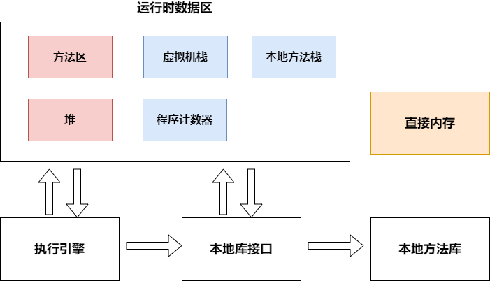
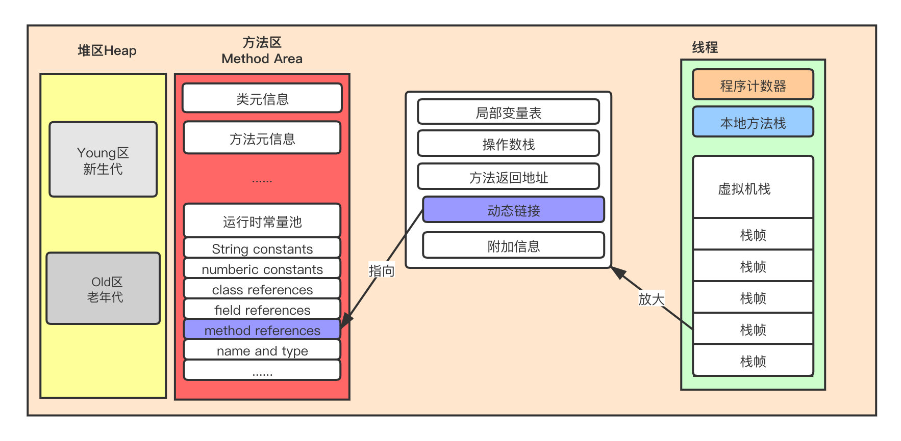
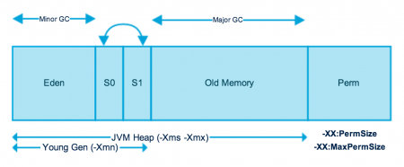
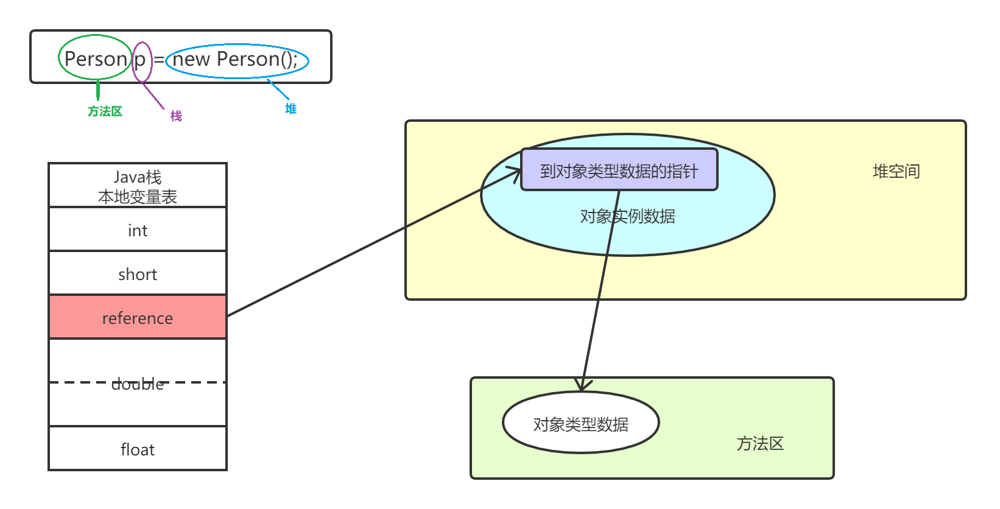

# 0. JDK6的内存结构

# 1. 程序计数器

* 线程私有的一块很小的内存
* 如果执行的是Java方法，程序计数器存储的是下一条字节码指令的地址
  如果执行的是本地方法，程序计数器为Undefined

# 2. 虚拟机栈

* 每执行一个Java方法，会往Java虚拟机栈中**push**一个栈帧；一个Java方法执行完毕，其对应的栈帧从Java虚拟机栈中**pop**

* 如果方法A调用了方法B，那么当方法B结束时，方法B的栈帧弹出，并将返回值传递给方法A的栈帧，存储在方法A的栈帧的操作数栈中

* 虚拟机栈的大小有两种设定方法
  
  - 固定
  
  - 动态调整

## 2.1 栈帧

栈帧的内部结构如下

* 操作数栈
* 局部变量表
* 动态链接
* 返回地址
* 其他附加信息
  * 锁记录

## 2.2 操作数栈

* **操作数栈主要用于保存计算过程的中间结果，同时作为计算过程中的变量提供临时的存储空间**

* 在方法执行过程中，根据字节码指令，往操作数栈中写入数据或提取数据，即入栈（push）、出栈（pop）

* 32bit类型在操作数栈中占用1个栈单位深度，64bit类型占用2个

* 操作数栈所需的最大深度在编译期就确定下来了——保存在方法的Code属性的`max_stack`中

* 如果被调用的方法带有返回值的话，其返回值将会被压入当前栈帧的操作数栈中

> 栈顶缓存技术——将栈顶元素缓存在物理CPU寄存器中，降低对内存的读写次数

## 2.3 局部变量表

* 存储方法参数和定义在方法体内的局部变量

* 局部变量表中，最基础的存储单位为Slot
  
  * double和long占用两个连续的Slot，其他类型占用1个Slot
  
  * byte，short，char，boolean在存储前会被转换为int
  
  * 如果当前栈帧对应的方法是构造方法or实例方法，那么index为0的Slot存储的是**对象引用this**

* 局部变量表的大小在编译期就确定下来了——保存在方法的Code属性的`maximum local variables`中

## 2.4 动态链接

class文件的编译过程不包括传统编译器的链接步骤，一切方法调用在class文件中存储的都是符号引用，不是直接引用，在JVM中，链接分为两种——动态链接，静态链接

- **静态链接（动作）**：被调用的方法在编译器可以确定，并且在运行时保持不变，那么在类加载时，就会将其符号引用转换为直接引用
- **动态链接（动作）**：被调用的方法在运行时才能确定，在运行期间，将符号引用转换为直接引用

动态链接：一个指向运行时常量池中栈帧对应的method reference的指针，这个指针就是用于上述的动态链接，在运行时将符号引用转换为直接引用

# 3. 本地方法栈

## 3.1 本地方法接口

* 一个 Native Method 就是一个 Java 调用非 Java 代码的接口
* Native Method存在的原因
  1. 与外界环境交互
  2. 与操作系统交互：Java程序有时仍需要依赖一些底层系统的支持。通过本地方法，可以实现与操作系统的交互

## 3.2 本地方法栈

* 跟Java虚拟机栈相似，不同的是Java 虚拟机栈用于管理 Java 方法的调用，而本地方法栈用于管理本地方法的调用

# 4. 堆

## 4.1 内存划分

* 堆是用来存放对象实例的
* 堆在逻辑上进行了划分
  * 年轻代（Eden+Survivor0+Survivor1）
  * 老年代
  * 永久代（JDK8后移除，改为元空间）

## 4.2 TLAB

虽然堆是线程共享的，但是每个线程可以在堆（Eden）中划分出 **线程私有的分配缓冲区(Thread Local Allocation Buffer)**，线程就可以在自己的TLAB上创建对象，避免了线程安全问题

# 5. 方法区

* Class对象
* **运行时常量池(内含字符串常量池)** 
  存放各种字面常量，class文件中的符号引用，以及符号引用解析得到的直接引用  
* **类型信息**
  类型的全限定名，类型父类的全限定名，类型实现的接口的全限定名，类型是类还是接口，类型的访问修饰符等
* **field信息**
  类中声明的所有字段(包括静态变量和实例变量，不包括局部变量)的描述(名称，类型，修饰符等)  
* **方法信息** 
  方法的名称，返回类型，参数表，**字节码指令**，修饰符，局部变量表和操作数栈的大小，异常表  
* **静态变量**   
* **指向类加载器的引用**  
* **指向Class类对象(Class.forName()的Class)的引用**  

# 6. 堆,方法区和栈的交互关系

# 7. 直接内存

直接内存并不属于运行时数据区

JDK1.4引入NIO类，引入了一种基于Channel与Buffer的I/O方式，可以使用Native函数库直接分配堆外内存(在直接内存中分配空间)，然后通过一个存储在堆中的DirectByteBuffer对象作为这块内存的引用进行操作
