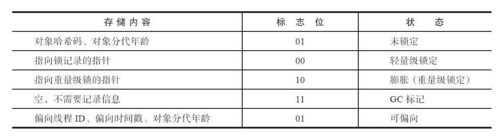
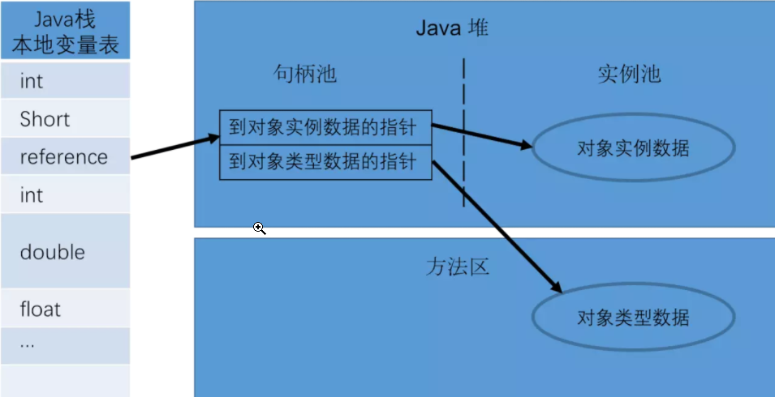
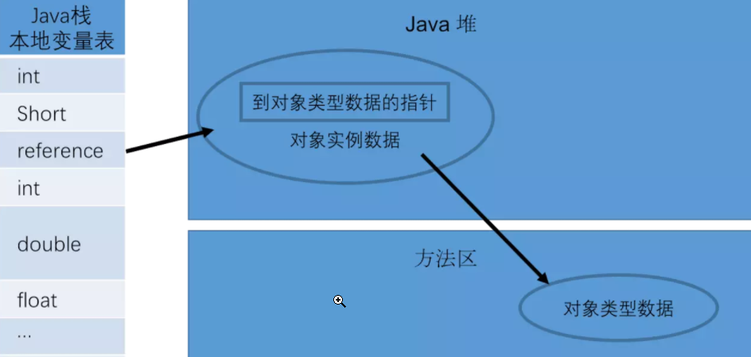

### **1. 对象的创建**

* 使用new——调用了构造方法
* 使用Class对象的newInstance()——调用了构造方法
* 使用Constructor类的newInstance方法——调用了构造方法
* 使用clone方法——没调用构造方法
* 使用反序列化——没调用构造方法

### **2. 通过new创建对象**

* ①遇到 new 指令时，首先检查这个指令的参数是否能在运行时常量池中定位到一个类的符号引用，并且检查这个符号引用代表的类是否已经被加载、解析和初始化过。   
  如果没有，执行相应的类加载

* ②为新对象分配内存，并保证线程安全
  
  * **分配内存的方法**    
    
    * **若堆内存规整——指针碰撞**
      若堆内存规整，使用过的内存放在一边，未使用的放在另一边，中间放着一个指针作为指示器
      分配内存时，仅仅把指针向向未使用的一边移动一段与对象大小相等的距离即可  
    * **若堆内存不规整——空闲列表** 
      虚拟机维持一个列表，记录哪些内存块是可用的  
      分配内存时，从列表中找到一块足够大的空间分配给对象实例，并更新列表记录  
  
  * **保证分配内存时线程安全的方法**  
    
    * JVM采用CAS+失败重试 保证内存分配操作的原子性
    * TLAB

* ③将分配到的内存空间初始化为0(不包括对象头)，接下来就是填充对象头，把对象是哪个类的实例、如何才能找到类的元数据信息、对象的哈希码、对象分代年龄等信息存入对象头。

* ④执行<init>()初始化对象  

### **3. 对象的内存布局**

一个实例对象占有的内存可以分为三块——对象头，实例数据，对齐填充  

* **对象头**(普通对象2个字，数组3个字)  
  
  * 第一个字——>Mark Word(32or64位，内容取决于**最后2位标识位**)
    
    
  
  * 第二个字——>指针，指向这个实例对象所属的类的Class对象
  
  * 第三个字——>数组长度  

* **实例数据**  

* **对齐填充** 
  不是必然需要，主要是占位，保证对象大小是某个字节的整数倍   

### **4. 对象的访问定位——引用定位到对象的方式**

* #### **句柄访问**
  
  如果使用句柄访问，Java堆中可能会划分出一块来作为**句柄池**
  
  reference存储的是句柄池的地址 
  

* #### 直接指针
  
  reference存储的是实例对象的地址 （Java采用这个）
  实例对象的对象头中存储有指向Class对象的指针 
   