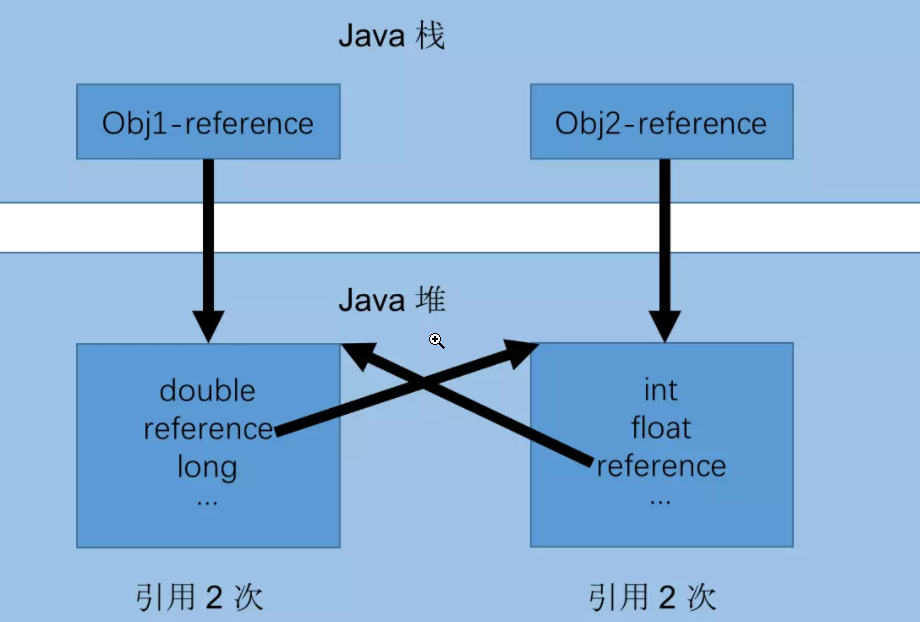
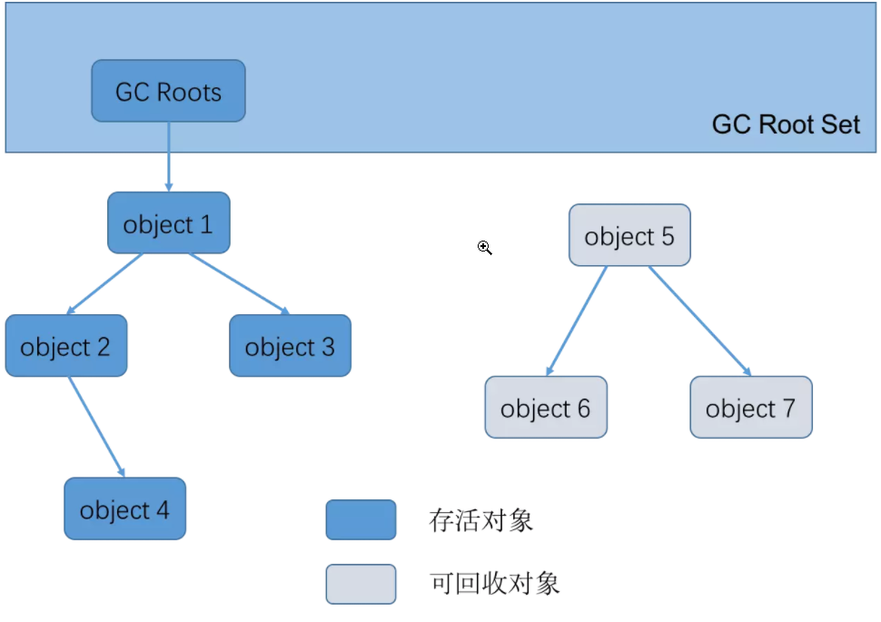

### 1. 判断对象已死

#### 1.1 引用计数法

给对象添加一个引用计数器，每当有一个地方引用对象，计数器值+1，当引用失效，计数器值-1。当计数器为0时，表示对象已死，但会出现以下问题   
Obj1=null,Obj2=null后，由于两个对象之间仍然相互引用，导致两个对象无法被清除   

#### 1.2 可达性分析

‘GC Roots’ 的对象作为起始点出发，通过**引用链**到达下一个对象

当一个对象到 GC Roots 没有任何引用链相连的时候说明对象不可达

* 可以作为GC Roots对象的东西
  * 栈帧中的局部变量表引用的对象
  * 本地方法栈中JNI引用的对象
  * 静态属性引用的对象
  * 常量引用的对象
* **可达性分析**要求全过程都基于一个 **能保障一致性的快照**，在该快照中进行 **对象图的遍历**
  * 在可达性分析时 **Stop The World**，很容易的满足
  * 但如果用户线程与可达性分析并发，那么有两种解决方案
    * **增量更新——CMS使用**
    * **原始快照——G1使用**

  

### 2. 引用的类型

* #### **强引用**
  
  类似于 Object obj = new Object(); 创建的 
  强引用不置为null的话，其指向的对象不会被回收  

* #### **软引用**
  
  SoftReference 类实现软引用，软引用指向的对象，在内存不足时会被回收  

* #### **弱引用**
  
  WeakReference 类实现弱引用，弱引用指向的对象，只要触发GC就会被回收  

* #### **虚引用**
  
  PhantomReference 类实现虚引用
  无法通过虚引用获取一个对象的实例  
  为一个对象设置虚引用关联的唯一目的就是能在这个对象被收集器回收时收到一个系统通知。  

### 3. 对象被回收的条件

* 可达性分析，对象不可达，将进行如下操作

* 如果对象还没有执行finalize()方法，就会被放入F-Queue中

* 当GC触发时，Finalizer线程会F-Queue中的对象的finalize()方法

* 执行完finalize()方法后，会再次判断对象是否可达，如果不可达，才会被回收
  
  （所以对象可以通过在finalize()中将自己连接上某个GC Root链的方式来拯救自己）

### 4. 垃圾回收算法

* #### **标记-清楚算法**
  
  将要被清清除对象进行标记，触发GC时，回收被标记的对象
  
  * 缺点
    * 执行效率不稳定
    * 非移动式，不需要移动对象，但会造成内存空间的碎片化

* #### **标记-复制算法**(JVM新生代使用)
  
  将内存空间分为两块，每次只使用一块，当使用的内存块满了的时候，将该内存块中的存活对象复制到另一个内存块上，然后清空该内存块    
  
  * **JVM新生代使用的复制算法**
    空间利用率低下，因为绝大多数新生代熬不过第一轮GC，所以没必要1:1划分内存空间   
    JVM新生代采用的就是复制算法，不过新生代中，将内存空间划分为**Eden+Survivor1+Survivor2(8:1:1)**三块内存空间   
    每次只会使用Eden和一块Survivor，
    当Eden空间不足时，触发GC，将Eden和使用的Survivor中的存活对象复制到另一块Survivor上(如果存活的对象Survivor装不下，那么多出来的对象进入老年代),
    然后清空Eden和使用的Survivor  
  * 缺点
    * 对象存活率较高时，需要进行较多的复制，效率降低——不适用于老年代
    * 空间利用率低

* #### **标记-整理算法**(JVM老年代使用)
  
  将存活的对象移动到内存的一端，然后将剩下的部分清除
  
  * 缺点
    * 标记-整理算法是移动式的，需要移动存活的对象，移动存活对象时必须全程暂停用户应用线程(Stop The World)

* #### **分代算法**(JVM采用的)
  
  JVM将内存分代，不同的代采用不同的垃圾回收算法  
  
  * **新生代**——每次GC都有大量对象死去，采用上面的复制算法  
  * **老年代**——对象存活率高，采用上面的标记-整理算法  
  * **永久代**(方法区就是永久代，jdk1.8废除了永久代) 
    永久代要回收的——废弃的常量和不再使用的类(Class对象)   
    * 判断废弃常量
      一般是判断没有该常量的引用。
    * 判断不再使用的类，必须以下**3个条件**都满足  
      * 该类的所有实例都已被回收  
      * 加载该类的ClassLoader已被回收  
      * 该类的Class对象没有被引用

### 5. JVM内存空间的另一种划分方式

* 堆
  * 新生代
  * 老年代
* 方法区(永久代)——JDK1.8后移除

### 6. 垃圾回收算法实现细节

#### 6.1 根节点枚举

* 在使用 **可达性分析**前，我们需要先找到**GC Roots**，对GC Roots的枚举必须 **Stop The World**（因为如果在根节点枚举的过程中，根节点集合的对象引用关系在不断变化，那么枚举出来的GC Roots是不准确的）

* 并不需要一个不漏的检查完所有执行上下文和全局的引用位置，虚拟机知道哪些地方存放着对象引用——通过**OopMap**实现
  
  * **OopMap**
    
    一旦类加载完成，HotSpot会把 对象内什么偏移量上是什么类型的数据计算出来，并会在特定位置（安全点）**记录下栈和寄存器里哪些位置是引用**（为其生成一个OopMap），这样收集器在扫描时可以直接知道这些信息，并不需要一个不漏的从GC Roots开始查找

### 7. GC的划分和触发条件

#### 7.1 GC的划分

* **通用的GC**
  * **Young GC**：只回收新生代
  * **Full GC**：回收整个堆，包括新生代，老年代，永久代（如果存在）
* **特殊的GC**
  * **Old GC**：只回收老年代（只有CMS的concurrent collection有）
  * **Mixed GC**：收集所有新生代和部门老年代（只有G1有）

#### 7.2 GC的触发条件

* young GC触发条件——当新生代中的eden区满时触发

* **Full GC触发条件**
  
  * 当准备要触发一次young GC时，如果统计数据中从新生代晋升到老年代的对象的平均大小>老年代剩余空间，那么触发一次Full GC
  * 老年代空间不足
  * 如果有永久代的话，那么在永久代空间不足时也会触发Full GC
  * System.gc()默认也是触发Full GC
