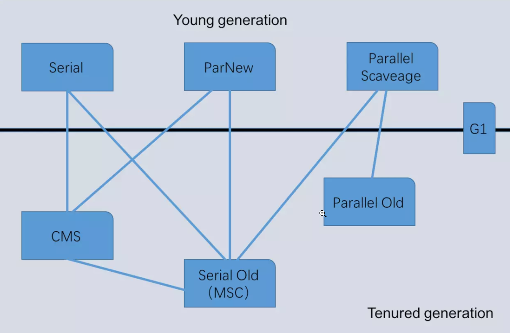
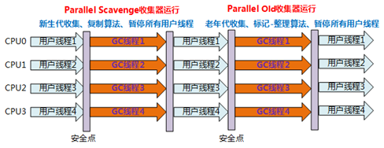
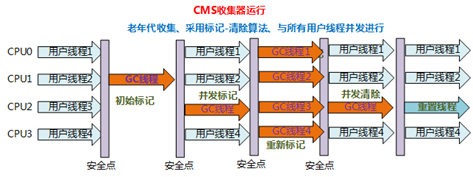
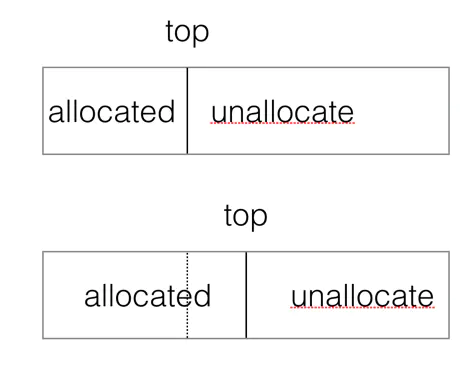
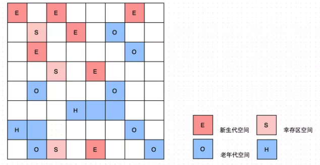
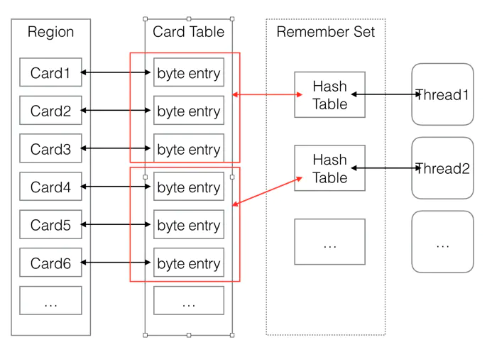

**如果两个收集器之间存在连线——它们可以搭配使用**

### 1. 新生代垃圾回收器(都是采用标记-复制算法)

#### 1.1 Serial

* 单线程收集器，只会使用一个GC线程来进行完成垃圾收集工作   
  并且在进行垃圾回收时必须 **Stop The World**
* 使用标记-复制算法
* 使用场景  
  Client模式下的虚拟机  

#### 1.2 ParNew

* Serial的多线程版本，使用多个GC线程来完成垃圾收集工作 ，在垃圾回收时，会 **Stop The World**
* 使用标记-复制算法
* 使用场景
  * 工作在Server模式
  * 只有ParNew能与CMS配合工作

#### 1.3 Parallel Scavenge

* **并行**的多线程垃圾处理器，会触发 **Stop The World**

* 使用标记-复制算法

* 该收集器的目标是达到一个**可控制的吞吐量**，吞吐量=运行用户代码时间/（运行用户代码时间+垃圾收集时间），并且可以开启GC自适应调节

* Parallel Scavenge收集器使用2个参数控制吞吐量
  
  * XX:MaxGCPauseMillis ：控制最大的垃圾收集停顿时间
  * XX:GCRatio：直接设置吞吐量大小

* Parallel Scavenge还提供第三个参数—— **-XX:UseAdaptiveSizePolicy**，开启**GC自适应调节策略**
  开启这个参数后，不需要手工指定新生代大小，eden和survivor的比例等细节，只需要设置好堆大小，最大的垃圾收集停顿时间，吞吐量大小，虚拟机会根据系统运行情况，动态调整这些参数

### 2. 老年代垃圾回收器

#### 2.1 Serial Old

* 单线程垃圾收集器，会导致 Stop The World
* 采用标记-整理算法

#### 2.2 Parallel Old

* Parallel Scavenge的老年代版本
* 采用标记-整理算法  
  

#### 2.3 CMS(Concurrent Mark Sweep)

* 以实现最短Stop The World时间为目标的垃圾收集器

* 使用**标记-清除**算法

* 工作流程：
  
  
  
  * ①初始标记：(导致Stop The World)标记下GC Roots直接关联到的对象，速度很快
  * ②并发标记：(不会导致Stop The World，与用户线程并发)从GC Roots直接关联的对象出发，进行**可达性分析（使用增量更新算法）**开始遍历整个对象图，耗时长
  * ③重新标记：(导致Stop The World)并发标记期间，用户程序继续运作，可能会导致部分对象的标记变动，重新标记就是为了修正这些对象的标记记录
  * ④并发清除：(不会导致Stop The World)清除掉标记为已经死亡的对象，由于不会移动存活对象，所以用户线程不必暂停

* 缺点
  
  * 对CPU资源十分敏感，会占用一部分CPU资源而导致应用程序变慢
  
  * **并发失败问题（Concurrent Mode Failure）**——由于CMS进行GC时，大多数时候用户线程扔继续运行，就必须在老年代预留足够的内存空间给用户线程使用，所以CMS不是等老年代内存空间没了才开始GC，而是当老年代内存空间使用了一定比例后开始GC，这种会出现一种情况，当CMS开始GC时，预留的内存比较少，但在CMS执行GC的过程中，用户线程继续执行，耗尽了预留的内存，就会出现 **并发失败(Concurrent Mode Failure)**，这时JVM会临时启动Serial Old收集器进行老年代的垃圾收集，会 **Stop The World比较长的时间**
    
    * **解决方案**——合理设置开始GC时的老年空间使用比例
  
  * **晋升失败（Promotion Failure）**——在进行Minor GC时，Survivor空间不足，对象只能放入老年代，但CMS采用的是标记清除算法，可能导致老年代内存空间足够但是内存碎片较多，找不到一块连续的内存存放晋升对象
  
  * CMS采用 **标记-清除算法**，会产生大量空间碎片
    
    * **解决方案**——设置 -XX:CMSFullGCsBeforeCompaction=n，上一次CMS GC后，要执行n次Full GC后对内存进行整理压缩

### 3. Garbage First

* G1是一款面向服务器的垃圾收集器，以极高概率满足GC停顿时间要求，具备高吞吐量，有以下特点
1. 回收的范围是整个Java堆

2. G1也是多线程的垃圾收集器，同时在某些阶段允许GC线程与用户线程并发运行

3. * G1基于 **Region**的堆内存布局，将堆划分为多个大小相同的Region（默认是2048个）
   
   * 每个Region都可以根据需要，扮演4个角色——**新生代的Eden**，**Survivor**，**老年代**，**Humongous**，G1收集器对扮演不同角色的Region采用不同的策略去处理
   
   * 每个Region都可以划分成2个部分——已分配的和未分配的，它们之间的界限为top
     
     将一个对象分配到Region，只需要增加top值
     
     
   
   * Region是单次回收的最小单元，每次收集到的内存空间都是Region大小的整数倍
   
   * 对于超过半个Region容量的大对象，会存放在N个连续的Humongous Region中
   
   

4. 从整体上看采用的是标记-整理算法，从局部（2个Region）上看采用的是标记-复制算法

5. 建立了**可预测**的停顿时间模型，用户可以指定期望停顿时间，G1会将停顿时间控制在用户设定的停顿时间内（单次STW默认最多200ms）

6. 其他垃圾垃圾收集器触发GC时，目标是对负责的区域进行全量回收，但是G1进行垃圾回收时，只追求在**限制的时间内**回收尽可能多的垃圾（STW时间不会太长）

#### 3.1 G1处理思路

* 让G1根据各个region回收所获得的空间大小以及回收所需时间，维护一个优先级列表，每次根据用户设定允许的收集停顿时间，优先处理回收收益最大的Region
* Minor GC——如果eden和survivor占用的内存超过了整个堆的60%，触发一次Minor GC，只对eden和survivor进行回收
* Full GC——如果老年代超过堆的45%，进行一次FullGC

#### 3.2 记忆集和卡表

Region通过**记忆集和卡表**解决**跨Region引用对象问题**——提供记忆集，可以避免可达性分析时进行全堆扫描

* 每个Region都有一个记忆集，记忆集会记录下别的Region指向自己的指针，并标记这些指针分别在哪些卡页的范围之内
* 每一个Region，被分为若干个Card，每一个Card，都有一个byte来表示其是否被修改过，这些byte的集合就是Card Table
* 记忆集本质是哈希表，key是别的Region的起始地址，Value是一个集合，存储卡表的索引号
* 可能有多个线程并发修改记忆集，为了避免冲突，记忆集划分为多个哈希表，每个线程只会在自己的哈希表修改
* 在回收一个Region的时候不需要执行全堆扫描，只需要检查它的记忆集就可以找到外部引用

#### 3.3 G1垃圾回收过程

* **初始标记**
  
  标记下GC Roots能直接关联到的对象，G1会使用SATB记录存活对象的快照

* **并发标记**——使用原始快照算法（SATB）保证用户线程和GC线程互不干扰
  
  **与用户线程并发**，从 **GC Roots**开始进行 **可达性分析**，找出存活对象
  
  在此期间，用户线程可能修改了原本的引用，所以需要检查存活的对象与其对照是否一致，如果不一致对象图扫描后，要重新处理SATB记录下的在并发时有引用变动的对象

* **最终标记**
  
  Stop The World，处理那些在并发标记阶段发生变化的对象

* **筛选回收**
  
  Stop The World，多条收集器线程并行完成
  
  更新Region的统计数据，对各个Region的回收价值和成本进行排序，根据用户所期望的停顿时间来制定回收计划，然后把决定回收的Region中的存活对象复制到空的Region中，再清理掉整个旧 Region
