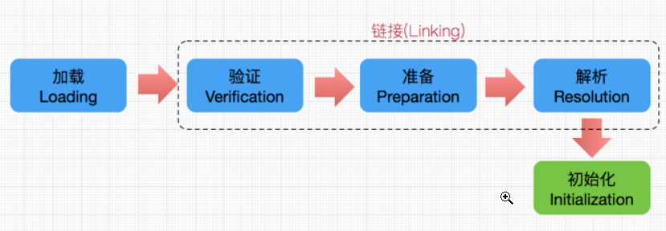

### 1. 类加载时机

* new一个对象
* 访问类的静态属性，静态方法
* 反射
* JVM的启动类
* 如果一个类进行加载，那么优先加载其父类

### 2. 类加载流程



#### 2.1 Loading


该过程由 **ClassLoader**完成

就是将二进制流读入内存，并为之创建一个java.lang.Class对象

1. 通过类的 **全限定名**获取类的.class文件(可以从磁盘，网络等获取)
2. 将class文件中的静态存储结构转换为方法区中的运行时数据结构
3. 在内存中生成一个代表这个类的 **java.lang.Class对象**，作为该类运行时数据结构的访问入口

#### 2.2 Verification

1. **文件格式验证**
   
   主要验证字节流是否符合Class文件格式规范，并且能被当前的虚拟机加载处理。例如：主，次版本号是否在当前虚拟机处理的范围之内。常量池中是否有不被支持的常量类型。指向常量的中的索引值是否存在不存在的常量或不符合类型的常量。

2. **元数据验证**
   
   这个类是否有父类(Object除外)  
   
   这个类是否继承了不允许继承的类(final类) 
   
   如果这个类不是抽象类，这个类是否实现了父类和接口中要求实现的所有方法
   
   类中的字段，方法是否与父类产生矛盾

3. **字节码验证**
   
   最重要的验证环节，分析数据流和控制，确定语义是合法的，符合逻辑的。主要的针对元数据验证后对方法体的验证。保证类方法在运行时不会有危害出现。

4. **符号引用验证**
   
   主要是针对符号引用转换为直接引用的时候，是会延伸到第三解析阶段，主要去确定访问类型等涉及到引用的情况，主要是要保证引用一定会被访问到，不会出现类等无法访问的问题。

#### 2.3 Preparation

为类变量分配内存并设置初始值

* static变量——设置为零值
* final static变量——设置为其声明的值

#### 2.4 Resolution

将.class文件的常量池中的符号引用替换为直接引用

* **符号引用**：以一组符号来描述所引用的目标
* **直接引用**：可以指向目标的指针针、相对偏移量或者是一个能间接定位到目标的句柄

#### 2.5 Initialization

**子类在初始化前必须完成父类的初始化**，初始化的本质就是执行clinit方法

* 对于类
  1. 检查父类是否已经加载——若未加载，则先加载父类
  2. 检查类的接口是否已经加载——若未加载，则先加载接口
  3. Javac编译器会自动收集 static属性赋值语句，static代码块 生成<clinit>()方法（收集顺序按照代码中的顺序） ——然后执行类构造器<clinit>()
* 对于结构
  1. 没有(1)(2)——只有用到父接口时，才会加载父接口
  2. 并且执行接口的<clinit>()方法并不会先执行父类的<clinit>()方法，只有当使用到父接口时，父接口才会被初始化

**JVM会保证一个类的clinit()方法在多线程环境中可以被正确的加锁，保证只有一个线程会执行该方法，其他线程阻塞，这样才能保证类只会加载一次**

### 3. clinit与init的区别

* clinit
  1. clinit只有在类加载时才会执行，一个类只会加载一次，clinit也只会执行一次
  2. clinit是Java自动收集静态赋值语句和静态代码块形成的
  3. clinit的执行发生在类加载的initialization阶段，并且在子类initialization前，必须保证父类和接受已经完成了初始化——父类和接口的clinit会先执行，然后再执行子类的clinit
* init
  1. init是在创建对象时执行，创建一次对象就执行一次init
  2. init是Java自动收集构造代码块和构造方法形成的
  3. 创建子类对象前，一定会先创建父类对象——先执行父类的init，再执行子类的init

### 4. ClassLoader

在JVM中，一个类由 **加载它的类加载器**和 **类本身**共同确定其在JVM中的唯一性


#### 4.1 ClassLoader类型

* **启动类加载器(BootstrapClassLoader)**
  
  C++实现，其他的都是用Java实现
  
  负责加载JVM基础核心类库，**无法被Java程序直接使用**
  
  **能加载的类有以下条件**
  
  * 存放在`$JAVA_HOME/lib` 目录下，或者 存放在被 -Xbootclassp下
  * 被-Xbootcalsspath参数指定的路径下

* **拓展类加载器(Extension ClassLoader)**
  
  负责把一些类加载到JVM内存中，**可以在Java程序中使用**
  
  **能加载的类有以下条件**
  
  * 存放于`$JAVA_HOME/lib/ext`目录下的类库
  
  * 被java.ext.dirs系统变量所指定的路径中的所有类库

* **应用程序类加载器(Application ClassLoader)**
  
  是ClassLoader.getSystemClassLoader()的返回值
  
  负责加载 用户类路径(ClassPath)上的的所有类库,**可以在Java程序中使用**
  
  一般情况下这个就是程序默认的类加载器

#### 4.2 双亲委托机制

* **工作过程**
  
  1. 当一个类加载器收到类加载请求，先在缓存中查看这个类是否已经被加载过，如果没有，它首先不会自己去加载这个类，而是把这个请求传递给它的父类加载器，父类加载器把这个请求传递给父类加载器的父类加载器……直到传递到启动类加载器（向上传递）
  
  2. 启动类加载器在它的搜索范围中查找所要加载的类——找到，就loading这个类
     
     找不到——传递给子类加载器……直到某个类加载器可以在它的搜索范围查找到所要加载的类（向下传递）

* **双亲委托机制的好处**
  
  * 使得Java基本类库中的类（像Object），在各种类加载器环境中都能够保证是由某个特定的类加载器来加载的

* **实现代码**
  
  ```java
      protected Class<?> loadClass(String name, boolean resolve) throws ClassNotFoundException
      {
          synchronized (getClassLoadingLock(name)) {
              // First, check if the class has already been loaded
              Class<?> c = findLoadedClass(name);
              if (c == null) {
                  long t0 = System.nanoTime();
                  try {
                      if (parent != null) {
                          c = parent.loadClass(name, false);
                      } else {
                          c = findBootstrapClassOrNull(name);
                      }
                  } catch (ClassNotFoundException e) {
                      // ClassNotFoundException thrown if class not found
                      // from the non-null parent class loader
                  }
  
                  if (c == null) {
                      // If still not found, then invoke findClass in order
                      // to find the class.
                      long t1 = System.nanoTime();
                      c = findClass(name);
  
                      // this is the defining class loader; record the stats
                      PerfCounter.getParentDelegationTime().addTime(t1 - t0);
                      PerfCounter.getFindClassTime().addElapsedTimeFrom(t1);
                      PerfCounter.getFindClasses().increment();
                  }
              }
              if (resolve) {
                  resolveClass(c);
              }
              return c;
          }
      }
  ```
