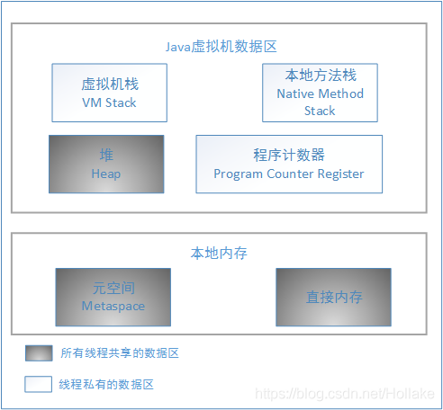

* JDK1.6   
  方法区： 详细见**1.JVM内存结构.md**  
  堆： 实例对象  
  
* JDK1.7(字符串常量池，静态变量 从方法区移动到堆中)   
  方法区：移出**字符串常量池**和**静态变量**   
  堆： 实例对象，**字符串常量池**，**静态变量**  

* JDK1.8   
  移除了方法区，将JDK1.7的方法区中的剩下东西移到 元空间 **(元空间属于本地内存)**      
  堆同JDK1.7  

**JDK1.8内存模型**  

