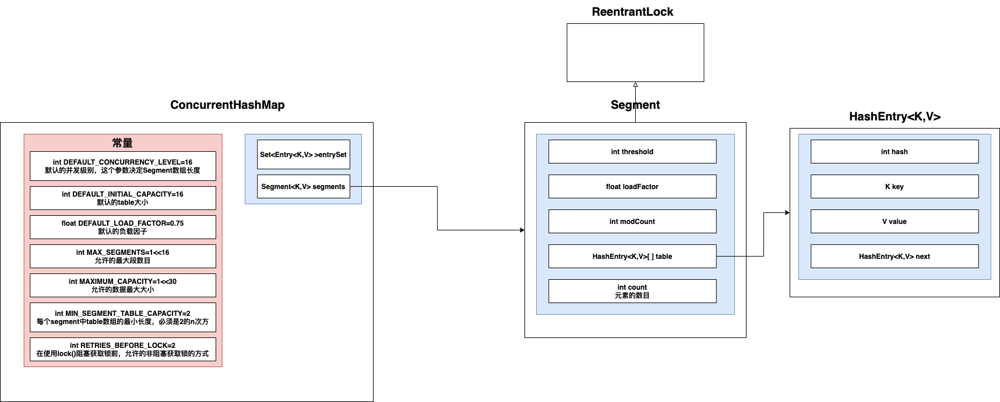
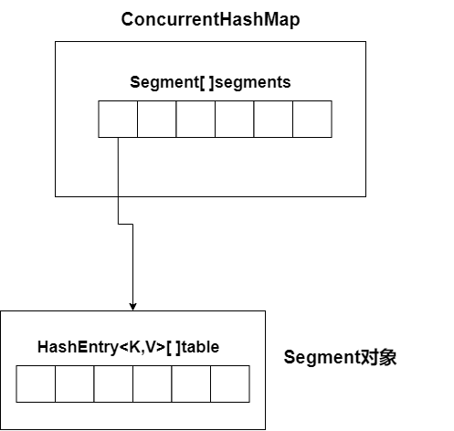

# 1. 数据结构

* JDK1.7的HashMap由一个个Segment组成——采用 **锁分段技术**
* 每个Segment都是一个带锁的 HashEntry数组，HashEntry数组中每个桶都是一个链表
* Segment中读写操作很多都是通过Unsafe实现的

# 2. 方法

## 2.1 构造方法

根据传入的参数initialCapacity和concurrentLevel，计算出**每个Segment中的table的大小（必须为2的n次方）**和Segment数组的大小

创建一个Segment对象，将其设置为Segment数组中中的第一个元素（Segment数组中只有一个元素，这个Segment是原型对象）

## 2.2 put

## 2.2 rehash()

1.drawio.png)

* 对于旧数组中的每一个链表，找到链表末尾一连串在新数组中索引相同的节点

2.drawio.png)

* 将这个一连串的节点直接移动到新数组中
* 对于剩下的节点，在新数组中直接创建新的相同的节点，通过头插法插入新数组

## 2.3 get

通过hash计算在Segment数组中的索引，然后通过UNSAFE取出对应的Segment

然后通过hash计算在Segment的table中的索引，然后遍历链表取出

## 2.4 size

1. 不断循环，每轮循环都会遍历Segment数组中的每个Segment然后统计各个Segment中的键值对数目，得到总和

   必须连续2次统计得到的总和相等，才能返回

2. 如果循环超过了一定次数还没返回，那么就会强制获得所有Segment的锁，然后统计其数目，统计完后释放锁
