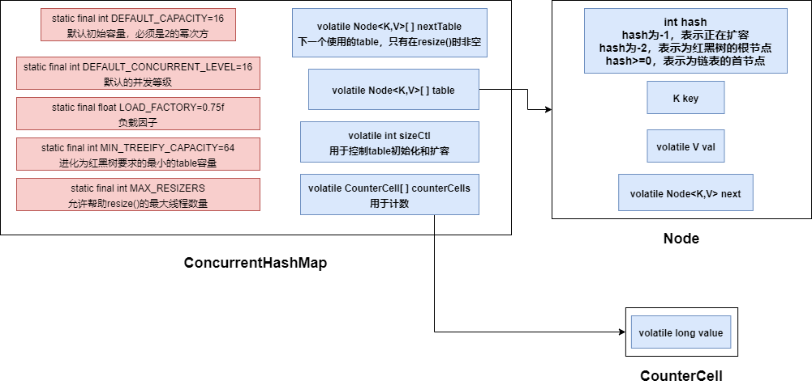
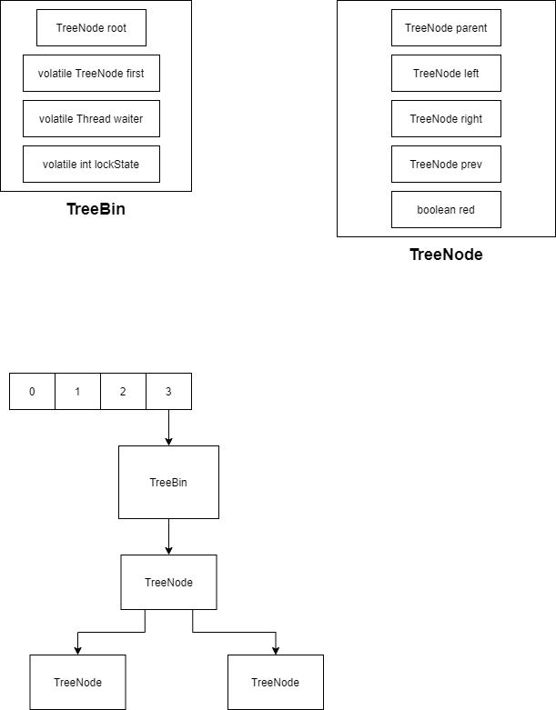
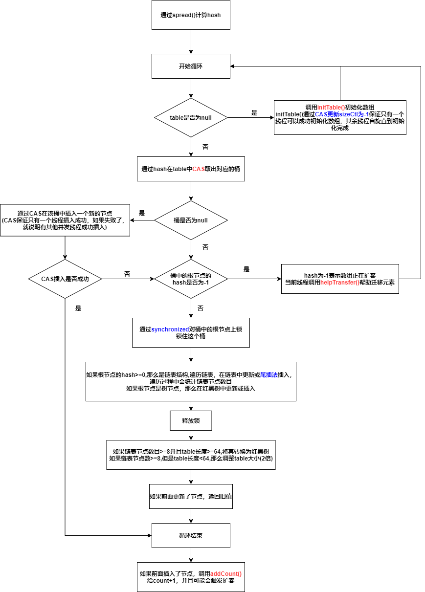

## 1. 数据结构

ConcurrentHashMap中JDK1.8的底层存储结构与JDK1.8的HashMap是一样的——都是 数组+链表+红黑树

JDK1.8中ConcurrentHashMap的结构与基本属性变量，初始化逻辑都与HashMap差不多


ConcurrentHashMap添加了以下新的字段



* **sizeCtl**：用于控制table初始化和扩容
  * 如果sizeCtl为负数——table正在初始化或扩容（-1：初始化，-n：表示有n-1个线程正在帮助扩容）
  * sizeCtl为正数——下一个扩容阈值
  * sizeCtl为0——数组还没有被初始化
* **counterCells**：用于计数，统计键值对数目


### 1.1 节点类型

Node以下有4个子类

* **ForwardingNode**
* **ReservationNode**——保留节点
* **TreeBin**
* **TreeNode**

#### 1.1.1 ForwardingNode

扩容节点，只是在扩容阶段使用的节点，主要作为一个标记，其hash值为-1，其他线程在put时，如果发现节点的hash值为-1，会帮助迁移数据

#### 1.1.2 TreeBin和TreeNode



* TreeBin可以放在桶中
* TreeNode不可以放在桶中，红黑树节点


## 2. ConcurrentHashMap线程安全

ConcurrentHashMap通过**CAS+synchronized**保证并发环境下的线程安全

* ConcurrentHashMap中查找元素，替换元素，赋值元素都是通过Unsafe的原子操作实现

* ConcurrentHashMap的锁粒度为**Node**
* ConcurrentHashMap允许多个线程同时帮助扩容


## 3. 哈希函数

哈希函数spread()

```java
static final int HASH_BITS = 0x7fffffff;

return (h ^ (h >>> 16)) & HASH_BITS;
```

## 4. put

假设有**多个线程**同时执行put()方法



### 4.1 put如何保证数组元素的可见性

1. Node数组采用volatile来修饰——保证对整个数组的引用在不同线程之间可见，但并不保证数组内部的元素在各个线程之间可见，所以访问数组中某个位置的元素不能通过下标来访问
2. 通过CAS来访问数组中某个位置的元素


## 5. initTable

如果多个线程同时执行initTable()

那么只有一个线程可以通过CAS将 sizeCtl更新为-1，然后创建table，创建完成后会更新 **sizeCtl为下一次扩容的阈值**

其余线程不断自旋直到table创建完毕


## 6. addCount与size

在HashMap中，我们搞了一个size变量来统计元素个数

类比HashMap，ConcurrentHashMap中也可以搞一个size变量来统计元素个数，用volatile修饰，保证可见性，然后通过CAS来增1或减1

但是在并发量很大的情况下，会造成特别严重的竞争，因此做了更好的优化——设置一个CounterCell数组，每个CounterCell对象都可以统计数目，将不同的线程分散到不同的CounterCell对象上，不同的线程操作不同的CounterCell，最后需要统计size的时候，取出所有CounterCell里面的值相加即可

### 6.1 size

遍历CounterCell数组，将每个CounterCell的value相加

### 6.2 addCount(难点)


## 7. helpTransfer和transfer(难点)

## 8. get

1. 计算哈希值找到对应的桶
2. 如果桶为null，就直接返回null
3. 根据桶的根节点的类型进行相应的操作（链表or红黑树）

**get通过Unsafe来保证线程安全**

