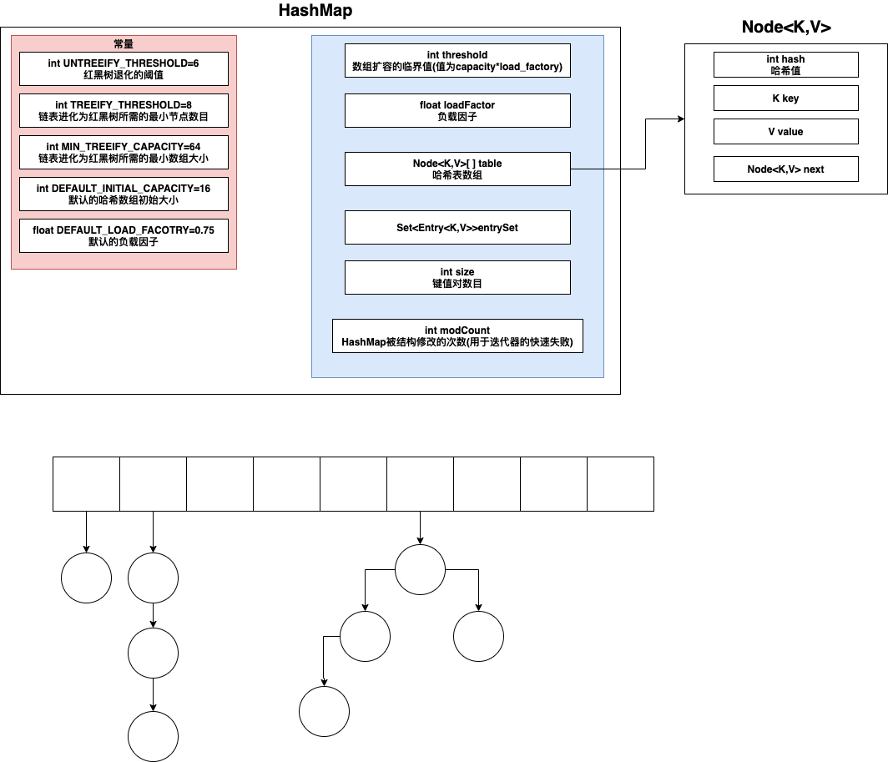
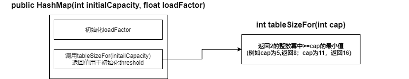
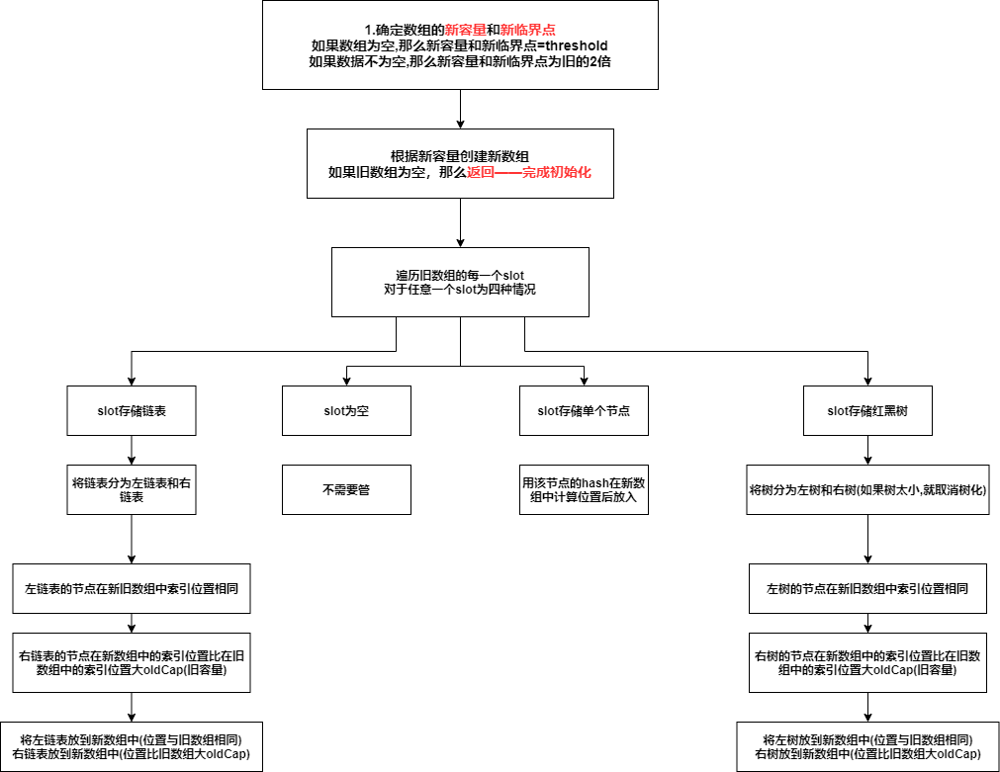
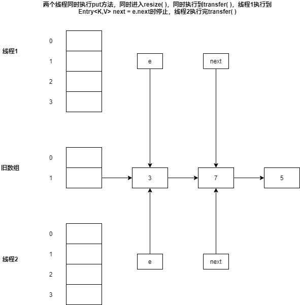
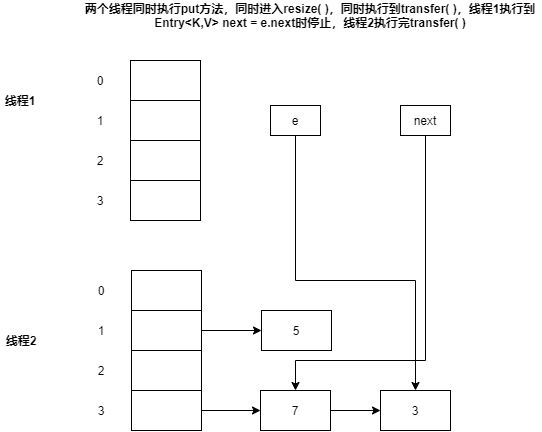
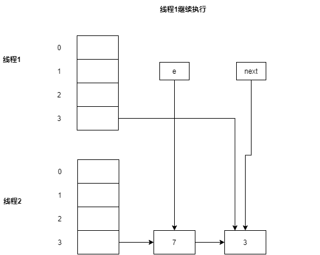
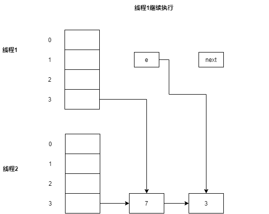
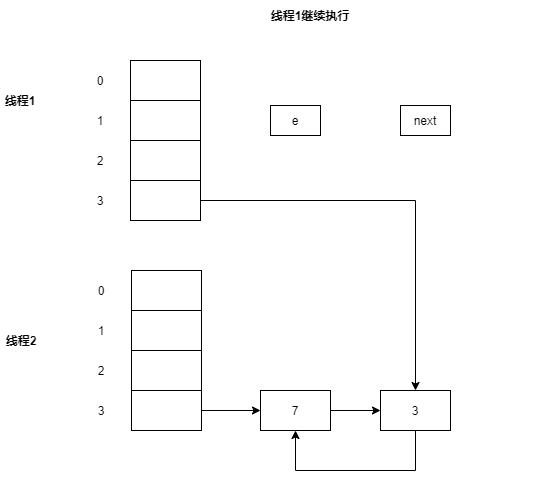

如果未说明版本，那么默认为**JDK1.8**


# 1. HashMap数据结构

HashMap采用 **数组+链表+红黑树** 来存储元素




# 2. HashMap方法

## 2.1 构造方法



* 构造方法仅仅初始化 **loadFactor**和 **threshold**，不会初始化哈希表数组table以及entrySet

* 如果传递了initialCapacity参数，那么threshold为tableSizeFor计算出来的值

  如果没有，那么threshold不会在构造方法中初始化，而是在第一次调用put时，初始化为**DEFAULT_LOAD_FACTOR * DEFAULT_INITIAL_CAPACITY(12)**

## 2.2 哈希函数，计算索引

### 2.2.1 哈希函数

```java
reutrn (key==null)?0:(h=key.hashCode())^(h>>>16);//h>>>16表示取高16位
```

### 2.2.2 计算索引

```
hash&(table.length-1)
```


## 2.3 put


* 如果**找到了hash和key相同的节点**，那么修改其值就结束了

* 如果没有找到，需要创建新节点，那么在整个操作最后会对 **modCount**和 **size**作自增操作，并且进行resize()判断

* **链表进化为红黑树需要满足2个条件**
  
  * **单个链表的元素个数>=TREEIFY_THRESHOLD(8)**
  
  * **table的长度>=MIN_TREEIFY_CAPACITY(64)**
  
    > 如果链表元素个数>=8，但是table长度<64，那么不会进化为红黑树，而是对table扩容
  
* **数组扩容的情况**

  * 第一次调用put方法——构造方法不会初始化table，所以第一次调用put时，会通过resize()来初始化table
  * 在链表中插入一个元素后，链表元素个数>=8 ，但是table长度<64，那么会对数组进行扩容
  * 插入一个元素后，如果键值对个数> threshold，那么会对数组进行扩容


## 2.4 resize扩容




## 2.5 get

1. 计算哈希值
2. 通过哈希值计算索引位置
3. 如果索引位置为空，返回空
4. 如果不为空，判断索引位置的元素是否为要找的元素，如果是，就返回该节点
5. 判断索引位置存储的是链表还是红黑树
   * 链表——遍历链表查找
   * 红黑树——在红黑树中查找

## 2.6 remove

计算要删除的元素的索引值

* 该位置为空，删除
* 该位置只有一个节点，检查是否是要节点的元素，如果是，删除该节点
* 如果该位置是链表，那么从链表中删除指定元素
* 如果该位置是红黑树，那么从红黑树中删除该元素
  * 删除后，如果红黑树的节点数目<6，那么退化为链表

如果发生了删除操作，那么 **modCount自增**，**size自减**


# 3. HashMap的数组长度总是2的n次方

HashMap通过 **hash&(table.length-1)**来计算索引

底层数组长度是2的n次方，该计算效率最高

由于length是2的整数幂，length-1的二进制中低位就全是1，高位全部是0。在与hash值进行&运算时，低位的值总是与原来hash值相同，高位&运算时值为0。这就保证了不同的hash值发生碰撞的概率比较小，这样就会使得数据在table数组中分布较均匀，查询速度也较快


# 4. HashMap的线程不安全

JDK1.7——死循环，数据丢失，数据覆盖

JDK1.8——数据覆盖（并发put）


## 4.1 JDK1.7—扩容导致的死循环

JDK1.7中，扩容操作会造成线程不安全，根源就在JDK1.7的transfer函数中。transfer方法将原有Entry数组的元素拷贝到新的Entry数组里——导致死循环（调用resize()扩容的时候，会调用transfer() ）

```java
void resize(int newCapacity) {
     Entry[] oldTable = table;
     int oldCapacity = oldTable.length;
     if (oldCapacity == MAXIMUM_CAPACITY) {
     threshold = Integer.MAX_VALUE;
     return;
     }
     // 创建2倍大小的新数组
     Entry[] newTable = new Entry[newCapacity];
     // 将旧数组的链表转移到新数组，就是这个方法导致的hashMap不安全，等下我们进去看一眼
     transfer(newTable, initHashSeedAsNeeded(newCapacity));
     table = newTable;
     // 重新计算扩容阈值(容量*加载因子)
     threshold = (int)Math.min(newCapacity * loadFactor, MAXIMUM_CAPACITY + 1);
}
```

```java
void transfer(Entry[] newTable) {
  //src引用了旧的Entry数组
  Entry[] src = table; 
  int newCapacity = newTable.length;
 
  for (int j = 0; j < src.length; j++) {
    Entry<K,V> e = src[j]; //取得旧Entry数组的每个元素
    if (e != null) {
      src[j] = null;//释放旧Entry数组的对象引用（for循环后，旧的Entry数组不再引用任何对象）
  	do {
   		Entry<K,V> next = e.next;//如果一个线程执行到这里挂起，另一个线程完成transfer操作，当该线程继续运行就可能导致死循环
   		int i = indexFor(e.hash, newCapacity); //计算元素在新数组中的位置

   		e.next = newTable[i]; 
   		newTable[i] = e; //头插法插入元素
   		e = next; //访问下一个元素
   		} while (e != null);
  	}
 	}
}
```

* JDK1.7中采用数组+链表才存储元素

* JDK1.7中HashMap采用的是 **头插法**

* 扩容时，遍历每一个slot，对于一个slot中的链表进行如下操作
  * 遍历链表，计算链表中每个节点在新数组中的索引，然后将其插入到新数组中的新位置中
  
  * 这里插入采用的是 **头插法(将节点插入到原有链表的头部)**，头插法会导致链表的顺序翻转，会导致死循环
  
    
    
    
    
    
    
    
    
    


## 4.2 JDK1.8—扩容导致数据覆盖

* 并发put时候，2个线程同时执行到 **(计算索引，判定索引位置是否为空)**，假设该位置为空，A线程执行完该判断操作后挂起，B执行该操作，然后往该位置设置了节点，然后A也往该位置设置了节点——导致数据覆盖
* 代码末尾的++size，也会导致数据覆盖——多个线程执行++size，但是


# 5. JDK1.7的HashMap

## 5.1 数据结构

JDK1.7的HashMap采用**链表数组**来存储元素

## 5.2 JDK1.8相对于JDK1.7做了哪些优化

1. 数据结构上的优化
2. 链表插入的方式由头插法改为了尾插法
3. JDK1.7扩容的时候，每个元素的位置需要重新哈希，JDK1.8的时候，每个元素的位置要么不变，要么原来索引+旧数组容量