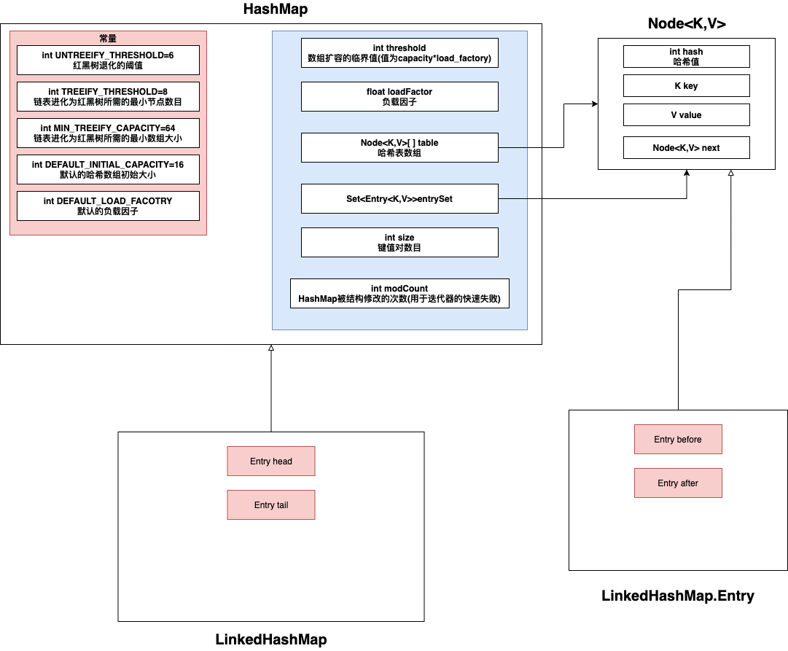
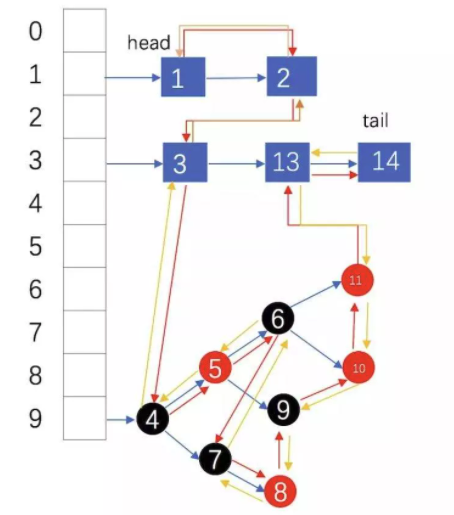

## 1. LinkedHashMap数据结构

* LinkedHashMap继承自HashMap，在拥有HashMap的 数组+链表+红黑树 结构外，还有head和tail两个指针——构成一个双向链表

* 所以LinkedHashMap的数据结构如下图——LinkedHashMap的数据结构分2个维度来看
  
  * 哈希表——每个哈希桶中要么是链表要么是红黑树，哈希表用于快速定位
  * 双向链表——双向链表是一个LRU列表（没有容量限制，所以不会淘汰最老的元素），头部节点老，尾部节点新
  
  

## 2. LinkedHashMap中双向队列的顺序

LinkedHashMap的双向队列两种顺序——插入顺序，访问顺序

* 插入顺序：默认情况，双向链表中的节点按照插入的顺序排列
* 访问顺序：将accessOrder设置为true，双向链表中的节点按照访问的顺序排列（put和get已经存在的节点，会将其移动到链表尾部）

## 3. put()

LinkedHashMap的put()逻辑与HashMap基本一致，就是添加了额外的2个逻辑

* 如果put()操作是对存在的元素进行了更新——那么会调用 **afterNodeAccess()**
  * 默认情况下，accessOrder为false，不会进行任何动作
  * 可以在构造方法中初始化accessOrder为true，那么该方法会将操作的节点移动到链表的尾部
* 如果put()操作是插入了一个元素——那么会调用 afterNodeInsertion()
  * 该方法可能会删除最老的节点（默认实现是永远不会进行删除的，如果想要实现需要复写removeEldestEntry()方法）

## 4. get()

* 调用HashMap的getNode()获取节点，如果获得的节点不为null，那么还会进行额外操作——调用 **afterNodeAccess()（逻辑同上）**

## 5. remove()

* remove()逻辑与HashMap基本一致，就是一处节点之后——调用 **afterNodeRemoval()——将节点从双向链表中删除**

## 6. keySet()

获取LinkedhashMap的keySet()，然后通过迭代器去访问——访问的顺序就是 **双向链表中的顺序**