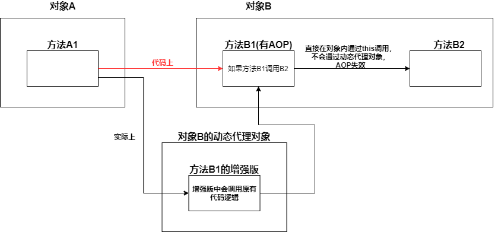

* **一个方法可以有多个AOP**

* 不同对象间的函数调用不会导致AOP失效

* **AOP失效**

  * AOP增强的方法必须是非private的，private方法无法使用AOP

  * **同一个对象**内的**函数自调用**会导致**被调用函数**的AOP失效
    * 解决方法
      1. 将被调用函数移动到另一个类中
      2. 在类中注入自己，然后通过注入的引用来调用被调用函数
  * final修饰方法——导致AOP失效
  * static修饰方法——导致AOP失效
  * 对象未被Spring管理