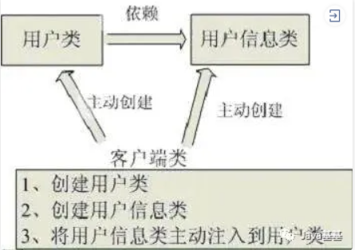
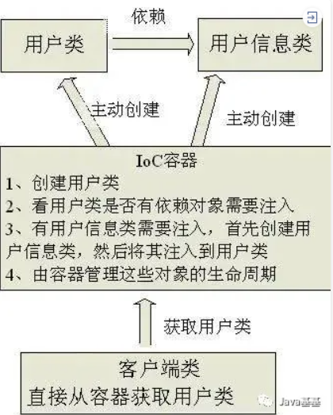

### 1. IoC是什么

IoC(Inversion of Control)控制反转

在Java开发中，IoC意味着将你设计好的对象交给容器控制，而不是传统的在对象内部直接控制

> * **理解控制**
>
>   传统Java SE中，我们直接在对象内部通过new创建对象——程序主动去创建依赖对象
>
>   IoC有专门的一个容器来创建这些对象——由IoC来控制这些对象的创建，而不需要显示new
>
> * **理解反转**
>
>   传统程序是我们在对象中主动控制去直接获取依赖对象（正转）
>
>   
>
>   IoC容器来帮助我们注入对象需要的依赖对象（反转）
>
>   
>
>   

### 2. IoC和DI

DI（Dependency Injection）依赖注入——组件之间的依赖关系由容器在运行期决定（由容器动态地将某个依赖关系注入到组件中）

### 3. IoC和DI的意义

在没有使用Spring的时候，每个对象在需要使用他的合作对象或者依赖对象时，自己均要使用new来将合作对象创建出来，这个合作对象是由自己主动创建出来的，创建合作对象的主动权在自己手上，自己需要哪个合作对象，就主动去创建，创建合作对象的主动权和创建时机是由自己把控的，而这样就会使得对象间的耦合度高了，A对象需要使用合作对象B来共同完成一件事，A要使用B，那么A就对B产生了依赖，也就是A和B之间存在一种耦合关系，并且是紧密耦合在一起。

使用了Spring之后就不一样了，创建合作对象B的工作是由Spring来做的，Spring创建好B对象，然后存储到一个容器里面，当A对象需要使用B对象时，Spring就从存放对象的那个容器里面取出A要使用的那个B对象，然后交给A对象使用，至于Spring是如何创建那个对象，以及什么时候创建好对象的，A对象不需要关心这些细节问题

所以控制反转IOC(Inversion of Control)是说创建对象的控制权进行转移，以前创建对象的主动权和创建时机是由自己把控的，而现在这种权力转移到第三方，比如转移交给了IOC容器，它就是一个专门用来创建对象的工厂，你要什么对象，它就给你什么对象，有了 IOC容器，依赖关系就变了，原先的依赖关系就没了，它们都依赖IOC容器了，通过IOC容器来建立它们之间的关系