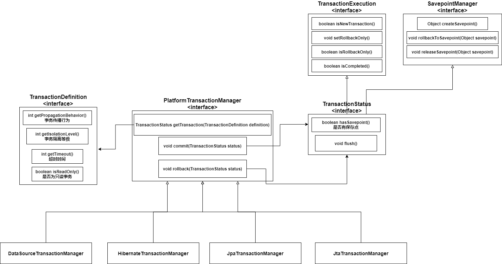

### 1. Spring事务介绍

Spring并不直接管理事务，而是提供了多种事务管理器，他们将事务管理的职责委托给Hibernate或者JTA等持久化机制所提供的相关平台框架的事务来实现。
Spring事务管理器的接口是**PlatformTransactionManager**，通过这个接口，Spring为各个平台如JDBC、Hibernate等都提供了对应的事务管理器，但是具体的实现就是各个平台自己的事情了。如下图




> Spring根据事务配置生成TransactionDefinition对象，传参给PlatformTransactionManager对象的getTransaction()方法，得到TransactionStatus对象


### 2. 事务传播属性

多个事务同时存在时，Spring该如何处理这些事务的行为

|         常量名称          |                           常量解释                           |
| :-----------------------: | :----------------------------------------------------------: |
|   PROPAGATION_REQUIRED    | 支持当前事务，如果当前没有事务，就新建一个事务（Spring默认） |
| PROPAGATION_REQUIRES_NEW  | 新建事务，如果当前存在事务，将当前事务挂起，先执行新建的事务。新建的事务和被挂起的事务没有任何关系，是两个独立的事务，外层事务失败回滚后，不能回滚内层事务执行的结果(内层事务已提交)，内层事务失败抛出异常，外层事务捕获，也可以选择不处理回滚操作 |
|   PROPAGATION_SUPPORTS    |      支持当前事务，如果当前没有事务，就以非事务方式执行      |
|   PROPAGATION_MANDATORY   |          支持当前事务，如果当前没有事务，就抛出异常          |
| PROPAGATION_NOT_SUPPORTED |    以非事务方式执行操作，如果当前存在事务，将当前事务挂起    |
|     PROPAGATION_NEVER     |         以非事务方式执行，如果当前存在事务，抛出异常         |
|    PROPAGATION_NESTED     | 如果当前已经存在一个事务，则运行在一个嵌套的事务中，嵌套事务独立于当前事务进行单独地回滚和提交，内部事务的回滚不会对外部事务造成影响；如果当前事务不存在，按照REQUIRED执行 |

> 假设外层事务ServiceA的 methodA()调用了内层ServiceB的methodB()
>
> * REQUIRED
>
>   如果B()的传播属性为 REQUIRED，那么执行 ServiceA.methodA() 的时候spring已经起了事务，这时调用 ServiceB.methodB()，ServiceB.methodB() 看到自己已经运行在 ServiceA.methodA() 的事务内部，就不再起新的事务，加入当前事务
>
>   假如 ServiceB.methodB() 运行的时候发现自己没有在事务中，他就会为自己分配一个事务。
>
>   这样，在 ServiceA.methodA() 或者在 ServiceB.methodB() 内的任何地方出现异常，事务都会被回滚。
>
> * REQUIRES_NEW
>
>   如果B()的传播属性为 REQUIRED_NEW，那么当执行到 ServiceB.methodB() 的时候，ServiceA.methodA() 所在的事务就会挂起，ServiceB.methodB() 会起一个新的事务，等待 ServiceB.methodB() 的事务完成以后，挂起的事务才继续执行。
>
>   如果 ServiceB.methodB() 已经提交，那么 ServiceA.methodA() 失败回滚，ServiceB.methodB() 是不会回滚的。如果 ServiceB.methodB() 失败回滚，如果他抛出的异常被 ServiceA.methodA() 捕获，ServiceA.methodA() 事务仍然可能提交(主要看B抛出的异常是不是A会回滚的异常)。
>
> * SUPPORTS
>
>   假设ServiceB.methodB() 的事务级别为 PROPAGATION_SUPPORTS，那么当执行到ServiceB.methodB()时，如果发现ServiceA.methodA()已经开启了一个事务，则加入当前的事务，如果发现ServiceA.methodA()没有开启事务，则自己也不开启事务。这种时候，内部方法的事务性完全依赖于最外层的事务
>
> * MANDATORY
>
>   如果ServiceB.methodB()事务级别为 PROPAGATION_MANDATORY，那么当执行到ServiceB.methodB()时，如果发现ServiceA.methodA()已经开启了一个事务，则加入当前的事务，如果发现ServiceA.methodA()没有开启事务，则抛出异常
>
> * NOT_SUPPORTED
>
>   以非事务方式执行，如果当前存在事务，将事务挂起——将ServiceA.methodA()的事务挂起，以非事务方式执行ServiceB.methodB()，执行完后挂起的事务继续执行
>
> * NEVER
>
>   以非事务方式运行，如果发现当前存在事务，抛出异常（ServerA.methodA()必须无事务）
>
> * NESTED
>
>   如果ServiceB.methodB()的事务等级为PROPAGATION_NESTED
>
>   如果ServiceB.methodB()失败rollback，那么内部事务(ServiceB.methodB())将会回滚到它执行前的SavePoint，而外部事务(ServiceA.methodA())有以下两种处理方式
>
>   * 捕获异常，执行异常分支逻辑
>
>     ```java
>     void methodA(){
>         try{
>             ServiceB.methodB();
>         }catch(SomeException e){
>             //执行其他业务，如ServiceC.methodC();
>         }
>     }
>     ```
>
>     如果ServiceB.methodB()执行失败，那么它会回滚到执行之前的SavePoint（相当于没有执行果methodB）
>
>   * 外部事务根据自己的选择决定回滚还是提交
>
>     如果内部事务(ServiceB.methodB())rollback，那么外部事物可以根据配置决定是commit还是rollback
>
>   

### 3. Spring的隔离等级

* ISOLATION_DEFAULT：默认隔离等级，使用数据库默认的事务隔离等级
* ISOLATION_READ_UNCOMMITTED
* ISOLATION_READ_COMMITTED
* ISOLATION_REPEATABLE_READ
* ISOLATION_SERIALIZABLE


### 4. 事务失效

#### 1. AOP失效

Spring事务时通过AOP实现的，所以导致AOP失效的因素也会导致事务失效

* 一个类中方法自调用会导致AOP失效，事务也会失效

  >一个类中，方法A调用方法B，导致方法B的事务失效

* private方法无法使用AOP，事务也会失效，事务要求必须是public

* static修饰方法——导致AOP失效，事务也失效

* final修饰方法——导致AOP失效，事务也失效

* 对象未被Spring管理


#### 2. 跨数据源的事务

如果一个事务中对**不同的数据源**进行了操作，那么该事务失效


#### 3. 回滚异常配置不正确

默认情况下，方法抛出 **RuntimeException及其子类**，**Error及其子类**才会进行回滚

所以如果抛出其他异常，事务是不会回滚的，导致事务失效——可以通过 **rollbackFor**进行配置


#### 4. 数据库引擎不支持事务

数据库引擎本身不支持事务


#### 5. 多线程

多线程下，因为线程不归spring管理，所以线程不能获取spring注入的bean，也不能使用spring的事务


#### 6. 数据源没有配置事务管理器


### 5. 事务不会滚

#### 1. 错误的传播特性

事务的传播特性配置错误

#### 2. 自己吞了异常

如果在方法中将异常吞了，那么事务不会回滚

```java
 @Transactional
    public void add(UserModel userModel) {
        try {
            saveData(userModel);
            updateData(userModel);
        } catch (Exception e) {
            log.error(e.getMessage(), e);
        }
    }
```

#### 3. 抛出的异常跟事务的回滚异常不一样

事务默认的回滚异常时——RuntimeException及其子类，Error及其子类

我们也可以通过 rollbackFor 配置回滚异常

如果抛出的异常与回滚异常不一致，那么就无法回滚


### 6. 长事务导致的问题

```java
@Transactional(rollbackFor = Exception.class)
public void save(RequestBillDTO requestBillDTO){
     //调用流程HTTP接口创建工作流(RPC调用，耗时)
    workflowUtil.createFlow("BILL",requestBillDTO);
    
    //转换DTO对象
    RequestBill requestBill = JkMappingUtils.convert(requestBillDTO, RequestBill.class);
    requestBillDao.save(requestBill);
    //保存明细表
    requestDetailDao.save(requestBill.getDetail())
}
```

**产生的问题**——在很多人使用的时候，会导致数据库连接不足，将数据库连接池占满


#### 事务原因分析

@Transactional是使用AOP实现的，本质是在目标方法执行前后进行拦截，在目标方法执行前加入or创建一个事物，在目标方法执行后，根据实际情况选择 提交或回滚事务

Spring遇到该注解时，会自动从数据库连接池中获取connection，并开启事务然后绑定到ThreadLocal上

@Transactional注解包裹的整个方法都是使用同一个connection连接，如果方法中出现了耗时操作（第三方接口调用，业务逻辑复杂，批量数据处理等）就会导致占用这个connection时间很长——导致**长事务问题**


#### 长事务危害

1. 长事务运行时间长，迟迟不释放connection，容易导致数据库连接池被占满，应用无法获取连接资源
2. 容易导致数据库死锁（因为长事务执行时间长，操作的数据库资源对，获得的锁多）
3. 数据库回滚时间长
4. 在主从架构只能够导致主从延时变大


#### 解决方法——避免长事务

1. **使用编程式事务**

   使用编程式事务来手动管理事物的开启，提交，回滚，可以精细化控制事务的范围

2. **对方法进行拆分**

   将不需要事物的逻辑排除掉，同时注意避免事务失效
