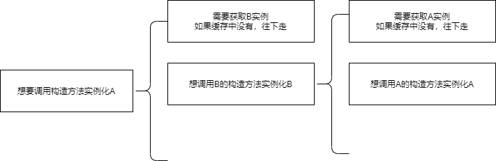

Spring常见三种注入依赖的方式

1. 字段用@Autowired进行依赖注入
2. 使用构造方法进行依赖注入
3. 通过setter进行依赖注入

# 循环依赖

> 以A依赖B，B依赖A为场景

## 1. 原型场景是不支持循环依赖的

原型场景——创建重复的对象（多例模式）

如果A，B都是多例模式，那么Spring会报错

> 如果一个类是多例模式，那么获取该类的对象时，不会查找缓存，而是直接创建
>
> 我们getBean(A.class)——代码会创建一个新的A对象，创建新的A时，发现要注入原型字段B，然后去创建B，创建B时发现要注入原型字段A，然后去创建A......

## 2. Spring内部如何解决循环依赖，一定是默认的**单例**Bean中

### 2.1 如果A，B有任何一方使用构造器注入，那么不支持循环依赖

### 2.2 A,B使用setter注入or@Autowired注入时，支持循环依赖

