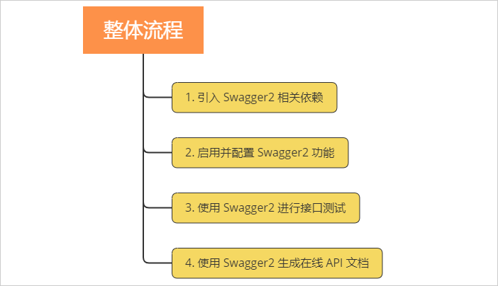
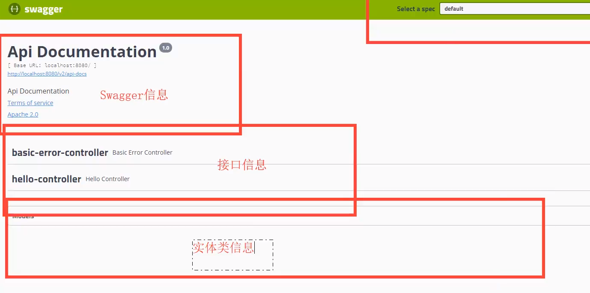

 
***
1. 引入依赖
```
<!-- 添加swagger2相关功能 -->
   	<dependency>
   		<groupId>io.springfox</groupId>
   		<artifactId>springfox-swagger2</artifactId>
   		<version>2.9.2</version>
   	</dependency>
   	<!-- 添加swagger-ui相关功能 -->
   	<dependency>
   		<groupId>io.springfox</groupId>
   		<artifactId>springfox-swagger-ui</artifactId>
   		<version>2.9.2</version>
   	</dependency>
```  
***
2. 启用并配置 Swagger2 功能  
   @Configuration——配置类   
   @EnableSwagger2——启动Swagger2功能
   @Bean——将Docket对象放入Spring容器    
```java
@Configuration//配置类
@EnableSwagger2//启动Swagger2功能
public class SwaggerConfiguration {
    @Bean//自定义的Docket对象要放入Spring容器
    public Docket getDocket(){
        //创建一个SwaggerAPI文档对象Docket，内置默认api信息
        Docket docket= new Docket(DocumentationType.SWAGGER_2);
        
        //创建api对象，自定义设置api信息
        ApiInfo apiInfo=getApiInfo();
        docket.apiInfo(apiInfo);
        
        //SwaggerAPI文档显示该包下的所有内容
       //select()出现必须有build(),select()和build()之间可以加apis()或paths()
        docket.select().apis(RequestHandlerSelectors.basePackage("com")).paths(PathSelectors.any()).build();
        return docket;
    }
    
    public ApiInfo getApiInfo(){
        //Contact对象存储作者信息——名字，网站，电子邮箱
        Contact contact=new Contact("黄相淇","url.com","907478820@qq.com");
        ApiInfo apiInfo = new ApiInfo(
                "黄相淇的SwaggerAPI文档",//api标题
                "欢迎来到黄相淇的SwaggerAPI文档",//api描述
                "1.0", //api版本号
                "team.url",//组织的URL
                contact,//Concat对象
                "Apache 2.0",//文档名称
                "http://www.apache.org/licenses/LICENSE-2.0",//文档链接
                new ArrayList<>());
        return apiInfo;
    }
}
``` 
***
3. 启动项目，然后访问 http://127.0.0.1:8080/swagger-ui.html ，即可打开自动生成的可视化测试页面，页面会显示Control和Model的信息   
   

***

4. 生成API文档——直接在Controller上加注解即可
* @Api:注解Controller，标记它为Swagger文档资源
   * tags：控制标签列表
      * 可以在一个 Controller 上的 @Api 的 tags 属性，设置多个标签，那么这个 Controller 下的 API 接口，就会出现在这多个标签中。
      * 如果在多个 Controller 上的 @Api 的 tags 属性，设置为同一个标签，那么这些 Controller 下的 API 接口，仅会出现在这一个标签中。
      * 本质上，tags 就是为了分组 API 接口，和 Controller 本质上是一个目的。所以绝大数场景下，我们只会给一个 Controller 一个唯一的标签。例如说，UserController 的 tags 设置为 "用户 API 接口"
* @ApiOperation：注解Controller方法，标记这是一个Api操作  
  * value：Api操作名
  * notes：Api操作描述
* @ApiImplicitParam：注解Controller方法上，标注方法的参数信息   
  * name ：参数名。
  * value ：参数的简要说明。
  * required ：是否为必传参数。默认为 false 。
  * dataType ：数据类型，通过字符串 String 定义。
  * dataTypeClass ：数据类型，通过 dataTypeClass 定义。在设置了 dataTypeClass 属性的情况下，会覆盖 dataType 属性。推荐采用这个方式。
  * paramType ：参数所在位置的类型。有如下 5 种方式：
     * "path" ：对应 SpringMVC 的 @PathVariable 注解。
     * 【默认值】"query" ：对应 SpringMVC 的 @PathVariable 注解。
     * "body" ：对应 SpringMVC 的 @RequestBody 注解。
     * "header" ：对应 SpringMVC 的 @RequestHeader 注解。
     * "form" ：Form 表单提交，对应 SpringMVC 的 @PathVariable 注解。
     * 😈 绝大多数情况下，使用 "query" 值这个类型即可。
  * example 属性：参数值的简单示例。
  * examples 属性：参数值的复杂示例，使用 @Example 注解。  
    
* @ApiModel ：注解类,标注Model类，Model类会出现在Swagger界面的Model信息中
  * value：Model的名字
  * description ：Model的描述     
    
* @ApiModelProperty：标注Model类的属性   
  * value：属性的描述 
  * dataType :和 @ApiImplicitParam 注解的 dataType 属性一致。不过因为 @ApiModelProperty 是添加在成员变量上，可以自动获得成员变量的类型
  * required:和 @ApiImplicitParam 注解的 required 属性一致
  * example :和@ApiImplicitParam 注解的 example 属性一致  

