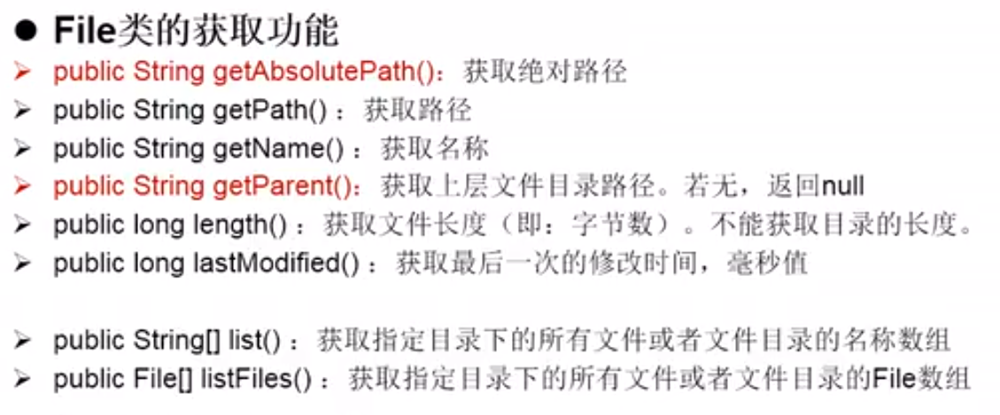
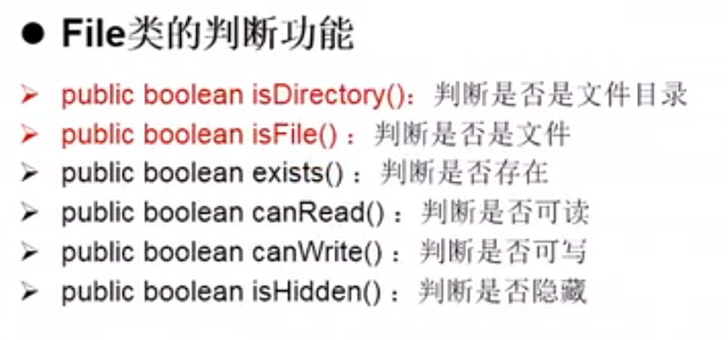

**File**——可以对任何类型的文件,目录进行操作,但不对内容进行操作   
1. **构造方法**  
* **public File(String pathname)**
* **public File(String parent, String child)**
* **public File(File parent, String child)**

2. **File的获取功能**
   
   
3. **File的重命名功能**  
   
   
4. **File的判断功能**  
    
   
5. **File的其他功能**  
* public boolean createNewFile()  ——文件不存在，创建，返回true;文件存在，返回false
* public long lastModified()  ——返回文件最后一次修改的时间
* public boolean mkdir()  ——创建文件路径下的单级目录
* public boolean mkdirs()  ——创建文件路径下的所有目录  