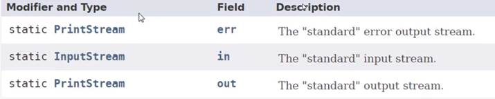
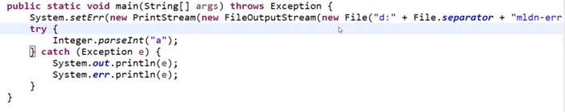

**System提供了3个常量——err，in，out**   

out——标准输出（默认为显示器输出）   
err——错误输出（默认为显示器输出）in——标准输入（默认为键盘输入）   

**out和err的区别**   
System.out.println( );System.err.println( );区别在于输出的内容，字体的颜色不同，其他无差别  

**out，err，in的可修改性**   
System类中还提供了可以修改out，err，in的方法    
我们可以通过这些方法修改输入输出的位置     
默认情况下，System.out.println( )和System.err.println( )是在显示器上进行输出   
但是进行如下操作后，System.err.println( )将把内容输出到文件中   
