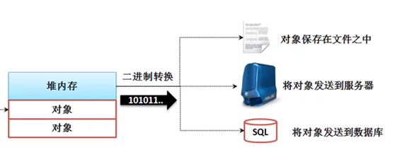

1. **什么是序列化和反序列化**  
   * **序列化**:  通过**ObjectOutputStream**将**Java对象**转换为**二进制流**,从而可以将对象信息保存在文件中,或者通过网络发送给其他主机,或者将对象存储到数据库中   
     
     
   * **反序列化**: 通过**ObjectInputStream**将**二进制流**重新转换为**Java对象**     

2. **序列化的条件**  
   一个自定义类如何才能够序列化
   * 1 实现Serializable接口  
   * 2 提供一个**private static final long serialVersionUID**
    * 3 除了要保证该类是可序列化的,还要保证该类内部的成员也都是可序列化,否则会报错    
        默认情况下基本数据类型都是可序列化的,String也可序列化   
 

3. **serialVersionUID的作用**   
* Java的序列化机制是通过在运行时判断类的serivalVersionUID来验证版本一致性的   
  在进行反序列化时，JVM会把传来的字节流中的serivalVersionUID与本地相应实体类的serialVersionUID进行比较，如果相同就认为是一致的，可以进行反序列哈，否则就不能进行反序列化   
  
* 凡是实现Serializable接口的类都必须有一个表示序列化版本标识符的静态常量private static final long serialVersionUID   
  如果我们没有人为赋予,那么JVM会**根据类的内部成员**帮我们创建一个UID,但这样只要类的内部成员发送改变，UID就会改变,可能会导致无法反序列化   
  所以,最好是**人为地设置serialVersionUID**   

4. **如何实现序列化和反序列化**   
* 序列化——ObjectOutputStream——void writeObject(Object obj)——将obj转换为二进制流输出   
* 反序列化——ObjectInputStream——Object readObject()——将二进制流转换为Java对象

5. **transient**   
用transient和static修饰的成员无法序列化

