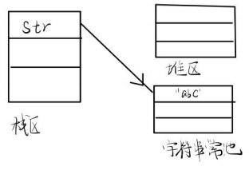
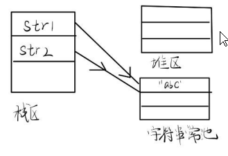
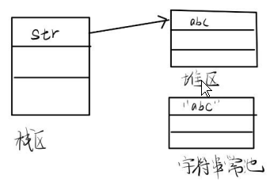
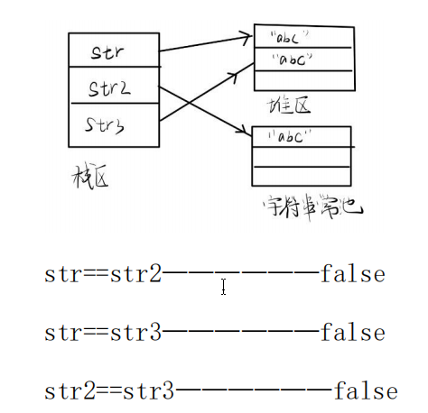
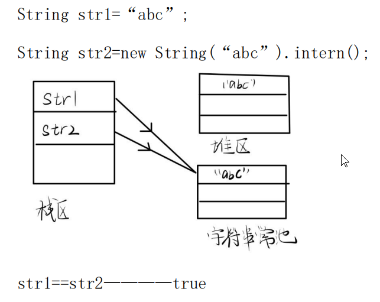

**1. 字符串介绍**  
JDK1.9 之后针对字符串的形式定义变多了   
JDK1.9 之前 String 用的是 private final char[] value     
JDK1.9 之后 String 用的是 private final byte[] value     
从上面可以看出，String 就是对数组的一种特殊包装应用 所有一旦赋值就无法改变    

String 类可以    
1，直接赋值 也可以通过    
2，构造方法进行实例化 两种方法的效果是不一样的  

**2. String的两种创建方式**  
==是数值比较，比较的是对象时，判断的是两个对象的内存地址是否相同(两个引用是否指向同一个对象)    
equals() 判断的是两个对象的内容是否相同      
首先我们要先了解 Java 中的字符串常量池      

**①String 直接赋值**    
字符串常量其实是 String 类的隐匿对象 String str="abc" 去字符串常量池中查看字符串"abc"是否在字符串常量池中      
如果不在————在字符串常量池中创建一个 String 对象("abc")， 然后 str 保存这个对象的内存地址(指向这个对象)     
如果在————str 保存字符串常量池中 String 对象("abc")的地址 无论以后用这种方式创建多少个值为”abc”的字符串对象，始终只 有一个内存地址被分配。   

   

```
String str1="abc";
String str2="abc";
```

str1==str2;————————true，因为 str1 和 str2 都保存着字符串常量池中 String 对象("abc")的地址    

**②new String创建字符串**     
String str=new String("abc");     
字符串常量池会检测"abc"是否在常量池中    
如果不在————在字符串常量池中创建一个 String 对象("abc")， 然后再堆中也创建一个 String 对象("abc") 也就是会创建 2 个 String 对象，str 保存堆中 String 对象的地址     
如果在—————在堆中创建一个 String 对象，然后 str 保存堆中 String 对象的地址     

    

String str2="abc"—————直接指向字符串常量池中的 String 对象"abc"    
String str3=new String("abc")—————在堆中再创建一个 String 对象("abc")，str3 保存该对象的地址    

   

**③String的intern()**     
String引用调用intern()方法，会去字符串常量池中查找时候有内容相同的字符串常量   
如果有，返回该字符串常量的引用    
如果没有，在字符串常量池中创建一个字符串常量，并返回其引用   

   

**3. String是不可变对象**   
String str=“abc”;————在字符串常量池中创建“abc”对象， str 保存该对象的地址    
str=str+”efg”;————原来 str 指向的“abc”对象并没有消失， 仍然保存在字符串常量池中 而是创建了一个新的 String 对象”abcdefg”,str 指向了“abcdefg”    
由此也可以看出，频繁的对 String 对象进行修改，会造成很 大的内存开销。    
此时应该用 StringBuffer 或 StringBuilder 来代替 String。     
而 new String（）更加不适合，因为每一次创建对象都会调用 构造器在堆中产生新的对象，性能低下且内存更加浪费。
