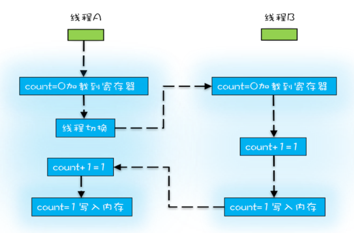

### 1. 可见性

#### 1.1 概念

一个线程对共享变量的修改，另一个线程可以立刻看到

#### 1.2 可见性问题

JMM中，每个线程都有自己的 **本地内存**，线程修改数据会现在本地内存修改，然后再由本地内存刷新到主内存，这就可能导致A线程在自己的本地内存中修改了共享变量的值，但是B线程无法同步获得更新的值，这就导致了 **内存可见性**问题

（硬件：每个CPU都有自己的Cache，读操作：将数据从内存读入Cache，然后才能访问；写操作：直接在Cache中修改）

### 2. 原子性

#### 2.1 概念

一个或多个操作在CPU执行时不被中断

#### 2.2 线程切换对原子性的挑战

* CPU为每个线程分配时间片，CPU通过 **时间片分配算法**来执行任务，一个线程的任务执行一个时间片后，会切换到下一个线程的任务，CPU就这样不停的切换线程
* Java里的一条语句往往需要多条CPU指令，**但线程切换可以发生在任何一条CPU执行完**，这就可能导致一条语句只执行了一半，就发生切换，导致语句无法获得预期的结果

#### 2.3 例子

count+=1有三条CPU指令

1. 将count从内存读取寄存器
2. 寄存器执行+1
3. 将值写入内存

### 3. 有序性

#### 3.1 概念

程序按照代码的先后顺序执行

#### 3.2 指令重排序带来的有序性问题

编译器和CPU为了提高程序的性能，会进行指令排序

指令重排序遵循as-if-serial规则，不会破坏单线程的程序的语义和数据依赖关系

但可能会破坏多线程程序的语义和数据依赖关系

### 4. 并发的缺点

* 上下文切换带来性能损耗
* 线程安全问题
