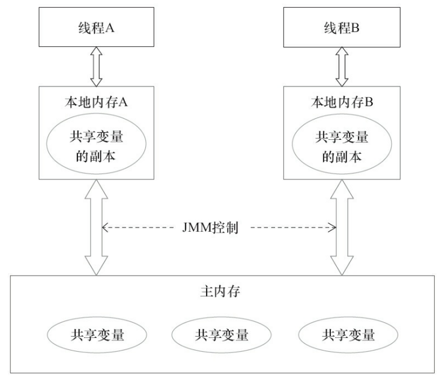
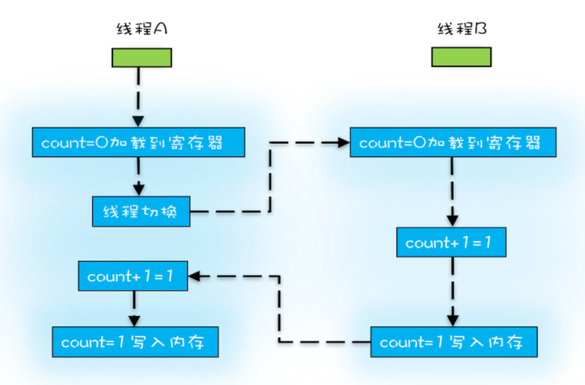
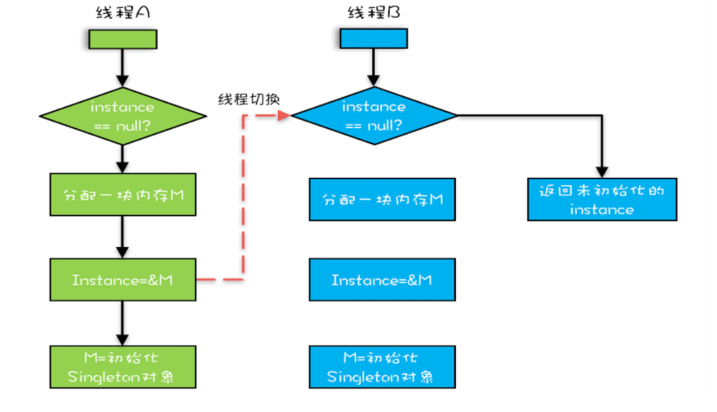

### 1. 可见性

#### 1.1 概念

一个线程对共享变量的修改，另一个线程可以立刻看到

#### 1.2 可见性问题



JMM中，每个线程都有自己的 **本地内存**，线程修改数据会现在本地内存修改，然后再由本地内存刷新到主内存，这就可能导致A线程在自己的本地内存中修改了共享变量的值，但是B线程无法同步获得更新的值，这就导致了 **内存可见性**问题

（硬件：每个CPU都有自己的Cache，读操作：将数据从内存读入Cache，然后才能访问；写操作：直接在Cache中修改）


### 2. 原子性

#### 2.1 概念

一个或多个操作在CPU执行时不被中断

#### 2.2 线程切换对原子性的挑战

* CPU为每个线程分配时间片，CPU通过 **时间片分配算法**来执行任务，一个线程的任务执行一个时间片后，会切换到下一个线程的任务，CPU就这样不停的切换线程
* Java里的一条语句往往需要多条CPU指令，**但线程切换可以发生在任何一条CPU执行完**，这就可能导致一条语句只执行了一半，就发生切换，导致语句无法获得预期的结果

#### 2.3 例子

count+=1有三条CPU指令

1. 将count从内存读取寄存器
2. 寄存器执行+1
3. 将值写入内存



### 3. 有序性

#### 3.1 概念

程序按照代码的先后顺序执行

#### 3.2 编译优化带来的有序性问题

编译器在编译时，会进行编译优化，其中的指令重排序会破坏代码执行的先后顺序，这在多线程编程时，可能会带来问题

#### 3.3 例子

```java
public class Singleton {
  static Singleton instance;
  static Singleton getInstance(){
    if (instance == null) {
      synchronized(Singleton.class) {
        if (instance == null)
          instance = new Singleton();
        }
    }
    return instance;
  }
}
```

* **创建对象的指令顺序**
  1. 分配一块内存 M；
  2. 在内存 M 上初始化 Singleton 对象；
  3. 然后 M 的地址赋值给 instance 变量。
* **指令重排序后的顺序**
  1. 分配一块内存 M；
  2. 将 M 的地址赋值给 instance 变量；
  3. 最后在内存 M 上初始化 Singleton 对象。

这就可能导致下图的问题



