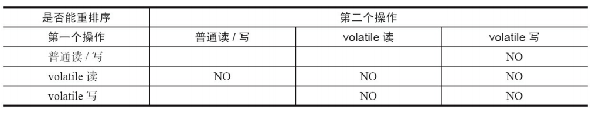
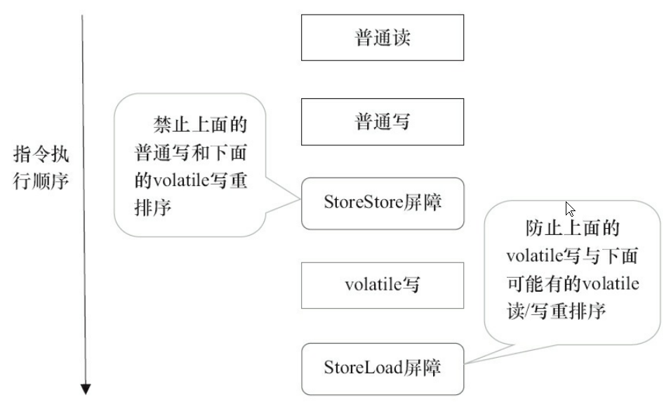
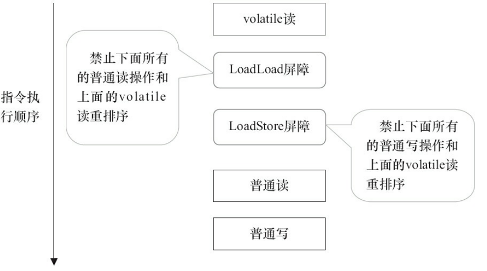

#### 1.1 保证变量的可见性

volatile变量的修改对所有线程可见，体现在读，写两方面

* **写**

  某个线程在自己的本地内存中修改volatile变量，会立刻刷新到主内存中

* **读**

  某个线程如果想要读取volatile变量，JMM将该线程对应的本地内存设置为无效，该线程只能从主内存中获取
  
  

#### 1.2 保证变量的单次读写具有原子性

对volatile变量的单次读写操作具有**原子性**(JMM不保证64位数据double或long的读写操作具有原子性)，对于 **i++这种复合操作**，仍然是没有原子性的

**volatile只保证变量的单次读写具有原子性，复合操作就没有原子性了**

#### 1.3 禁止指令重排序，保证有序性

- 当程序执行到volatile变量的读操作或者写操作时，在其前面的操作的更改肯定全部已经进行，且结果已经对后面的操作可见
- 在进行指令优化时，不能将volatile语句与其他语句重排序

编译器在生成字节码时，会插入 **内存屏障**来禁止指令冲排序

* 每个volatile写操作——前面插入一个StoreStore屏障（StoreStore保障到达volatile写时，前面的所有操作都已经同步到主内存中了），后面插入一个StoreLoad屏障

  

* 每个volatile读操作——前面插入LoadLoad和LoadStore

  

#### 1.4 volatile适用场景

volatile只能在有限的一些情况下使用volatile变量代替锁

* 通过CAS对volatile变量进行写
* 对变量的操作必须是原子的（i++这种不行）

