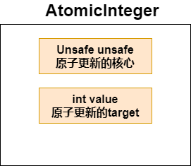

JDK提供了13个原子操作类，可以原子更新变量的值，原子操作类都是使用 **Unsafe**实现的包装类

* **特性**：在多线程环境下，当有多个线程同时执行这些类的实例包含的方法时，具有排他性，即当某个线程进入方法，执行其中的指令时，不会被其他线程打断，而别的线程就像自旋锁一样，一直等到该方法执行完成
* **实现**：通过CAS+volatile+Unsafe来保证源自操作

### 1. 原子更新基本类型类

* **AtomicBoolean原子更新boolean**
* **AtomicInteger原子更新int**
* **AtomicLong原子更新long**

上面三个类几乎一模一样，**以AtomicInteger为例**



```java
public AtomicInteger{
    private Unsafe unsafe;
    private int value;

    //获取value的值
    public final int get() {
        return value;
    }

    //设置value的值
    public final void set(int newValue) {
        value = newValue;
    }

    //对value进行原子+delta，返回加后的value
    public final int addAndGet(int delta) {
        return unsafe.getAndAddInt(this, valueOffset, delta) + delta;
    }

    //如果value的值与expect相同，那么更新value为update，返回true
    //否则，返回false
    public final boolean compareAndSet(int expect, int update) {
        return unsafe.compareAndSwapInt(this, valueOffset, expect, update);
    }

    //返回value的值，然后对value进行+1原子更新
    public final int getAndIncrement() {
        return unsafe.getAndAddInt(this, valueOffset, 1);
    }

    //懒惰更新，最终会设置成newValue，使用lazySet设置值后，可能导致其他线程在之后的一小段时间内还是可以读到旧的值
    public final void lazySet(int newValue) {
        unsafe.putOrderedInt(this, valueOffset, newValue);
    }

    //以原子方式设置为newValue的值，并返回旧值
    public final int getAndSet(int newValue) {
        return unsafe.getAndSetInt(this, valueOffset, newValue);
    }
}
```

### 2. 原子更新数组类型类

* **AtomicIntegerArray：原子更新int数组里的元素**
* **AtomicLongArray：原子更新long数组里的元素**
* **AtomicReferenceArray：原子更新引用数组中的元素**

### 3. 原子更新引用类型类

* **AtomicReference：原子更新引用**
* **AtomicReferenceFieldUpdater：原子更新引用所指对象中的属性**
* **AtomicMarkableReference：原子更新带有标记位的引用类**。可以原子更新一个boolean标记位和引用类型

### 4. 原子更新字段类型

* **AtomicIntegerFieldUpdater：原子更新int字段** 

* **AtomicLongFieldUpdater：原子更新long字段** 

* **AtomicStampedReference：原子更新带有版本号的引用**，该类将整数值与引用关联起来，可用于原子更新数据和数据的版本号，可以解决使用CAS进行原子更新时可能出现的ABA问题
