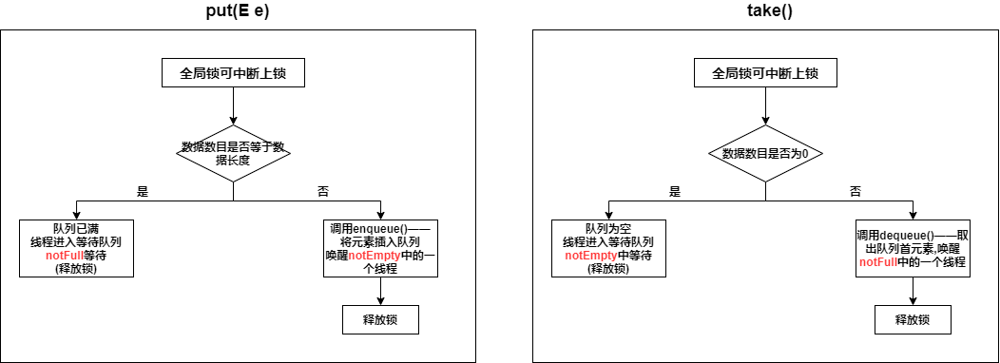

### 1. 什么是阻塞队列

阻塞队列是支持 **阻塞插入**和 **阻塞移除**的队列

阻塞队列通过 **通知模式**来实现

#### 1.1 阻塞插入

如果队列满了，那么进行插入操作的线程会阻塞，直到队列不满

#### 1.2 阻塞移除

如果队列为空，那么进行获得元素的线程会阻塞，直到队列不为空

#### 1.3 方法

| 方法/处理方式 | 抛出异常      | 返回特殊值                | 一直阻塞   | 阻塞，超时退出            |
| ------- | --------- | -------------------- | ------ | ------------------ |
| 插入      | add(e)    | offer(e)(空间不够—false) | put(e) | offer(e,time,unit) |
| 移除      | remove(e) | poll()(为空—null)      | take() | poll(time,unit)    |
| 检查      | element() | peek()(为空—null)      | 不可用    | 不可用                |

### 2. Java提供的阻塞队列

* **ArrayBlockingQueue**：一个由数组结构组成的有界阻塞队列。 
* **LinkedBlockingQueue**：一个由链表结构组成的有界阻塞队列。 
* **PriorityBlockingQueue**：一个支持优先级排序的无界阻塞队列。 
* **DelayQueue**：一个使用优先级队列实现的无界阻塞队列。 
* **SynchronousQueue**：一个不存储元素的阻塞队列。 
* **LinkedTransferQueue**：一个由链表结构组成的无界阻塞队列。 
* **LinkedBlockingDeque**：一个由链表结构组成的双向阻塞队列

### 3 ArrayBlockingQueue

用**数组**实现的**有界**阻塞队列，按照**FIFO**对元素排序

* 有一把全局锁——对队列的**操作**，都必须**加锁**

* 分为公平模式与非公平模式——由全局锁实现
  
  * 公平模式：阻塞的线程按照阻塞的顺序依次醒来继续操作
  * 非公平模式：反之**(默认)**

* 阻塞插入和阻塞删除的实现——依赖于 **notEmpty**与 **notFull**两个等待队列

* 阻塞插入——发生阻塞——在 **notFull**中等待
  
  阻塞删除——发生阻塞——在 **notEmpty**中等待

#### 3.1 类图


#### 3.2 构造方法

```java
    public ArrayBlockingQueue(int capacity) {
        this(capacity, false);
    }

    public ArrayBlockingQueue(int capacity, boolean fair) {
        if (capacity <= 0)
            throw new IllegalArgumentException();
        this.items = new Object[capacity];
        lock = new ReentrantLock(fair);//设置公平模式还是非公平模式
        notEmpty = lock.newCondition();
        notFull =  lock.newCondition();
    }
```

#### 3.3 阻塞方法



### 4. LinkedBlockingQueue

* 用链表实现的**有界阻塞**队列（最大大小为 Interger.MAX_VALUE），按照**FIFO**对元素排序

* 两个全局锁
  
  * **takeLock**：取操作加锁
  * **putLock**：写操作加锁

* 阻塞插入——发生阻塞——在 **notFull**中等待
  
  阻塞删除——发生阻塞——在 **notEmpty**中等待

#### 4.1 类图


#### 4.2 阻塞方法


### 5. ArrayBlockingQueue与LinkedBlockingQueue的区别

* ArrayBlockingQueue是存取共用一把锁，LinkedBlokingQueue是存有存锁，取有取锁

* ArrayBlockingQueue是put一个元素后，唤醒一个take线程；take一个元素后，唤醒一个put线程
  
  LinkedBlockingQueue是put一个元素后，查看是否还能再put一个，如果能，唤醒另一个put线程；take一个元素后，查看是否要有元素可以take，如果有，唤醒另一个take线程

### 6. PriorityBlockingQueue

**无界**阻塞优先队列，底层是一个**堆(数组实现的二叉树)**

* 元素实现 Comparable接口
* 传入Comparator

### 7. DelayQueue

* 支持 **延时**获取元素的无界阻塞队列
* 队列中的元素必须实现 **Delayed接口**，创建元素时，可以指定多久才能从队列中获取当前元素

### 8. SychronoutQueue

* 不存储元素的阻塞队列，每一个put操作必须等待take操作，否则不能继续添加元素

* 支持**公平模式** 与 **非公平模式**