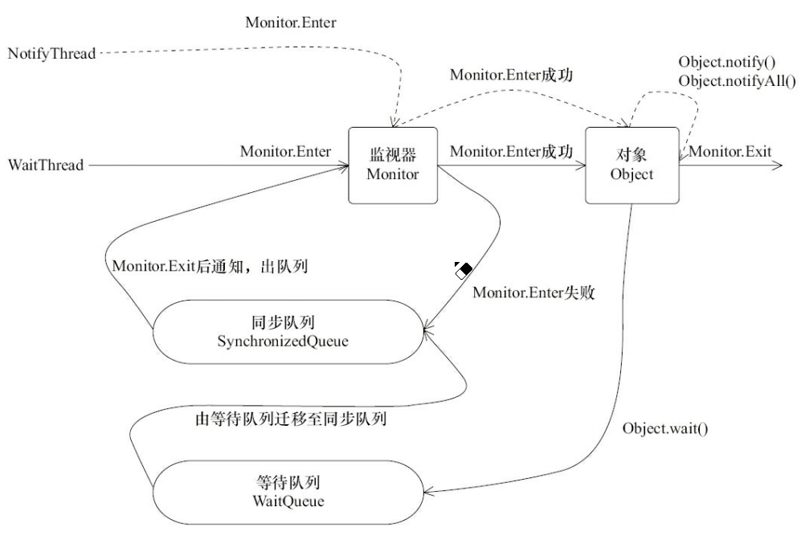

### 0. Java线程面试题

#### 0.1 线程占用的内存

* JDK1.4默认单个线程占用256K
* JDK1.5默认单个线程占用1M
* 可以通过-Xss参数设定

#### 0.2 为什么要使用线程池

* 手动创建线程池的缺点
  * 不受风险控制：服务器CPU资源有限，如果每个人都显示手动创建线程，不知道哪里的代码出现了多线程，在运行的时候所有线程都在抢占资源，不好控制
  * 频繁创建，开销大
  * 不好管理：可能无限制新建线程，可能占用过多系统资源导致死机或OOM。而重用存在的线程，减少对象创建、消亡的开销，性能佳
* 线程池优点
  * 降低系统资源消耗，通过重用已存在的线程，降低线程创建和销毁造成的消耗
  * 提高系统响应速度，当有任务到达时，通过复用已存在的线程，无需等待新线程的创建便能立即执行
  * 方便线程并发数的管控

### 1. 线程的状态

#### 1.1 线程状态枚举

* **NEW**

  线程被构建，还未start

* **RUNNABLE**

  运行状态

* **BLOCKED**

  阻塞状态，阻塞于锁

* **WAITING**

  等待状态

* **TIME_WAITING**

  超时等待状态，超过时间自行返回

* **TERMINATED**

  终止状态，表示线程执行完毕

#### 1.2 线程状态转换图


### 2. 守护线程和线程优先级

#### 2.1 守护线程

JVM中不存在非守护线程时，JVM会退出

#### 2.2 线程的优先级

创建线程的时候可以给线程设置优先级，优先级高的线程有更高的概率分配到更多的时间片（不绝对）


### 3. 线程中断

可以理解为Thread有个interrupted标识符，默认为false，表示一个线程是否被其他线程进行了中断操作

```java
public void interrupt();//将Thread的表示符设为false
public void isInterrupted();//返回标识符
public static isInterrupted();//返回标识符，并设为false
```

如果线程抛出InterruptedException，那么在抛出InterruptedException之前，JVM会先将标识符设为false，然后再抛出


### 4. 线程间通信

#### 4.1 通过volatile和synchronized

#### 4.2 等待/通知机制

* **sleep()**

  当前线程进入TIME_WAITING状态，不会释放锁，但会释放CPU资源

  一段时间后苏醒，回到RUNNABLE状态

* **yield()**

  当前线程由RUNNING状态变为READY状态，不会释放锁，但会释放CPU资源

* **wait()，notify()，nitifyAll()**

  * 使用wait(),notify(),nitofyAll()时需要对**调用对象加锁**（必须在同步代码块内）

  * 当前线程调用某个加锁对象的wait()后，会进入该对象的monitor对象的等待队列中，**释放锁，释放CPU资源**，**状态变为WAITING**

  * 当前线程调用某个加锁对象的notify()或nitifyAll()，等待队列中的线程从等待队列中移动到同步队列中，**线程状态由WAITING变为BLOKING**

    等待队列中的线程要想从wait()中返回，除了需要有其他线程调用notify()外，还需要等待线程释放锁，获得对象的锁后才能从wait()返回

  

* **join()**

  注意，wait()是Object的，join()是Thread的

  join()中底层调用的wait()

  若调用了thread2.join()

  就是让当前线程进入thread2的monitor对象的等待队列中，知道thread2结束才会被唤醒
  
  由于底层调用的是wait()，所以会释放锁，但注意释放的是thread2的锁

#### 4.3 等待/通知规范

* 等待方伪代码

  ```
  synchronized(对象){
  	while(条件不满足){
  		对象.wait();
  	}
  	对应的处理逻辑
  }
  ```

* 通知方伪代码

  ```
  synchronized(对象){
  	改变条件
  	对象.nitify();
  }
  ```

  


### 5. 创建线程的方式

#### 1. 继承Thread

#### 2. 实现Runnable接口/利用匿名对象/lambda表达式

#### 3. 实现Callable接口

#### 4. FutureTask(可以由调用线程执行其run()，也可以作为任务提交给线程池)

#### 5. 定时器

#### 6. Stream的parallelStream

#### 7. 线程池隐性创建


