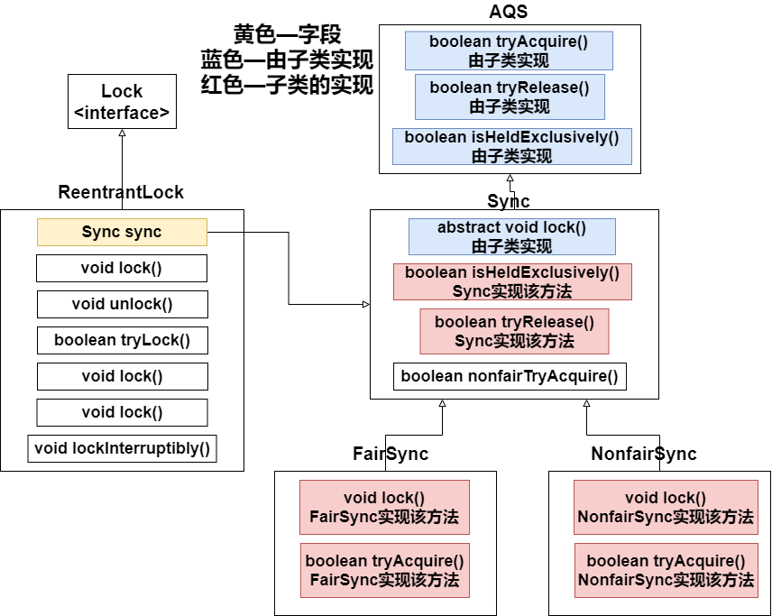
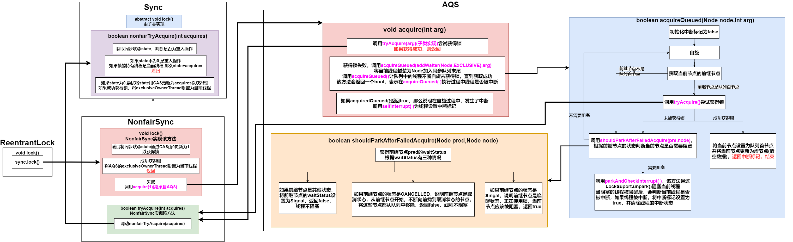
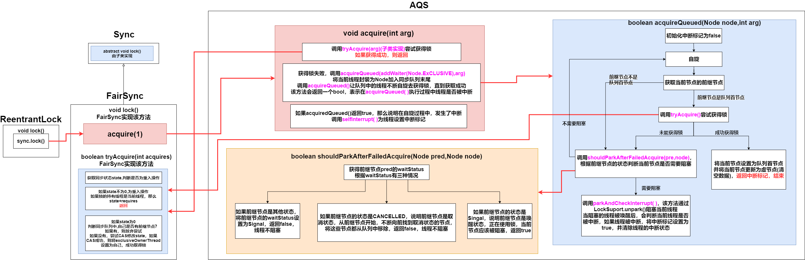
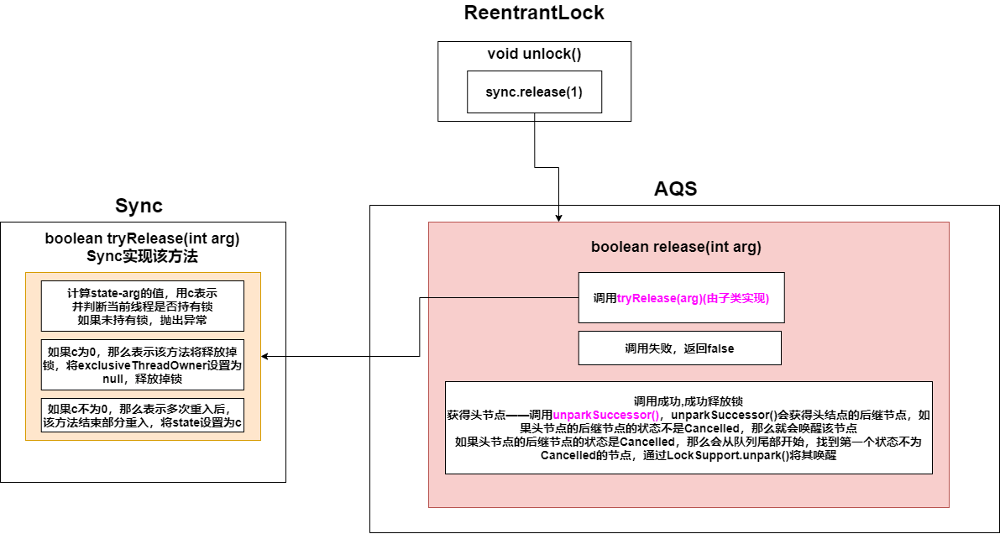

### 1. ReentrantLock介绍

**可重入**：任意线程获得锁后能够再次获取该锁而不会被锁阻塞

ReentrantLock实现了**AQS的独占模式**，是一个可重入锁，还分为 **公平锁**与 **非公平锁**

* **公平锁**：先对锁进行获取请求的线程一定先获得锁
* **非公平锁**

**非公平锁**的效率高于**公平锁**

**非公平锁**可能出现 **线程饥饿问题**——部分线程迟迟无法获得资源

**ReentrantLock**大多数方法的实现都是Sync及其子类来完成，ReentrantLock只是对外暴露了接口

### 2. ReentrantLock获得锁

#### 2.1 非公平锁获得锁

#### 2.2 公平锁获得锁

#### 2.3 公平锁与非公平锁的不同

**FairSync和NonfairSync的 lock() 和 tryAcquire() 逻辑不同**

1. 非公平锁在lock()方法的开始就会尝试去通过CAS修改同步状态以获得锁，公平锁不会

2. 在自旋时，非公平锁和公平锁都会在**前继节点为同步队列首节点时**，**调用tryAcquire()**尝试获取锁

   在 **tryAcquire()中**，如果state为0，那么非公平锁不会关心节点在同步队列中的位置，直接尝试CAS修改state获得锁；但是非公平锁关心节点的位置，会检查是否有前继节点，如果有，就会放弃

**上述2点**保证了公平锁一定是——先对锁进行获取请求的线程一定先获得锁，而非公平锁不一定

### 3. ReentrantLock释放锁

公平锁与非公平锁采用同一个逻辑

