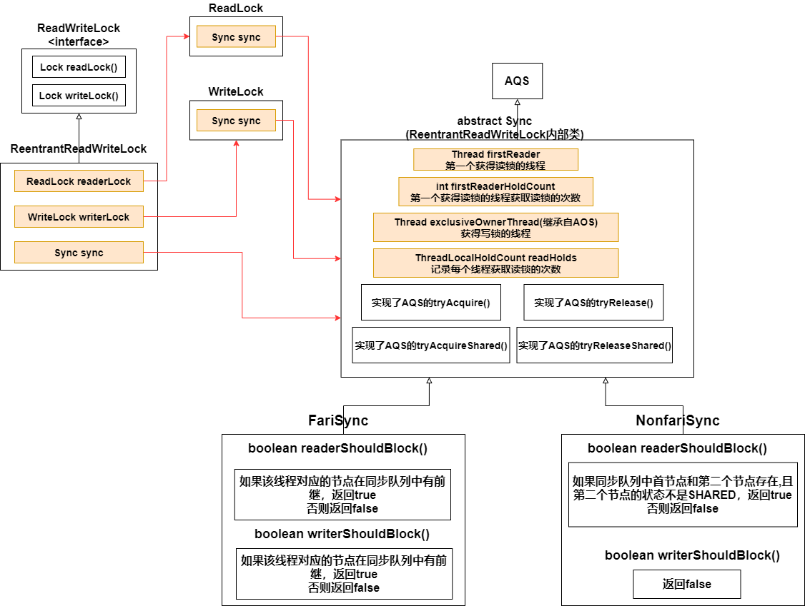
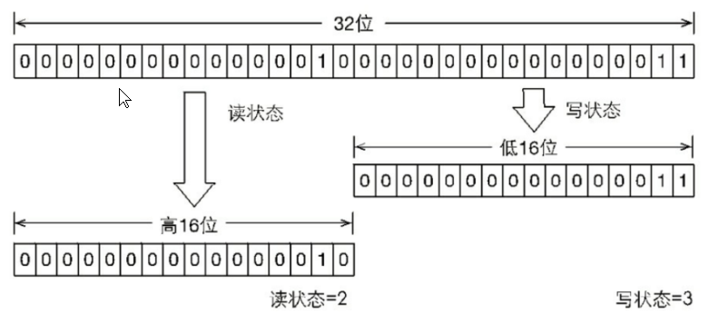
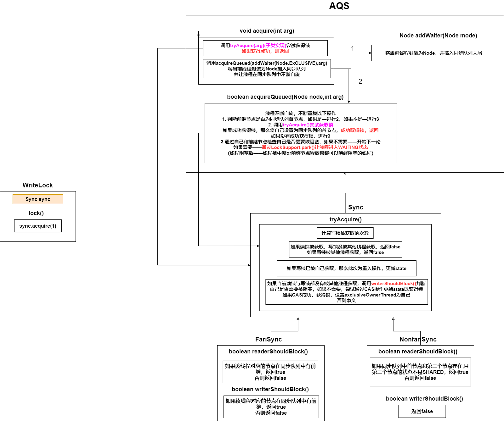
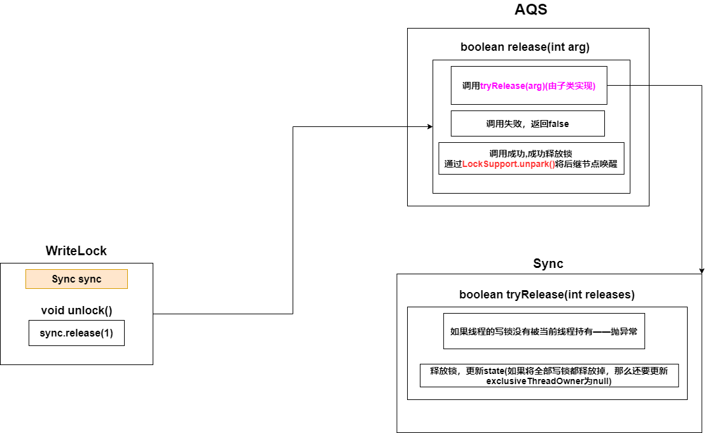
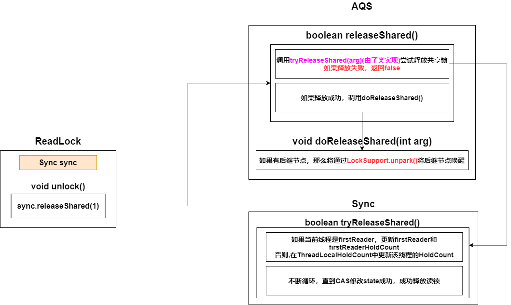

## 1. 类图结构

* ReadWriteLock中有一个**Sync对象**，ReadLock与WriteLock**共用**该**Sync对象**，读锁与写锁底层公用的是同一把锁

* ReentrantReadWriteLock中有一个 **读锁(ReadLock)**与一个 **写锁(WriteLock)**

  **读锁**是**共享模式**，**写锁**是**独占模式**，通过分离读写锁，提高并发性

* 读锁正在被使用时，其他线程可以直接获得读锁，不阻塞

  读锁正在被使用时，如果其他线程尝试取得写锁，会阻塞

  写锁正在被使用时，其他线程尝试获取读锁or写锁，都会阻塞

## 2. 特性

1. 支持公平锁与非公平锁，区别在于 **readerShouldBlock()**和 **writerShouldBlock()**的实现不同

2. **可重入**：拿到读锁后，可以再次获取读锁（但是不能再次获取写锁，拿到读锁后如果再次获取写锁，线程会一直阻塞）

   ​                拿到写锁后，可以再次获取写锁，也可以再次获取读锁

3. **锁降级**：线程拿到写锁后，在获取读锁，然后先释放掉写锁——降级为读锁

## 3. 方法

| 方法                    | 描述                                                         |
| ----------------------- | ------------------------------------------------------------ |
| int getReadLockCount()  | 获取读锁被获取的次数(**同步状态state进行位运算得到**)        |
| int getWriteHoldCount() | 返回当前线程获取写锁的次数(exclusiveOwnerThread指向的线程是获得写锁的线程，**state进行位运算得到**) |
| int getReadHoldCount()  | 返回当前线程获取读锁的次数，Sync内部有个ThreadLocalHoldCount(继承自ThreadLocal)保存有每个线程获取读锁的次数 |

## 4. 详细分析

### 4.1 读写状态设计

AQS通过 同步状态state来表示锁(0—锁可用，非0—锁不可用，可重入锁每重入一次state+1)

但在ReentrantReadWriteLock中ReadLock与WriteLock共用一个state，所以就不是这样简单的机制了

32位的state在ReentrantReadWriteLock中被划分为了两部分(16+16)

获得读锁，高16位+1（读锁状态——state>>16，读状态不为0——读锁已被获取）

获得写锁，低16位+1（写锁状态——state&&0x0000FFFF，写状态不为0——写锁已被获取）

### 4.2 写锁的获取与释放

#### 4.2.1 写锁的获取

#### 4.2.2 写锁的释放

### 4.3 读锁的获取与释放

#### 4.3.1 读锁的获取

#### 4.3.2 读锁的释放

