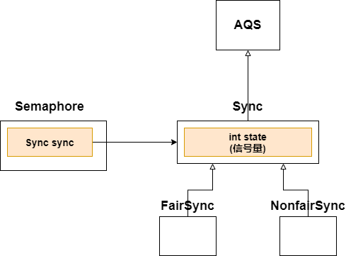
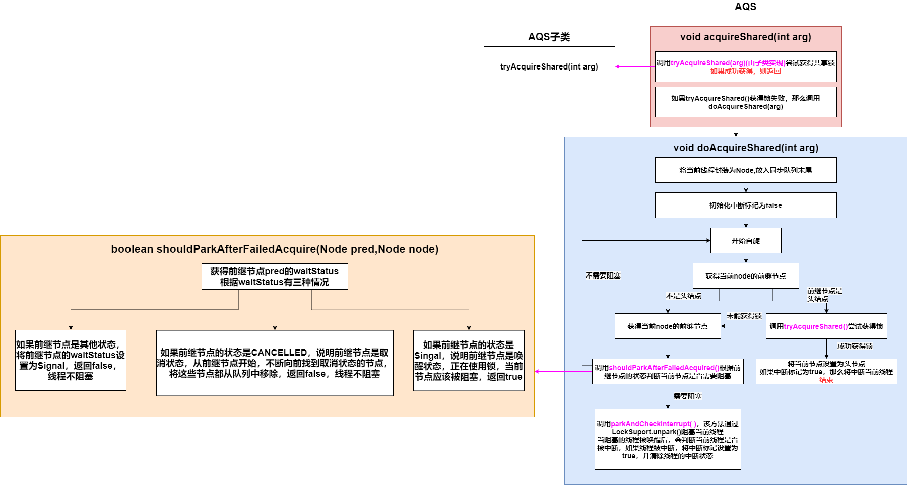
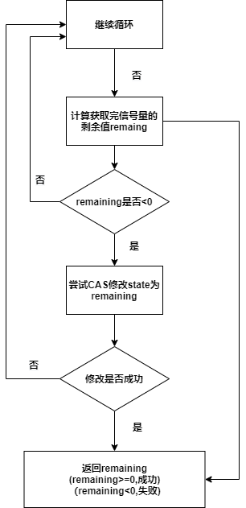
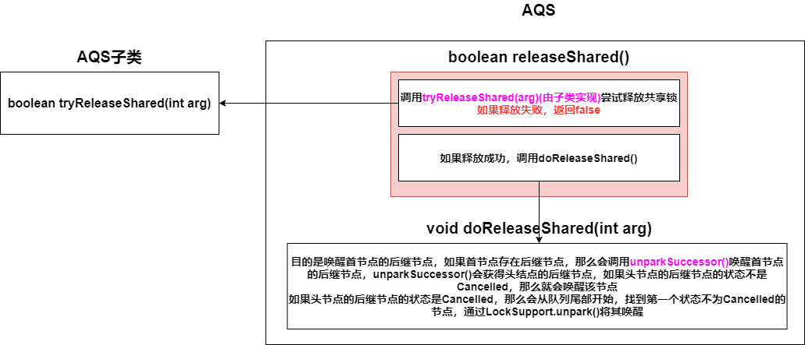
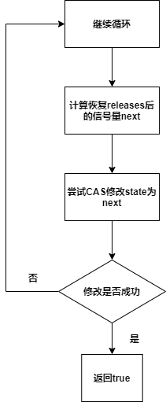

[toc]

### 1. Semaphore介绍

信号量，用来控制**同时访问特定资源的线程数目**

初始化时指定信号量(permits)的数目(本质还是AQS的state)

如果线程想要访问一个资源，必须先获得信号量减少，信号量为0时，线程无法访问资源，只能WATING等待信号量>0,

如果使用完资源，释放后，会补充信号量

（之前的ReentrantLock中state=0表示锁可用，state不为0表示锁不可用，Semaphore这里state不为0表示锁可用，state为0表示锁不可用）



### 2. 方法介绍

```java
//尝试获取一个信号量，如果信号量不为0，那么将信号量-1，返回
//如果信号量为0，WAITING直到信号量不为0
//可中断
public void acquire() throws InterruptedException

//尝试获取多个信号量，如果信号量足够，那么将信号量-permits，返回
//如果信号量不够，WAITING直到信号量不为0
//可中断 
public void acquire(int permits) throws InterruptedException
    
//同acquire()，但不可中断
public void acquireUninterruptibly()
    
//同acquire(int permits),但不可中断
public void acquireUninterruptibly(int permits)

//释放一个信号量
public void release()
    
//释放permits个信号量
public void release(int permits)
```


### 3. 方法详解

#### 3.1 void acquire(int permits)

底层调用的还是AQS共享模式获取锁的那一套




**公平模式**——**FariSync**中的 **tryAcquireShared(int acquires)**

.png)


**非公平模式**——**NonfairSync**中的  **tryAcquireShared(int acquires)**调用**Sync**中的 **nonfairTryAcquireShared(int acquires)**




#### 3.2 void release(int requires)

底层调用的还是AQS共享模式释放锁的那一套



**Sync**实现了 **tryReleaseShared(int releases)**


