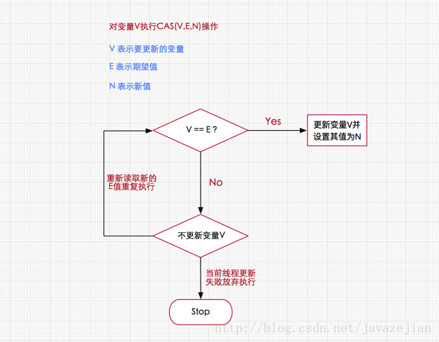

* CAS(Compare And Swap)有三个参数

  * V——要更新的变量
  * E——预期值
  * N——新值  

* CAS流程

  

  CAS会检查V的值是否为E，如果是，就执行更新操作  
  如果不是，那么CAS可以放弃执行，也可以进入自旋状态(不断尝试CAS操作，不会挂起线程，继续消耗CPU资源)

  

**CAS实现原子操作的三大问题**

* ABA问题——第一个线程执行CAS(V,E,U)操作，在获取到当前变量V，准备修改为新值U前，另外两个线程已连续修改了两次变量V的值，使得该值又恢复为旧值，这样的话，我们就无法正确判断这个变量是否已被修改过 
  * AtomicStampedReference解决    
    AtomicStampedReference原子类是一个带有时间戳的对象引用，在每次修改后，AtomicStampedReference不仅会设置新值而且还会记录更改的时间。当AtomicStampedReference设置对象值时，对象值以及时间戳都必须满足期望值才能写入成功 
* 使用循环CAS，时间长，开销大
* 只能保证一个共享变量的原子操作

