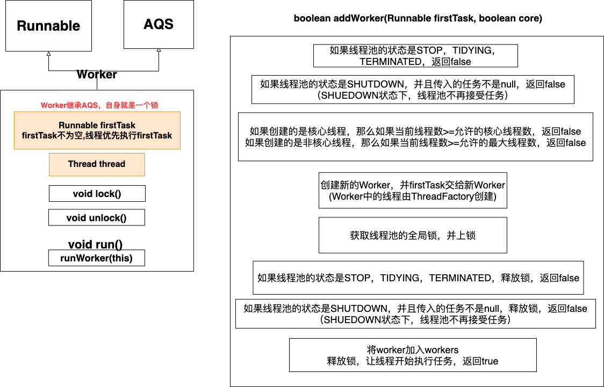

# 1. Executor框架介绍

## 1.1 任务的两级调度模型

应用程序通过Executor框架控制上层的调度

下层的调度有OS内核控制，不受应用程序控制


## 1.2 Executor架构结构

Executor架构分为**三个部分**

* **任务**

* **任务的返回结果**

* **执行任务**

  

  
  
  


# 2. Future接口

用于控制任务的执行，获得异步任务的执行状态，执行结果

向线程池提交Callable任务，线程池会返回一个Future对象供我们查看异步任务的执行状态，执行结果

```java
Future<String>future=executor.submit(new Callable<String>(){});
//上下等价

RunnableFuture<String>future=new FutureTask<String>(异步任务);
executor.execute(future);
```


# 3. ThreadPoolExecutor详解


## 3.1 线程池的状态

* 线程池有**五种运行状态**
  * **RUNNING**（运行）——可以接收新的任务并执行
  * **SHUTDOWN**（关闭）——不再接收新的任务，但是仍会处理已经提交的任务（包括线程正在执行的和处于阻塞队列中的）
  * **STOP**（停止）——不再接收新的任务，不会处理阻塞队列中的额任务，并且会中断正在执行的任务
  * **TIDYING**（整理）——所有的任务都已经终止，将线程池状态转换为TIDYING的线程会调用terminated()
  * **TERMINATED**（终止）——已经执行完毕terminated()，线程池终止
  
* 线程池维护了一个AtomicInteger变量来表示线程池所处的状态（该变量还可以表示线程池中的线程数）

* **线程池状态变化**

  


## 3.2 手动创建线程池

```java
    public ThreadPoolExecutor(int corePoolSize,
                              int maximumPoolSize,
                              long keepAliveTime,
                              TimeUnit unit,
                              BlockingQueue<Runnable> workQueue,
                              ThreadFactory threadFactory,
                              RejectedExecutionHandler handler) {
        //略
        this.corePoolSize = corePoolSize;
        this.maximumPoolSize = maximumPoolSize;
        this.workQueue = workQueue;
        this.keepAliveTime = unit.toNanos(keepAliveTime);
        this.threadFactory = threadFactory;
        this.handler = handler;
    }
```

**参数介绍**

* **corePoolSize**：初始化ThreadPoolExecutor中的corePoolSize，**指定核心线程的数量**

* **maximumPoolSize**：初始化ThreadPoolExecutor中的maximunPoolSize，**代表线程池中允许的最大线程数**

* **keepAliveTime**：初始化ThreadPoolExecutor中的keepAliveTime，**空闲线程允许存活的最大时间**

* **unit**：keepAliveTime的单位

* **workQueue**：初始化ThreadPoolExecutor中的workQueue，**任务队列**

* **threadFactory**：初始化ThreadPoolExecutor中的threadFactory，**线程工厂，用于创建线程**

* **handler**：初始化ThreadPoolExecutor中的handler，**拒绝策略**

  **ThreadPoolExecutor内置4种拒绝策略**

  * **AbortPolicy**：直接抛出异常。 
  * **CallerRunsPolicy**：由提交任务的线程处理任务
  * **DiscardOldestPolicy**：丢弃队列中最老的任务，重新提交这个被拒绝的任务
  * **DiscardPolicy**：不处理，丢弃掉。 


## 3.3 execute()执行过程

过程.png)
## 3.4 Woker和addWork()逻辑

* 线程池中，线程被封装为Worker
* **thread**：由线程池中的threadFactory创建
* **firstTask**：创建Worker的时，可以指定firstTask，如果firstTask不为null，那么线程优先执行firstTask



* 创建核心线程失败情况
  * 线程池的状态是STOP，TIDYING，TERMINATED
  * 线程池的状态是SHUTDOWN，并且传入了任务不是null（SHUTDOWN状态下，线程池不再接受新的任务）
  * 当前线程数>=允许的核心线程数
* 创建非核心线程失败情况
  * 线程池的状态是STOP，TIDYING，TERMINATED
  * 线程池的状态是SHUTDOWN，并且传入了任务不是null（SHUTDOWN状态下，线程池不再接受新的任务）
  * 当前线程数>=允许的最大线程数

## 3.5 Worker工作过程


* **Woker执行的任务有2个来源**
  
  1. Woker创建时指定的firstTask
  2. 从阻塞队列获取
* **Woker**分为阻塞 **核心线程**和 **非核心线程**——根据 **当前线程数目**是否<= **corePoolSize**来判断（所以对于同一个线程，某一时刻可以是核心线程，另一时刻可以是非核心线程）

* 默认情况下，核心线程会在阻塞队列永久阻塞获取，并且不会销毁，非核心线程只会在阻塞队列阻塞获取keepAliveTime的时间，超过了会进行销毁

  但是如果线程池设置了 **allowCoreThreadTimeOut**，那么核心线程的待遇就跟非核心线程一样了

## 3.6 关闭线程池

### 3.6.0 尝试销毁线程池——tryTerminate()

尝试将线程池的状态更改为 **TERMINATED**，只有以下2种情况才能成功

* 线程池状态为 **SHUTDOWN**，线程池中没有线程，并且阻塞队列为空
* 线程池为 **STOP**，线程池中没有线程

### 3.6.1 缓慢关闭线程池——shutdown()

1. 确保调用者有权限访问线程池中的线程
2. 将线程池的状态修改为 **SHUTDOWN**
3. 对线程池中的所有线程调用其interrupt()传递中断信号
4. 调用**tryTerminal()**尝试销毁线程池

```
第4步大部分情况都不会成功
线程池状态变为SHUTDOWN后，线程池不会再接受新的任务，但已经接受的任务仍会继续执行，当所有任务执行完后，线程检测到线程池状态为SHUTDOWN并且任务队列空了，那么线程会执行退出操作——在退出操作中，每个线程都会执行一次 tryTerminal()，最后一个退出的线程可以成功销毁线程池
```


### 3.6.2 快速关闭线程池——shutdownNow()

1. 确保调用者有权限访问线程池中的线程
2. 将线程池的状态修改为 **STOP**
3. 对线程池中的所有线程调用其interrupt()传递中断信号
4. 移出任务队列中所有未执行的任务
5. 调用**tryTerminal()**尝试销毁线程池

```
shutdownNow()移除任务队列中所有未执行的任务，从而实现快速关闭线程池
```


## 3.7 预热方法

### 3.7.1 prestartCoreThread

在线程池中预先创建一个线程

### 3.7.2 prestartAllCoreThreads

在线程池中创建所有的核心线程


## 3.8 面试题

### 3.8.1 如何理解keepAliveTime

如果线程池中的线程数目>corePoolSize，那么多余的线程一旦空闲超过keepAliveTime，就会销毁线程，直到线程数目==corePoolSize

### 3.8.2 为什么任务先放在任务队列中，而不是直接把线程数目拉到最大

我的个人理解

我认为线程池的本意是让核心数量的线程工作着，任务队列起到一个缓冲的作用，最大线程数目这个参数更像是无奈之举，在任务非常多的情况下做最后的努力，去新建线程来帮助处理任务

原生的线程池偏向于 **CPU密集型**，任务过多时不是创建更多的线程，而是先缓存任务，让核心线程去处理

而像Tomcat这种业务场景，是 **IO密集型**，原生的线程池并不合适，需要定制（Tomcat的线程池就是定制的）

# 4. ScheduledThreadPoolExecutor

* 继承自**ThreadPoolExecutor**，用于在给定的延迟后执行任务or执行定时任务
* 任务队列默认是用 **DelayWorkQueue**
* 提交任务后，任务封装为**ScheduledFutureTask**后，直接进入任务队列，然后由线程从任务队列任务队列中获取**ScheduledFutureTask**执行


## 4.1 任务类图


## 4.2 任务提交

ScheduledThreadPoolExecutor中

**schedule()**，**scheduleAtFixedRate()**，**scheduleWithFixedDelay()**，**submit()**,**execute()**的逻辑基本相同

接下来以schedule()为例进行讲解

.png)


**ScheduledThreadPool中，任务封装为ScheduledFutureTask后，直接进入任务队列，然后由线程从任务队列中获取ScheduledFutureTask执行**


## 4.3 任务的执行

* DelayWorkQueue和ScheduledFutureTask的结构

  

* 任务任务执行的步骤

  

  1. 线程从DelayWorkQueue中获取超时的ScheduledFutureTask

     (从queue中获取queue[0]，如果没有会阻塞等待，然后检查任务是否超时,如果任务没超时，会阻塞直到任务超时)

  2. 线程执行任务

  3. 线程修改ScheduledFutureTask的time为下一次执行的时间

  4. 线程将ScheduledFutureTask重新放回DelayWorkQueue

# 5. FutureTask

1. FutureTask可以由调用线程直接执行(FutureTask.run())（这种方式不会创建新的线程），也可以提交给线程池执行
2. FutureTask跟Future一样，可以控制任务的执行状态，获得任务的执行结果


## 5.1 FutureTask状态迁移图


# 6. 线程池大小确定

- **CPU 密集型任务(N+1)：** 这种任务消耗的主要是 CPU 资源，可以将线程数设置为 N（CPU 核心数）+1，比 CPU 核心数多出来的一个线程是为了防止线程偶发的缺页中断，或者其它原因导致的任务暂停而带来的影响。一旦任务暂停，CPU 就会处于空闲状态，而在这种情况下多出来的一个线程就可以充分利用 CPU 的空闲时间。
- **I/O 密集型任务(2N)：** 这种任务应用起来，系统会用大部分的时间来处理 I/O 交互，而线程在处理 I/O 的时间段内不会占用 CPU 来处理，这时就可以将 CPU 交出给其它线程使用。因此在 I/O 密集型任务的应用中，我们可以多配置一些线程，具体的计算方法是 2N。

```
CPU 密集型简单理解就是利用 CPU 计算能力的任务比如你在内存中对大量数据进行排序。但凡涉及到网络读取，文件读取这类都是 IO 密集型，这类任务的特点是 CPU 计算耗费时间相比于等待 IO 操作完成的时间来说很少，大部分时间都花在了等待 IO 操作完成上
```

