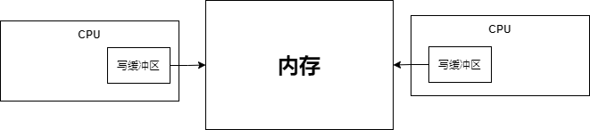

**以下三个因素都可能会破坏并发编程的特性**

## 1. 处理器写缓冲区

### 1.1 处理器写缓冲区的使用

每个处理器都有自己的写缓冲区，临时保存要想内存写入的数据

但写缓冲区只对其所在处理器可见，并且不是处理器将数据写入写缓冲区就立刻同步到内存的

### 1.2 处理器缓冲区对并发编程的影响

可能会**破坏多线程程序的内存可见性**

## 2 指令重排序

### 2.1 什么是指令重排序

编译器和处理器为了优化程序性能，会对指令序列进行重排序

### 2.2 重排序的类型

* **编译器重排序**

  编译器在不改变单线程程序语义的前提下，重排语句执行顺序

* **指令级并行重排序**

  如果语句之间不存在数据依赖性，那么**处理器**可以改变语句对应的机器指令的执行顺序

* **内存系统重排序**

  **处理器**会使用缓存和读/写缓冲区，对于没有数据依赖的读写操作，可以进行重排序

  

### 2.3 发生重排序需要遵守的原则

**编译器或处理器在进行重排序时，要遵守 as-if-serial语义**

1. 不管如何重排序，单线程程序的执行结果不能改变
2. 不能对存在数据依赖关系的操作进行重排序，如果不存在数据依赖关系，那么可以进行重排序

**as-if-serial考虑了单线程程序的数据依赖关系，将单线程程序保护了起来**

### 2.4 重排序对并发编程的的影响

as-if-serial没有考虑多线程程序的数据依赖关系，**会破坏多线程程序的语义，有序性**

## 3. 处理器优化

### 3.1 什么是处理器优化

为了使处理器内部的运算单元能够尽量的被充分利用，处理器可能会对输入代码进行乱序执行处理

### 3.2 处理器优化多并发编程的影响

处理器优化会破坏**多线程程序的有序性**

## 4. 上下文切换

* CPU为每个线程分配若干个时间片，CPU通过 **时间片分配算法**来执行任务，线程分配到的时间片用完后，CPU会切换到下一个线程的任务，CPU就这样不停的切换线程执行，CPU的切换可以发生在任何一条CPU指令执行结束后
* 高级语言的一条语句对应多条CPU指令

**上下文切换**会破坏程序的高级语言中操作的 **原子性**
