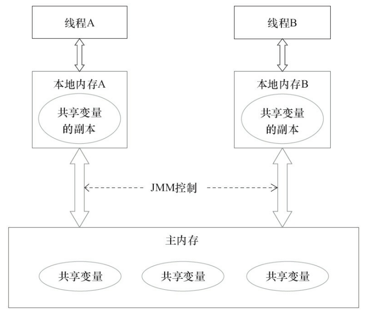

**为了保证并发编程的特性不被破坏，提供了以下几种模型**

## 1. 顺序一致性模型

顺序一致性模型可以保证并发编程的特性不被破坏，为多线程程序提供了极强的 **内存一致性保证**

### 1.1 特点

* 一个线程中的所有操作必须按照程序的顺序来执行
* （不管程序是否同步）所有线程都只能看到同一个的操作执行顺序，**所有对内存的操作都是原子的，并且其他线程立即可见**
* 只有一个全局内存，某一时刻，**只有一个线程可以访问内存**，多线程并发时，**串行访问内存**

### 1.2 例子

#### 1.2.1 同步程序

通过加锁实现线程A和线程B的同步

#### 1.2.2 未同步程序

虽然未同步，操作的执行整体上无序，但是两个线程都能看到执行顺序（因为顺序一致性模型保证每个线程的操作对其他线程立即可见）

## 2. JMM

### 2.1 什么是JMM

* JMM是一种抽象的概念，真实并不存在
* JMM是一种规范，定义了一组规则，**目的是解决由于多线程通过共享内存进行通信时，存在的本地内存数据不一致、编译器会对代码指令重排序、处理器会对代码乱序执行等带来的问题**
* JMM的要求不像顺序一致性模型那般严格，**它的方针是：对于正确同步的程序，那么在不改变程序执行结果的前提下，尽可能地为编译器和处理器的优化打开方便之门**
* JVM依据JMM实现

### 2.2 JMM有什么作用

* 每个处理器的内存模型不同，JMM屏蔽了不同处理器内存模型的差异，它在不同的处理器平台之上为Java程序员呈现了一个 **一致的内存模型**

* **JMM提供内存可见性保证**

  * **单线程程序**

    不会出现内存可见性问题

  * **正确同步的多线程程序**

    JMM通过限制 编译器和处理器的重排序来提供内存可见性保证

    JMM保证正确同步的多线程程序在任意的处理器平台上的执行具有 **顺序一致性（程序的执行结果与该程序在顺序一致性内存模型中的执行结果相同）**

  * **未同步/未正确同步的多线程程序**

    JMM为其提供最小安全性保障：线程执行时读取到的值，要么是之前某个线程写入的值，要么是默认值

    JMM该程序的执行结果与其在数据一致性模型中的执行结果一致

### 2.3 JMM描述的规则

* 定义线程和主内存之间的抽象关系
* 定义了8种内存交互操作及其规则
* 线程之间如何通信（线程之间的通信由JMM控制，JMM决定一个线程对共享变量的写入何时对另一个线程可见）
* 对指令重排序的限制

#### 2.3.1 线程和主内存之间的抽象关系

* 线程之间的共享变量存储在主内存中
* 每个线程都有一个**私有的本地内存(抽象概念)**，本地内存存储了该线程需要使用的共享变量的副本

#### 2.3.2 八种内存交互操作

- **lock(锁定)**，作用于**主内存**中的变量，把变量标识为线程独占的状态。
- **read(读取)**，作用于**主内存**的变量，把变量的值从主内存传输到线程的工作内存中，以便下一步的load操作使用。
- **load(加载)**，作用于**工作内存**的变量，把read操作主存的变量放入到工作内存的变量副本中。
- **use(使用)**，作用于**工作内存**的变量，把工作内存中的变量传输到执行引擎，每当虚拟机遇到一个需要使用到变量的值的字节码指令时将会执行这个操作。
- **assign(赋值)**，作用于**工作内存**的变量，它把一个从执行引擎中接受到的值赋值给工作内存的变量副本中，每当虚拟机遇到一个给变量赋值的字节码指令时将会执行这个操作。
- **store(存储)**，作用于**工作内存**的变量，它把一个从工作内存中一个变量的值传送到主内存中，以便后续的write使用。
- **write(写入)**：作用于**主内存**中的变量，它把store操作从工作内存中得到的变量的值放入主内存的变量中。
- **unlock(解锁)**：作用于**主内存**的变量，它把一个处于锁定状态的变量释放出来，释放后的变量才可以被其他线程锁定。

**规则**

- 不允许read、load、store、write操作之一单独出现，也就是read操作后必须load，store操作后必须write。
- 不允许线程丢弃他最近的assign操作，即工作内存中的变量数据改变了之后，必须告知主存。
- 不允许线程将没有assign的数据从工作内存同步到主内存。
- 一个新的变量必须在主内存中诞生，不允许工作内存直接使用一个未被初始化的变量。就是对变量实施use、store操作之前，必须经过load和assign操作。
- 一个变量同一时间只能有一个线程对其进行lock操作。多次lock之后，必须执行相同次数unlock才可以解锁。
- 如果对一个变量进行lock操作，会清空所有工作内存中此变量的值。在执行引擎使用这个变量前，必须重新load或assign操作初始化变量的值。
- 如果一个变量没有被lock，就不能对其进行unlock操作。也不能unlock一个被其他线程锁住的变量。
- 一个线程对一个变量进行unlock操作之前，必须先把此变量同步回主内存。

#### 2.3.3 线程之间如何通信

**JMM要求线程之间的通信必须经过主内存**

如果线程A与线程B之间想要通信，那么需要经过2个步骤

1. 线程A在本地内存修改后，刷新到主内存中
2. 主内存同步到线程B的本地内存后，由线程B读取

#### 2.3.4 对指令重排序的限制

* 对于编译器重排序，JMM的编译器重排序规则会禁止特定类型的编译器重排序
* 对于处理器重排序，JMM的处理器重排序规则会要求Java编译器在生成指定序列时，插入特定类型的 **内存屏障指令**，通过内存屏障指令来禁止特定类型的处理器重排序

**内存屏障的类型**

| 屏障类型            | 指令示例                   | 说明                                                         |
| ------------------- | -------------------------- | ------------------------------------------------------------ |
| LoadLoad Barriers   | Load1; LoadLoad; Load2     | 禁止指令重排序，Load1一定先于Load2                           |
| StoreStore Barriers | Store1; StoreStore; Store2 | 禁止指令重排序，store1一定先于store2;   store1写的数据会立刻同步到主内存中，对所有线程可见 |
| LoadStore Barriers  | Load1; LoadStore; Store2   | 禁止指令重排序，Load1一定先于Store2                          |
| StoreLoad Barriers  | Store1; StoreLoad; Load2   | 禁止指令重排序，Store一定先于Load2 ； store1写的数据会立刻同步到主内存中，对所有线程可见 |

StoreLoad Barriers是一个全能型屏障，具有其他3个屏障的效果，但是开销高（因为要把缓冲区中的数据刷新到内存中）

### 3. happens-before规则

#### 3.1 为什么要有happens-before

* JMM定义的规则难以理解和编程，happens-before便于程序员理解和编程，每条happens-before规则对应着多条JMM定义的规则
* 程序员希望基于一个强内存模型进行程序编写，但JMM为了尽可能发挥处理器性能，实现的是一个弱内存模型（JMM允许不改变程序运行结果的重排序），所以JMM提供happens-before规则，向程序员提供足够的内存可见性保证**（虽然有的保证并不一定真实存在，例如：如果一个代码块的锁只会被一个线程获取，那么这个锁可以被消除，但在程序员看来就是加锁的）**

#### 3.2 happens-before的定义

1. 如果一个操作happens-before另一个操作，那么第一个操作的执行结果将对第二个操作 可见，而且第一个操作的执行顺序排在第二个操作之前（这只是JMM对程序员的保证，让程序员认为，正确同步的多线程程序是按happens-before指定的顺序来执行的，但实际上可能不是）
2. 两个操作之间存在happens-before关系，并不意味着Java平台的具体实现必须要按照 happens-before关系指定的顺序来执行。如果重排序之后的执行结果，与按happens-before关系来执行的结果一致，那么JMM允许这种重排序

#### 3.3 happens-before内容

1. 程序顺序规则：一个线程中的每个操作，happens-before于该线程中的任意后续操作。 

2. 监视器锁规则：对一个锁的解锁，happens-before于随后对这个锁的加锁。 

3. volatile变量规则：对一个volatile域的写，happens-before于任意后续对这个volatile域的读。 

4. 传递性：如果A happens-before B，且B happens-before C，那么A happens-before C。 

5. start()规则：如果线程A执行操作ThreadB.start()（启动线程B），那么A线程的ThreadB.start()操作happens-before于线程B中的任意操作。 

6. join()规则：如果线程A执行操作ThreadB.join()并成功返回，那么线程B中的任意操作happens-before于线程A从ThreadB.join()操作成功返回

## 3. 顺序一致性模型与JMM的区别

* 顺序一致性模型是强内存模型，JMM是弱内存模型

* 顺序一致性模型保证单线程内的操作按程序的顺序执行，JMM不保证（即使程序正确同步，临界区中的代码可以重排序）

  

* （不管程序是否同步）顺序一致性模型中，所有线程都只能看到同一个的操作执行顺序（JMM不保证，因为JMM中线程在本地内存修改数据，在刷新到主内存之前，其他线程不可见）

* 顺序一致性模型保证对内存的读写操作都是原子的，JMM不保证对64位double或long数据的读写是原子的