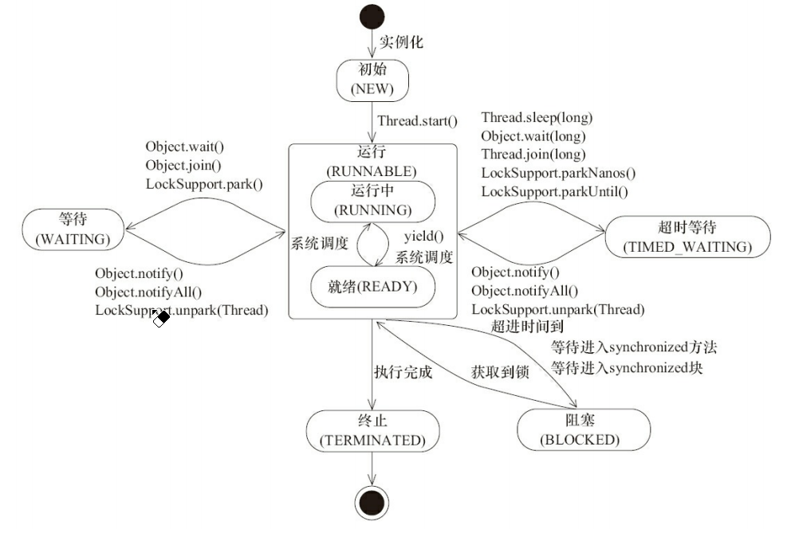

## 1. Java线程的状态

### 1.1 状态枚举

* **NEW**
  
  线程被构建，还未start

* **RUNNABLE**
  
  运行状态

* **BLOCKED**
  
  阻塞状态，阻塞于锁

* **WAITING**
  
  等待状态

* **TIME_WAITING**
  
  超时等待状态，超过时间自行返回

* **TERMINATED**
  
  终止状态，表示线程执行完毕

### 1.2 状态转换图



## 2. 线程中断

可以理解为Thread有个interrupted标识符，默认为false，表示一个线程是否被其他线程进行了中断操作

```java
public void interrupt();//将Thread的表示符设为true
public void isInterrupted();//返回标识符
public static isInterrupted();//返回标识符，并重设为false
```

如果线程抛出InterruptedException，那么在抛出InterruptedException之前，JVM会先将标识符设为false，然后再抛出

## 3. Java提供的线程间通信方式

### 3.1 volatile和synchronized

### 3.2 等待通知机制

* **sleep()**
  
  当前线程进入TIME_WAITING状态，不会释放锁，但会释放CPU资源
  
  一段时间后苏醒，回到RUNNABLE状态

* **yield()**
  
  当前线程由RUNNING状态变为READY状态，不会释放锁，但会释放CPU资源

* **wait()，notify()，nitifyAll()**
  
  * 使用wait(),notify(),nitofyAll()时需要对**调用对象加锁**（必须在同步代码块内）
  
  * 当前线程调用某个加锁对象的wait()后，会进入该对象的monitor对象的等待队列中，**释放锁，释放CPU资源**，**状态变为WAITING**
  
  * 当前线程调用某个加锁对象的notify()或nitifyAll()，等待队列中的线程从等待队列中移动到同步队列中，**线程状态由WAITING变为BLOKING**
    
    等待队列中的线程要想从wait()中返回，除了需要有其他线程调用notify()外，还需要等待线程释放锁，获得对象的锁后才能从wait()返回
  
  

* **join()**
  
  注意，wait()是Object的，join()是Thread的
  
  join()中底层调用的wait()
  
  Thread1若调用了thread2的join()，那么thread1会阻塞等待thread2结束——thread1进入了thread2的等待队列，直到thread2结束了才会被唤醒

## 4. Java线程创建方式

* 继承Thread
* 实现Runnable接口
* 实现Callable接口
* 定时器
* 
* 线程池隐式创建