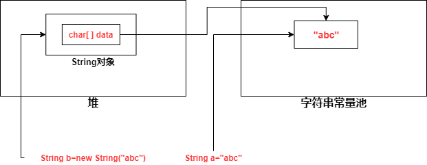

## 1. String不可变

- String是不可变类
  
  - final修饰String，防止开发人员通过继承去破坏String的不可变性
  
  - 大部分属性用final修饰，赋值后不能更改
    
    - `final char[] value`
    
    - `final int offset`
    
    - `final int count`

- String对象一旦被创建就是固定不变的了，对String对象的任何改变都不影响到原对象，相关的任何change操作都会生成新的对象

## 2. 字符串常量池

* JVM中有个字符串常量池，我们创建字面字符串时，会先检查该字符串是否存在于字符串常量池中
  
  * 如果在，返回指向它的引用
  
  * 如果不在，实例化一个字符串放入到字符串常量池中，返回其引用

* 通过`new String("abc")`来创建字符串，是在堆中创建一个新的String对象，该String对象中的value还是指向字符串常量池中的字符串
  
  所以通过`new String("abc")`来创建字符串时，可能会创建两个对象，如果字符串常量池中不存在`"abc"`，那么需要在字符串常量池中创建`"abc"`，然后再在堆上创建String对象
  
  

* 如果一个字符串，在编译期可以确定（字面字符串，或者字面字符串拼接都是编译器可以确定），那么存在于字符串常量池中
  
  一个字符串字面量如何由多个字符串字面量拼接而成，那么其在编译期可知，可以在字符串常量池中找到

* 如果一个字符串，在运行时才能知道具体的内容，那么其是在堆中

## 3. intern()

* 一个字符串，调用其intern()，java查找常量池中是否有相同unicode的字符串常量，如果有，则返回其引用，如果没有，则在常量池中增加一个unicode等于str的字符串并返回它的引用

## 4. String为什么不可变

1. 便于实现字符串常量池

2. 线程安全

3. 避免安全问题，让黑客无法修改字符串的值

4. 加快字符串的处理速度
