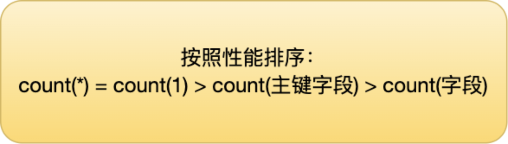

## 1. MySQL索引有哪些

1. 按数据结构分
   
   * B+树索引
   
   * 哈希索引
   
   * 全文索引

2. 按存储分
   
   * 聚簇索引
   
   * 非聚簇索引

3. 按照列数目分
   
   * 单列索引
   
   * 联合索引

4. 按照特性分
   
   * 主键索引
   
   * 唯一索引
   
   * 非空索引
   
   * 前缀索引（将char的前几个字符拿来构建索引）
   
   * 普通索引

## 2. 索引为什么用B+树

索引可以使用哈希表，红黑树，AVL树，B树，B+树来实现

1. B+树相比于B树
   
   * B+树真正的用户数据存储在叶子节点中，B树是非叶子节点存储用户数据，相同的磁盘IO下，B+树可以查询更多的节点
   
   * B+树叶子节点构成双向链表，可以支持范围查询，B树无法支持

2. B+树相比于红黑树
   
   * 在数据量很大并且相同的情况下，B+树的高度远小于红黑树的高度，红黑树的时间复杂度为O(logN)这就意味着查询红黑树需要访问更多的节点，需要更多的磁盘IO
   
   * 红黑树不支持范围查询

3. B+树相比于哈希
   
   * 哈希检索效率非常高，但是只能用于等值查询，无法用于范围查询，在范围查询的情况下，效率远低于B+树
   
   * Hash索引不支持排序，分组

## 3. count(*)和count(1)的区别

* count(字段)如何执行
  
  * Server层维护一个count变量
  
  * Server层循环向InnoDB获取记录（如果可以用二级索引，会优先用二级索引），读取count指定的字段，如果count指定的字段不为NULL，将count+1

* count(1)如何执行
  
  * Server层维护一个count变量
  
  * Server层循环向InnoDB获取记录（如果有二级索引，使用二级索引），InnoDB将获取到的记录返回给Server，Server将count+1（少了一个读取记录中的count指定字段的动作）

* count(*)如何执行
  
  * count(*)会转换为count(0)来处理，逻辑与count(1)基本一致
