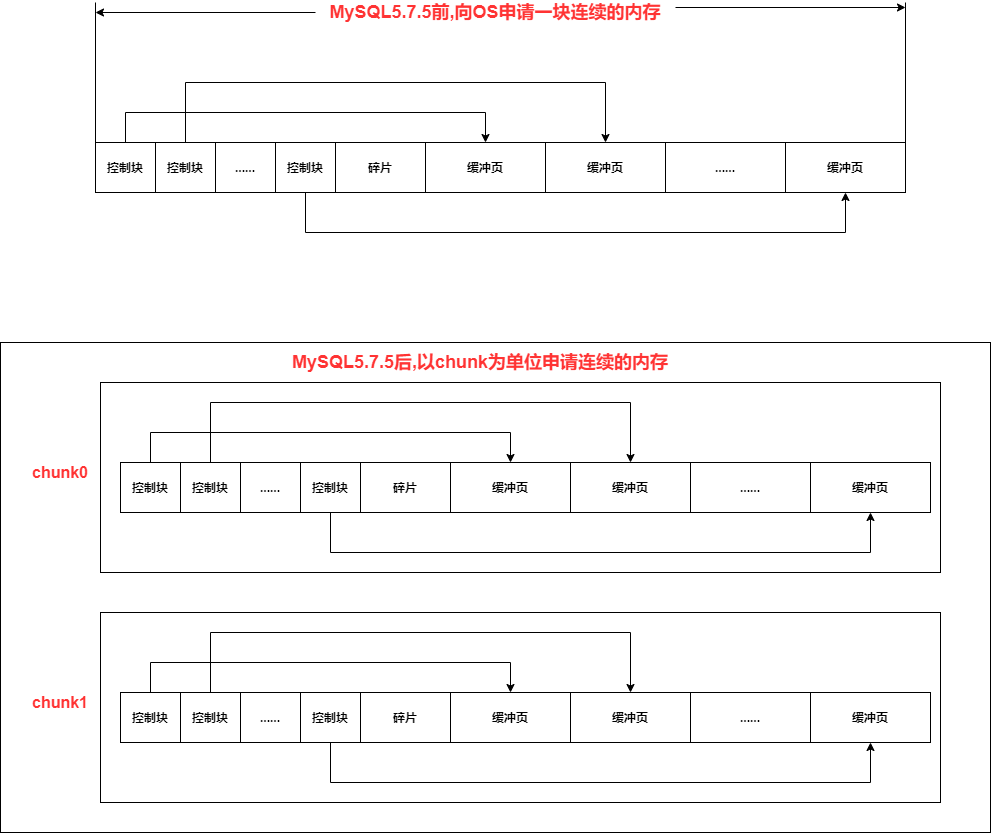
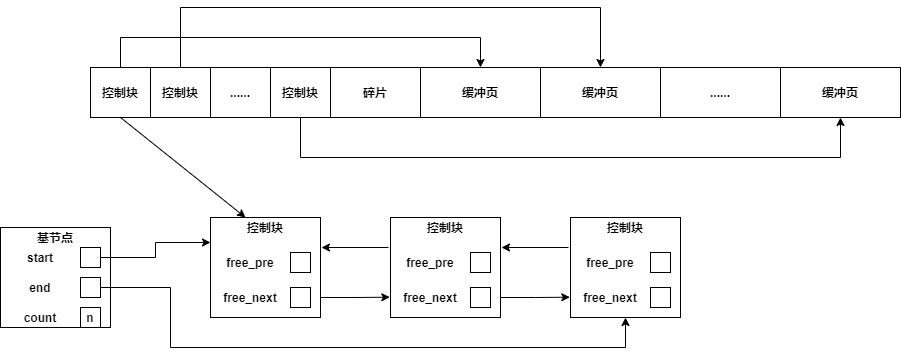
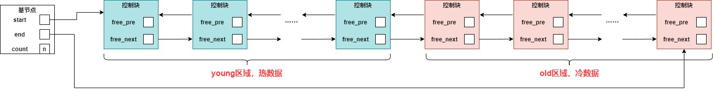

**InnoDB存储引擎下的内存池由以下部分组成**

* **缓冲池（buffer pool）**

* **redo log buffer**

* **额外内存池**

* **double write buffer**


## 1. 内存在读写操作中的使用

### 1.1 读操作

从磁盘读取文件数据是整页整页的读

查询时，先检查要查询的数据所在的页是否在缓冲池中

如果在——命中，从缓冲池读取该页

如果不在——从磁盘读取页数据，将页存放在缓冲池中

### 1.2 写操作

直接修改缓冲池中的页，通过Checkpoint机制将脏页刷新回磁盘


## 2. buffer pool(缓冲池)

* 缓冲池的大小由 **innodb_buffer_pool_size**决定

  缓冲池的数目由 **innodb_buffer_pool_instances**决定，可以有多个 buffer pool

* MySQL5.7.5前，Buffer Pool是向OS申请的**一块连续的内存空间**（运行过程中无法改变大小）

  MySQL5.7.5后，Buffer Pool以**chunk**为单位（一个chunk默认128MB）向OS申请一块连续的内存空间，一个Buffer Pool由多个chunk组成，每个chunk都是一块连续的内存空间（可以在运行期间，以chunk为单位来动态调整内存）

* Buffer Pool占用的内存空间划分为了**一个个缓冲页**

* **每个缓冲页都有一个控制块（大小固定）**，用来存储缓冲页的控制信息（缓冲页所属的表空间编号，页号，缓冲页在buffer pool中的地址，链表节点信息）

* **buffer pool为了更好的管理缓冲页，维护了许多链表结构**

* **为了快速判断我们想要获取的一个页是否在buffer pool中，buffer pool维护了一个哈希表**




### 2.1 free链表

* free链表用于管理空闲的缓冲页，如果一个缓冲页是空闲的，那么该缓冲页的控制块会加入free链表
* free链表的基节点（包含free链表的头节点地址，尾节点地址，链表节点数等信息）不存储在buffer pool中，而是单独申请了一块内存空间



### 2.2 flush链表

* 凡是被修改过的缓冲页对应的控制块都会加入flush链表
* flush链表中的节点对应缓冲页都是脏页
* flush链表中的节点肯定也是LRU链表中的节点
* 第一次修改某个页面时，会把该页面对应的控制块放入flush链表头部，之后再次修改该页面，就不会再次插入了，所以flush链表中的脏页是按照第一次修改时间进行排序的

### 2.3 LRU链表

* 所有正在被使用的缓冲页（不管是不是脏页），其控制块都会加入到LRU链表中
* LRU链表分为2个区域——存储热数据的young区域(使用频率高)，存储冷数据的old区域(使用频率低)（两个区域的比例由参数 **innodb_old_blocks_pct**控制，默认old区域占37%）



* 一个缓冲页对应的控制块如果要进入LRU链表，不是直接插入到LRU链表的头部，而是插入到**LRU链表old区域的头部**
* 一个缓冲页对应的控制块想由old区域进入young区域，必须满足——后续对该缓冲页的访问与第一次访问的时间间隔> innodb_old_blocks_time毫秒（page made young操作）

```nginx
思考，为什么要把LRU分为两个区域？
首先来看看，如果LRU不分区域，会有什么问题
1.InnoDB有预读机制，当InnoDB处理当前请求后，可能会预先把后面的某些页面加载到Buffer Pool中
2.全表扫描语句
首先是预读，如果预读的页没有被使用到，那么可能导出LRU链表尾部的一些缓冲页被淘汰掉，降低Buffer Pool命中率
然后是全表扫描，全表扫描会遍历所有的叶子节点，逐个读入Buffer Pool中，这会将LRU链表中原本正在使用的缓冲页淘汰掉，大大降低Buffer Pool的命中率
这对应着2个问题
1.加载到Buffer Pool中的页不一定会用到，并且还可能淘汰掉使用频率高的页
2.如果有非常多使用频率低的页同时加载到Buffer Pool中，可能将使用频率高的页从Buffer Pool中淘汰掉
所以为了解决这两个问题，将LRU分为2个区域
```


### 2.4 哈希表—快速查找

* 我们根据表空间号+页号来定位磁盘上的一个页
* 所以表空间号+页号是key，缓冲页控制块是value，以此创建一个哈希表
* 先从哈希表中根据表空间号+页号看看是否有对应的缓冲页，如果有，直接使用即可，如果没有，就需要从磁盘读取页面，然后放入buffer pool


### 2.5 脏页刷新到磁盘

有三种时机

#### 2.5.1 从LRU链表的冷数据中刷新一部分页面到磁盘

后台线程定时从LRU链表开始扫描一些页面，如果发现LRU链表中存在脏页，就把它们刷新到磁盘上


#### 2.5.2 从flush链表中刷新一部分页面到磁盘

后台线程定时从flush链表中刷新一部分到磁盘上


#### 2.5.3 用户线程刷新

 如果用户线程准备从磁盘加载一个页面到Buffer Pool中，但是Buffer Pool中没有可用的缓冲页

此时会查看LRU链表尾部，看看是否存在可以直接释放掉的未修改的缓冲页，如果没有，就会将LRU链表尾部的一个脏页刷新到磁盘上，然后释放掉该缓冲页


### 2.6 获取一个可用的缓冲页

1. 先查看free链表中是否有可用的缓冲页，如果有，那么从free链表中取出一个缓冲页，并将信息填入缓冲页对应的控制块，然后将数据写入缓冲页，然后将缓冲页对应的控制块从free链表移除，放入LRU链表

2. 如果没有的，就只能从LRU链表中淘汰一个缓冲页了

   首先查看LRU链表末尾是否有可以直接释放掉的未修改的缓冲页，如果有，将将其释放，将释放后的缓冲页拿来使用（修改缓冲页对应的控制块信息，将数据写入缓冲页，将缓冲页对应的控制块移动到LRU链表old区域的头部）

   如果没有，就将LRU链表尾部的一个脏页同步刷新到磁盘，然后释放掉，将释放后的缓冲页拿来使用（修改缓冲页对应的控制块信息，将数据写入缓冲页，将缓冲页对应的控制块移动到LRU链表old区域的头部）


### 2.7 向磁盘写一个页面的过程

1. 根据目标页面的**表空间号+页号**，在哈希表中查找对应的缓冲页**（查缓存）**

   * 如果找到了，进行3
   * 如果没找到，进行2

2. 从磁盘将目标页面读取出来，需要获取一个空闲的缓冲页来使用**（获取一个可用的缓冲页）**

   * 先查看free链表中是否有可用的缓冲页，如果有，那么从free链表中取出一个缓冲页，并将信息填入缓冲页对应的控制块，然后将数据写入缓冲页，然后将缓冲页对应的控制块从free链表移除，放入LRU链表

   * 如果没有的，就只能从LRU链表中淘汰一个缓冲页了

     首先查看LRU链表末尾是否有可以直接释放掉的未修改的缓冲页，如果有，将将其释放，将释放后的缓冲页拿来使用（修改缓冲页对应的控制块信息，将数据写入缓冲页，将缓冲页对应的控制块移动到LRU链表old区域的头部）

     如果没有，就将LRU链表尾部的一个脏页同步刷新到磁盘，然后释放掉，将释放后的缓冲页拿来使用（修改缓冲页对应的控制块信息，将数据写入缓冲页，将缓冲页对应的控制块移动到LRU链表old区域的头部）

3. **然后对缓冲页进行修改操作，并将缓冲页对应的控制块加入flush链表**


## 3. redo log buffer

InnoDB存储引擎会先把 重做日志信息放入缓冲区，然后按照一定频率将其刷新到redo log file

**刷新时机**

* Master Thread每一秒刷新一次（可以调整刷新频率）
* 事务提交时的刷新策略（取决于参数innodb_flush_log_at_trx_commit)
* redo log buffer剩余空间小于 1/2时，刷新一次


