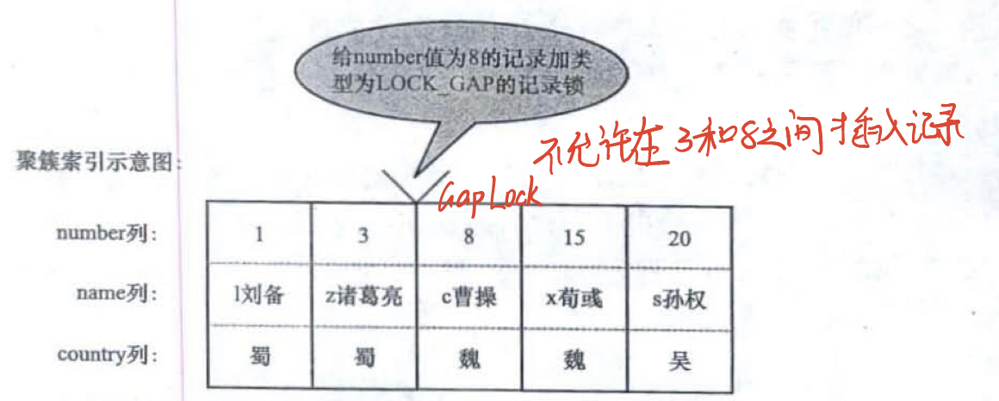
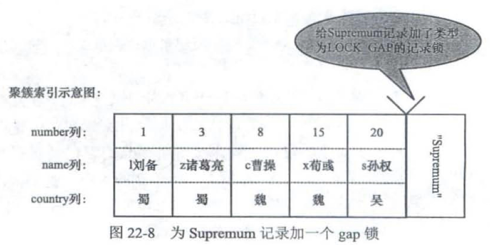
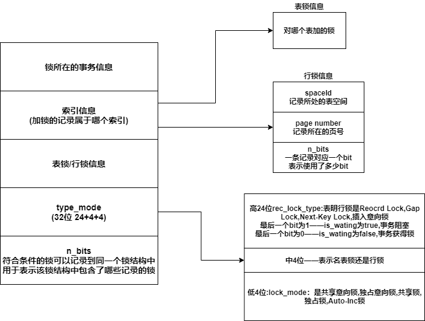
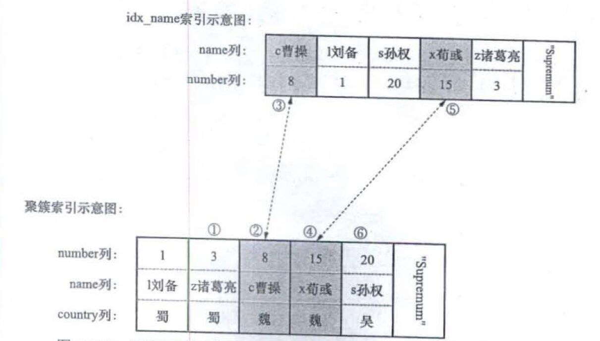
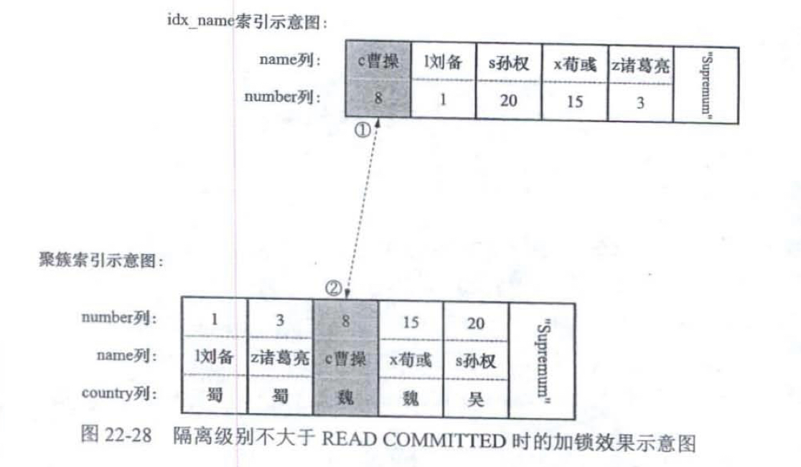
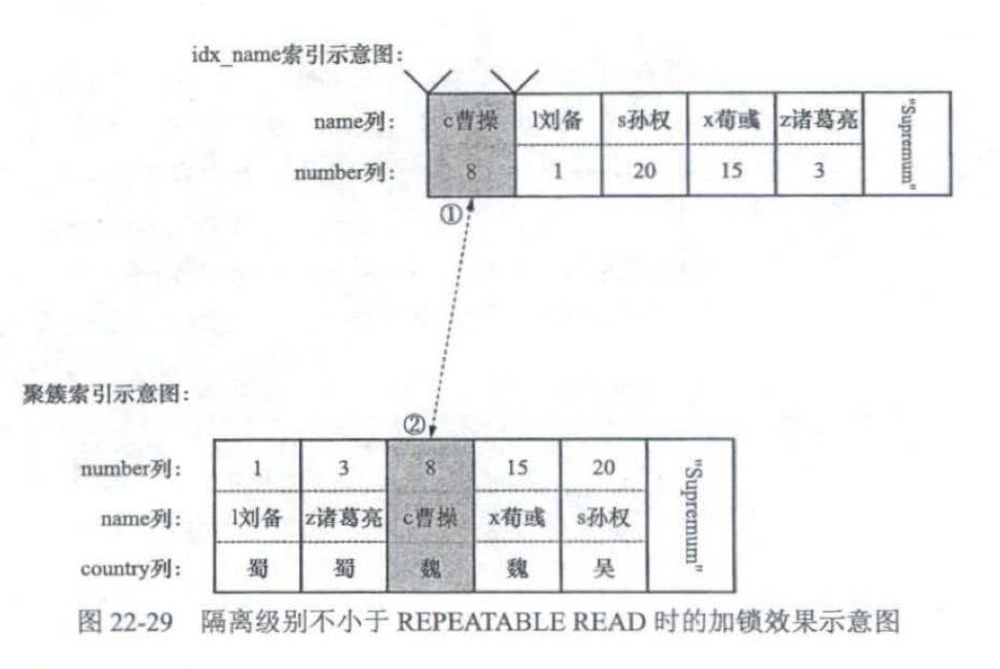

# 1. 锁的类型

MySQL Server层——支持表锁

InnoDB——支持行锁，意向锁

## 1.1 全局锁

对整个数据库实例加锁，MySQL提供了一个加全局读锁的方法—— **Flush Table with Read Lock**

该命令让整个数据库实例处于只读状态，其他事务的写操作语句都会被阻塞

全局锁的典型使用场景—— **做全库逻辑备份**，也就是把整库每个表都select出来存成文本

但是让整库都只读，听上去就很危险：

* 如果你在主库上备份，那么在备份期间都不能执行更新，业务基本上就得停摆
* 如果你在从库上备份，那么备份期间从库不能执行主库同步过来的 binlog，会导致主从延迟。

## 1.2 表级锁

### 1.2.1 表锁

- **共享锁(S Lock)**：允许事务对表进行读操作
- **排他锁(X Lock)**：允许事务对表进行写操作

**表锁的使用——lock tables ... read/write**

### 1.2.2 元数据锁

MDL(metadata Lock)，MDL不需要显示使用，访问一个表的时候自动加上

* 对一个表做增删改查时，加**MDL读锁**
* 更改表结构时，加**MDL写锁**
* MDL读锁之间不互斥，因此你可以有多个线程同时对一张表增删改查
* MDL读锁与MDL写锁互斥，MDL写锁之间互斥——保证修改表结构时的安全性

### 1.2.3 意向锁

因为使用InnoDB时，可能同时存在表锁和行锁，为了支持不同粒度上的加锁，引入了意向锁

意向锁也是一种**表锁**，意向锁是为了快速地判断表中的记录是否被上锁

- **意向共享锁(IS Lock)**：如果事务想给某条记录加上S锁，必须先给表加上IS锁
- **意向排他锁(IX Lock)**：如果事务想给某条记录加上X锁，必须先给表加上IX锁

### 1.2.4 AUTO-INC锁

如果表中的某个列添加 **AUTO_INCREMENT属性**，之后插入记录时，可以不指定该列的值，系统会自动赋予它递增的值，这主要是通过**AUTO-INC锁实现**

* AUTO-INC锁很特殊，不像其他的锁在事务结束后才释放，而是insert执行完后就释放

* 插入数据时，加一个标记的AUTO-INC锁，然后将自增列+1，执行insert，然后释放AUTO-INC锁，AUTO-INC锁会阻塞其他想要在该表中插入的事务，保证自增列连续递增

* AUTO-INC锁在大量数据插入时，会影响信息，所以InnoDB后来提供了一种**轻量级锁**来实现自增
  
  * 在自增字段上加上轻量级锁，给自增字段赋予一个自增值，然后释放轻量级锁，然后再去执行插入语句

**系统变量innodb_autoinc_lock_mode**决定采用哪种方式

- 如果为0——采用AUTO-INC锁
- 如果为1——采用轻量级锁
- 如果为2——根据插入的数据量来判定

## 1.3 行级锁

InnoDB支持两种行锁

- **共享锁(S Lock)**：允许事务读取一行数据
- **排他锁(X Lock)**：允许事务删除or更新一行数据

**行级锁有许多种类型——Record Lock，Gap Lock，Next-Key Lock，插入意向锁 等**

### 1.3.1 Record Lock

将一条聚簇索引记录/二级索引记录上锁

### 1.3.2 Gap Lock

Gap Lock主要用来**减少幻读**

如果某个记录被加上了gap lock，那么不允许其他事务在**该记录与其左边第一条记录之间**插入新的记录

一个事务想要insert时，会定位到要插入的位置的下一条记录，如果该记录上存在Gap Lock，那么该事务就要阻塞

每个页中都有两条伪记录——Infimum记录(该页中最小的记录)+Supremum记录(该页中最大的记录)

在Supremum记录上加Gap Lock，就可以让页中最后一条真实记录的右侧被锁定住

### 1.3.3 Next-Key Lock

Next-Key Lock=Record Lock+Gap Lock

### 1.3.4 插入意向锁

> insert执行采用的是隐式锁机制——如果判断不会发生锁冲突，那么就不会加锁，只要在锁冲突时，才会将隐式锁转换为显示锁（如下面两种情况）
> 
> - 要插入位置的右边第一条记录上有Gap Lock
> 
> - insert的记录和已有记录发生唯一键冲突

1. 事务执行insert时，会定位到要插入的位置，会检查要插入位置右边的第一条记录是否存在Gap Lock，如果该记录上存在Gap Lock，那么insert会被阻塞，**并生成一个插入意向锁**

2. 如果insert的记录和已有记录发生唯一键冲突，那么插入会失败
   
   - 如果主键冲突
     
     - RU和RC——插入新记录的事务给已存在的主键值重复的聚簇索引记录加S型Record Lock
     
     - RR和S——插入新记录的事务给已存在的主键值重复的聚簇索引记录加S型Next-Key Lock
   
   - 如果唯一二级索引冲突
     
     - 插入新记录的事务都会给已存在的二级索引列值重复的二级索引记录**添加 S 型 next-key 锁

## 1.4 锁兼容

如果一个事务想要访问某个资源，需要给这个资源加锁

一个事务想要访问某个资源，需要先给资源加上A锁，如果资源上已经有了B锁，并且A与B不兼容——当前事务要阻塞等待B锁释放

一个事务想要访问某个资源，需要先给资源加上A锁，如果资源上已经有了B锁，并且A与B兼容——当前事务可以加上A锁，访问资源

## 1.5 加锁总结

* 如果一个事务要修改表结构——给表加上元数据写锁
* 如果一个事务想要读一条记录——给表加上元数据读锁，意向读锁，然后给记录加上读锁
* 如果一个事务想要写一条记录——给表加上元数据读锁，意向写锁，然后给记录加上写锁
* 如果一个事务执行 LOCK TABLES table_name READ/WRITE——给表加上读锁/写锁
* 如果发生了锁兼容问题——元数据锁，表级读锁，表级写锁，意向读锁，意向写锁，行级读锁，行级写锁 之间的不兼容，那么事务就要阻塞，直到不兼容的锁释放

## 1.6 锁的释放

事务获得的锁，一般是在事务结束or回滚时才会释放，并不是不需要了就立刻释放（有的锁特殊，使用完就释放，例如AUTO-INC锁，就是不需要了就释放）

但是如果事务的隔离级别为 **READ UNCOMMITTED**和**READ COMMITTED**，在事务还未结束时，就会将**不符合搜索条件的记录上的锁**释放掉（具体可以看 **4.锁定读执行过程**）

# 2. InnoDB锁的内存结构

符合以下条件的行级锁可以放在同一个锁结构中

* 同一个事务产生的锁
* 加锁的类型一样
* 被加锁的记录存在于同一个页面中

# 3. 不同隔离等级下SQL的加锁情况

## 3.1 READ UNCOMMITTED

* **一致性非锁定读（快照读）普通select**——不加锁，直接读取记录的最新版本的值，可能出现脏读，不可重复度，幻读
* **一致性锁定读（当前读）**——**加Record Lock**
  * select ... lock in share mode——加**共享Record Lock**
  * select ... for update——加**独占Record Lock**
  * delete——先定位到记录，加上**独占Record Lock**
  * update
    * 如果未修改主键 and 被更新的列在修改前后存储空间不变——先定位到记录，加上**独占Record Lock**，然后在记录的位置进行修改
    * 如果未修改主键 and 被更新的列在修改前后存储空间变化——先定位到记录，加上**独占Record Lock**，然后将记录删除，再插入一条新的记录
    * 如果修改了主键，那么相当于——先delete记录，然后insert一条新的
  * insert——新插入的一条记录受隐式锁保护

## 3.2 READ COMMITTED

* **一致性非锁定读（快照读）普通select**——不加锁，通过MVCC读取，避免了脏读

* **一致性锁定读（当前读）**——**加Record Lock**
  
  * select ... lock in share mode——加**共享Record Lock**
  
  * select ... for update——加**独占Record Lock**
  
  * delete——先定位到记录，加上**独占Record Lock**
  
  * update
    
    * 如果未修改主键 and 被更新的列在修改前后存储空间不变——先定位到记录，加上**独占Record Lock**，然后在记录的位置进行修改
    
    * 如果未修改主键 and 被更新的列在修改前后存储空间变化——先定位到记录，加上**独占Record Lock**，然后将记录删除，再插入一条新的记录
    
    * 如果修改了主键，那么相当于——先delete记录，然后insert一条新的
  
  * insert——新插入的一条记录受隐式锁保护

### RC使用Gap Lock

- 事务向唯一二级索引中插入新记录时，如果出现了重复，那么对记录加 Next-Key Lock
- 唯一性约束检查和外键约束检查支持Gap Lock

## 3.3. REPEATABLE READ

* **一致性非锁定读（快照读）普通select**——不加锁，通过MVCC去读，避免了脏读，不可重复读

* **一致性锁定读（当前读）**——**加Next-Key Lock**
  
  * select ... lock in share mode——加**共享Next-Key Lock**
  
  * select ... for update——加**独占Next-Key Lock**
  
  * delete——先定位到记录，加上**独占Next-KeyLock**
  
  * update
    
    * 如果未修改主键 and 被更新的列在修改前后存储空间不变——先定位到记录，加上**独占Next-KeyLock**，然后在记录的位置进行修改
    
    * 如果未修改主键 and 被更新的列在修改前后存储空间变化——先定位到记录，加上**独占Next-KeyLock**，然后将记录删除，再插入一条新的记录
    
    * 如果修改了主键，那么相当于——先delete记录，然后insert一条新记录
  
  * insert——新插入的一条记录受隐式锁保护
  
  > 通过**MVCC**+**Next-Key Lock**，**避免了大部分的幻读**（如果在多次非锁定读中，发生了锁定读，那么会重新生成readview，导致后续的非锁定读与前面的非锁定读基于不同的readview，可能导致幻读）

### RR使用Record Lock

- 事务的范围查询走二级索引，在二级索引中对二级索引记录加上Next-Key Lock，回表时，对聚簇索引中的记录加上Record Lock
- 如果对唯一索引进行精确查询，加的都是Record Lock
- 如果查询使用聚簇索引，并且扫描区间左闭，扫描区间中第一条记录的索引值与扫描区间的左边界值相同——对第一条记录加Recrod Lock，其余记录加Next—Key Lock

## 3.4 SERIALIZABLE

* **一致性非锁定读（快照读）普通select**
  
  * 如果autocommit=0（禁用自动提交），那么普通的select语句会转换为 select ... lock in share mode（加S锁）
  * 如果autocommit=1（启用自动提交），那么会通过MVCC生成readview来读

* **一致性锁定读（当前读）**——**加Next-Key Lock**
  
  * select ... lock in share mode——加共享Next-Key Lock
  * select ... for update——加独占Next-Key Lock
  * delete——先定位到记录，加上**独占Next-KeyLock**
  * update
    * 如果未修改主键 and 被更新的列在修改前后存储空间不变——先定位到记录，加上**独占Next-KeyLock**，然后在记录的位置进行修改
    * 如果未修改主键 and 被更新的列在修改前后存储空间变化——先定位到记录，加上**独占Next-KeyLock**，然后将记录删除，再插入一条新的记录
    * 如果修改了主键，那么相当于——先delete记录，然后insert一条记录
  * insert——新插入的一条记录受隐式锁保护

# 4. 锁定读执行过程

* **默认情况下**，遍历的记录——**扫描区间的第一条记录开始，到扫描区间后的第一条记录**，所以给记录上锁后，都需要判断一次其是否符合边界条件，如果不符合，就需要向server层发送**查询完毕信息**
  
  （假设扫描区间是1-15，但遍历的记录可以为2,5,6,9,14,16）

## 4.1 直接走聚簇索引

1. 根据where条件，形成扫描区间

2. 定位到扫描区间的第一条记录，将其标记为当前记录

3. 如果是READ UNCOMMITTED和READ COMMITTED，给当前记录加上**Record Lock**
   
   如果是RR和 Serializable，给当前记录加上**Next-Key Lock**

4. 判断记录是否符合**边界条件**（边界条件——形成扫描区间的条件）
   
   如果不符合——在隔离等级为READ UNCOMMITTED和READ COMMITTED下，要释放掉锁，RR和Serializable下不释放锁，并向server层发送**查询完毕信息**
   
   如果符合，继续向下执行

5. 在server层判断其余搜索条件是否成立
   
   如果成立——发送给客户端，**不会释放锁，这个锁只有事务结束才会释放**
   
   如果不成立——在隔离等级为READ UNCOMMITTED和READ COMMITTED下，要释放掉锁，RR和Serializable下不释放锁

## 4.2 走二级索引

1. 根据where条件，形成扫描区间

2. 定位到扫描区间的第一条二级索引记录，将其标记为当前记录

3. 如果是READ UNCOMMITTED和READ COMMITTED，给当前记录加上Record Lock
   
   如果是RR和 Serializable，给当前记录加上Next-Key Lock

4. 进行索引下推（在存储引擎层判定记录是否符合查询条件，仅适用于二级索引，select语句）
   
   如果判定记录是否符合索引下推条件和边界条件，继续向下执行
   
   如果判定记录不符合索引下推条件，那么获取下一条记录作为当前记录，重新开始执行**步骤3**，这里不管是什么隔离等级都不会释放锁
   
   如果判定记录**不符合边界条件**——向server层报告 **查询完毕信息**

5. 执行回表操作，获得对应的聚簇索引记录，并加上 **Record Lock（不管是什么隔离级别，回表时加的都是Record Lock）**

6. 判断该聚簇索引记录是否符合边界条件（边界条件——形成扫描区间的条件）
   
   如果符合边界条件——执行步骤7
   
   如果不符合边界条件——在隔离等级为READ UNCOMMITTED和READ COMMITTED下，要释放掉锁，RR和Serializable下不释放锁，并且向server层报告 **查询完毕信息**

7. 在server层判断其余搜索条件是否成立
   
   如果成立——发送给客户端，不会释放锁，这个锁只有事务结束才会释放
   
   如果不成立——在隔离等级为READ UNCOMMITTED和READ COMMITTED下，要释放掉锁，RR和Serializable下不释放锁

# 5. update加锁过程

如果更新了二级索引列，那么除了对聚簇索引加锁独占锁外，还需要对二级索引记录也加独占锁

* READ UNCOMMITTED和READ COMMITTED
  
  * 根据搜索区间遍历聚簇索引，对于每条聚簇索引记录都会先加Record Lock，然后判断是否符合条件
    * 如果不符合查询条件，会释放聚簇索引记录上的锁
    * 如果符合查询条件，会对二级索引记录加 Record Lock
  
  

* REPEATABLE READ和SERIALIZABLE
  
  * 根据搜索区间遍历聚簇索引，对于每条聚簇索引记录都会先加Next-Key Lock，然后判断是否符合条件
    
    * 如果符合，对二级索引记录加Record Lock
    * 如果不符合，不会对二级索引记录加锁，但是聚簇索引记录上的锁不会释放

# 6. 特殊的加锁规则

1. 如果是精确匹配，在READ UNCOMMITTED和READ COMMITTED下，不会对扫描区间后的第一条记录加锁
   
   在REPEATABLE READ和SERIALIZABLE下，会为扫描区间后的第一条记录加Gap锁
   
   
   
   

2. 在Repeatable Read/Serializable下进行精确匹配，如果扫描区间内没有匹配的记录，那么对的扫描区间后的第一条记录加 **Next-Key Lock**

3. 在Repeatable Read/Serializable下，如果使用聚簇索引，并且扫描区间左闭，扫描区间中第一条记录的索引值与扫描区间的左边界值相同——对第一条记录加Recrod Lock，其余记录加Next—Key Lock

4. 任何隔离登记下，只要用唯一索引进行精确查询，都是对记录加Record Lock

5. 在Repeatable Read/Serializable下，如果按照从右到左的顺序进行扫描（例如 Order By xx DESC），那么会对扫描区间右边第一条记录加上Gap Lock

# 7. update 半一致性读

在Read Committed，REPEATABLE READ，Serializable下，update使用半一致性读

如果update语句读取的记录已经被加上了X锁，那么会读出该记录最新的版本，判断该版本与搜索条件是否匹配

如果不匹配——不对该记录加锁，跳到下一条记录

如果匹配——对该记录加锁