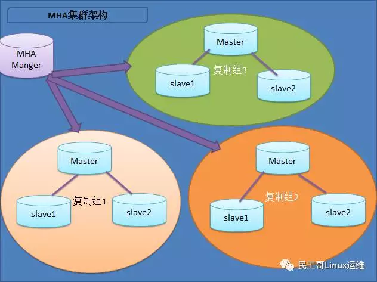
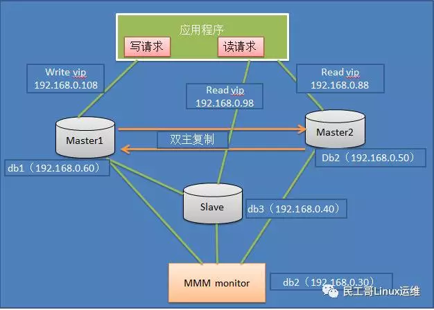

## 1. 主从架构

### 特点

1. 成本低，部署快速，方便
2. 读写分离
3. 主库单点故障
4. 数据一致性问题（同步延迟）

## 2. MySQL+MHA架构

### 特点

1. 安装部署简单，不影响现有架构
2. 自动监控和故障转移
3. 保障数据一致性
4. 适用于任何存储引擎

## 3. MMM架构

MMM(Master-Master Replication Manager for MySQL)——MySQL主主复制管理器

是一个关于MySQL主主复制配置的监控，故障转移和管理的套件——保证任何时候只有一个节点可以被写入

可以基于标准的主从配置的任意数量的从服务器进行负载均衡，所以可以用它来在一组基于复制的服务器中启动虚拟IP(VIP)

MMM还有数据备份，节点之间重新同步功能的脚本

### 特点

1. 安全，稳定性高，可拓展性好
2. 对服务器数量要求至少三台以上
3. 可实现读写分离

