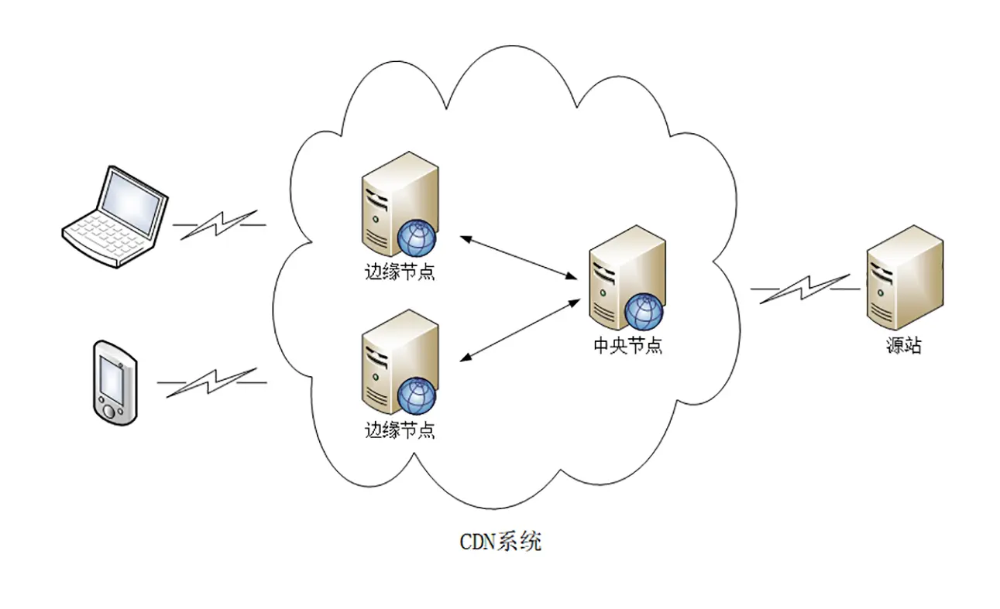

**CDN**——Content Delivery Network内容分发网络

**什么是CDN**

* 使用"推"或"拉"的手段，把源站的内容逐级缓存到CDN系统的每一个节点上
* 用户不直接访问源站，而是访问离用户最近的一个CDN节点——边缘节点，也就是缓存了源站内容的代理服务器

**CDN缓存的内容**

资源——静态资源 和 动态资源

* 静态资源

  数据内容“静态不变”，任何时候来访问都是一样的

* 动态资源

  数据内容是“动态变化”的，也就是由后台服务计算生成的，每次访问都不一样

CDN只能缓存静态资源，或者被指定了**Cache-Control**的动态资源

**CDN工作原理**

两个关键——**全局负载均衡**和**缓存系统**

* **全局负载均衡(Global Server Load Balance—GSLB)**

  一个CDN节点，是整个CDN系统的"大脑"——找到离用户较近的边缘节点，对CDN系统进行负载均衡

  

  当用户接入网络时，可以通过向GSLB发送请求，进入CDN的**"全局负载均衡系统"**，GSLB就会找出一个"最佳"(离用户较近并且负载均衡)的CDN节点为用户提供服务

  

  GSLB最常见的实现方式——**DNS负载均衡**

  * **DNS负载均衡**

    **没有CDN时**，本地DNS服务器访问权威DNS域名服务器，取得的是目标服务器的IP

    **加入了CDN**，本地DNS服务器访问权威DNS域名服务器，返回的是一个**别名记录**(CNAME:Canonical Name)，别名记录指向CDN的GSLB，本地DNS向GSLB发起请求，就进入了CDN的**全局负载均衡系统**，开始调度

    * 查看用户IP，查表得知地理位置，找相对最近的边缘节点
    * 查看用户的运营商网络，找相同网络的边缘节点
    * 检查边缘节点的负载情况，选择负载较轻的边缘节点

    GSLB考虑上述因素，找出最佳的边缘节点，把该节点的IP返回给本地DNS服务器。

* **缓存系统**

  使用缓存代理技术

  * 如果用户请求的资源恰好在CDN的缓存系统里，可以直接返回给用户（命中率）
  * 如果用户请求的资源不在CDN的缓存系统离，CDN以代理的方式从源站取（回源率）

  商业CDN节点的命中率都在90%以上
