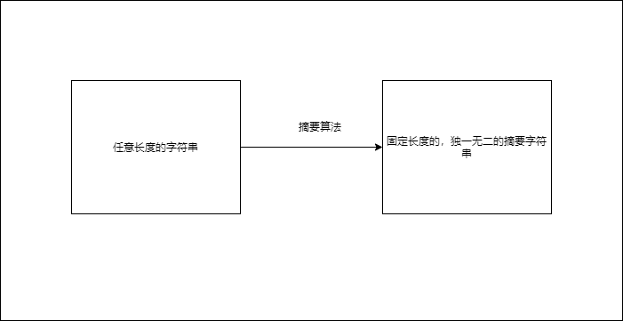
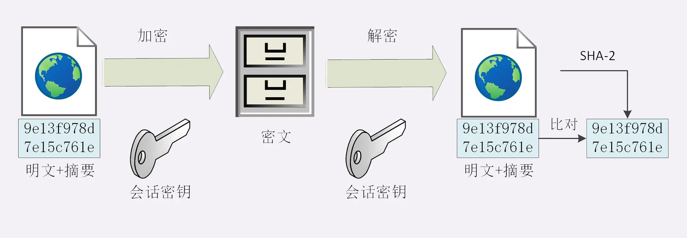

**摘要算法**  
摘要算法就是常说的散列函数，哈希函数      
* 单向性——不能由摘要字符串反推原字符串
* 雪崩性——原字符串的微小变化，都会导致摘要字符串剧烈变化  
* 只有算法，没有秘钥 

摘要算法
* SHA-2  

  

**使用摘要算法保证完整性**

* **真正的完整性必须建立在机密性之上，否则完整性无法保证**   
* **以下仅仅是一个例子，用来展示完整性，并非真实方案**

1. 发送方将原文通过摘要算法计算出摘要字符串，然后将摘要字符串拼接在原文后，形成**新字符串(原文+摘要字符串)**    
2. 然后将**新字符串**按照**HTTPS机密性的方式(用Session key加密)** 进行发送   
3. 接受方用Session key解密得到**新字符串后**，由于摘要字符串长度固定，所以可以很容易的分解为原文，摘要字符串  
4. 对分解得到的原文用相同的摘要算法进行计算，将计算结果与摘要字符串进行比较
5. 如果相同，则说明没有被篡改，完整   
   如果不同，则说明被篡改了    
     