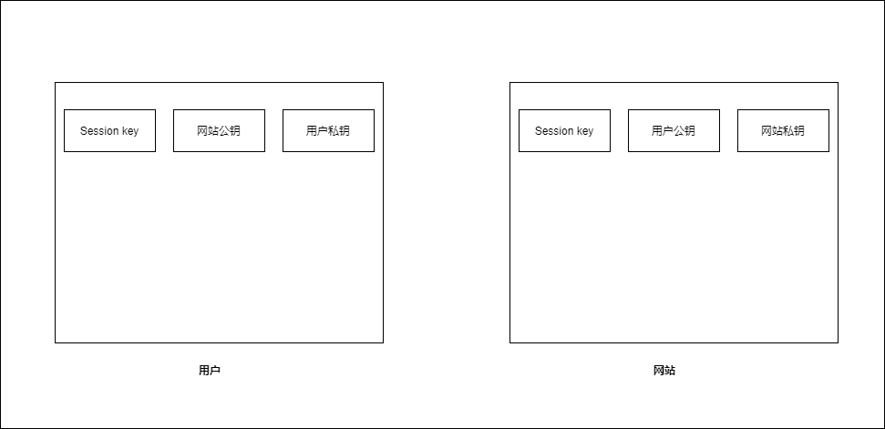
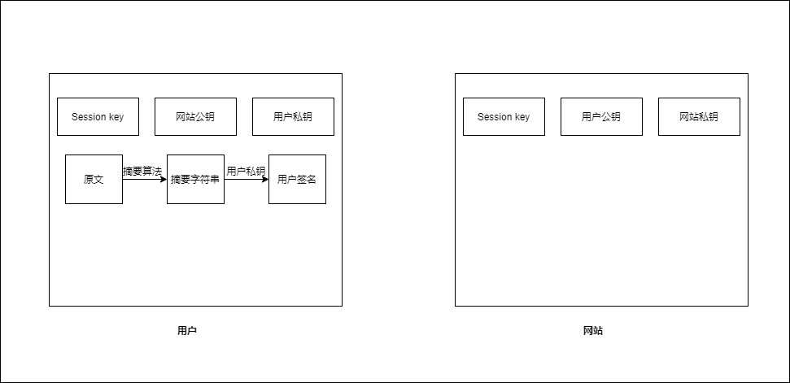
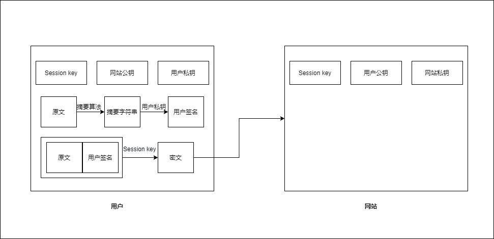
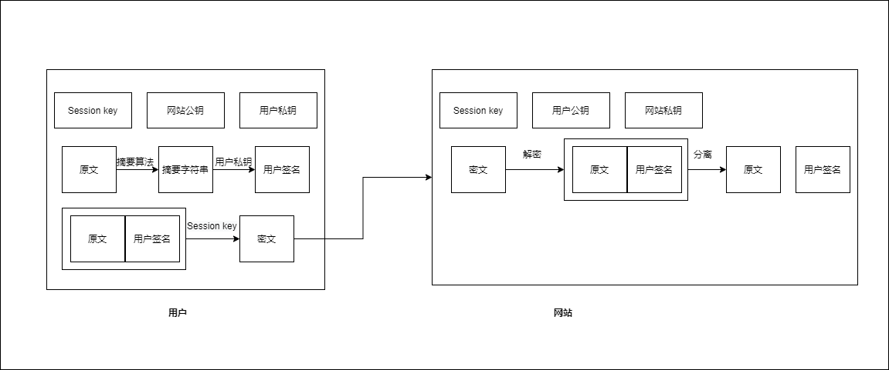
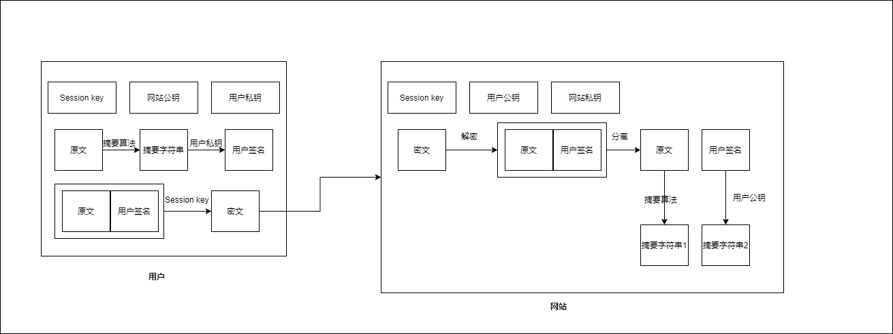

私钥：只能由本人持有，其他任何人都不会有，可以证明用户，网站的身份   

**数字签名**=**私钥**+**摘要算法**——同时实现**身份认证**和**不可否认**  
* 原理  
对摘要字符串进行私钥加密，公钥解密    

**以下过程实现了四大安全特性，但并不是TLS采用的方案，仅作为一个例子**

0. 假设通信的双方已经交换了公钥和Session Key
      

1. 用户对原文使用摘要算法计算得到摘要字符串   
   然后用自己的私钥对摘要字符串进行加密，得到数字签名(签名)  
        
   
2. 用户得到一个新的字符串(原文+用户签名)  
   将新的字符串用Session key加密成密文，发送给网站   
        
3. 网站接收到密文后，使用session key解密，然后分离为原文和用户签名
   
4. 网站对原文使用摘要算法得到摘要字符串1，使用用户公钥对用户签名进行解密(验签)，得到摘要字符串2    
   
5. 比较摘要字符串1和摘要字符串2   
如果相同，则此次通信安全   
