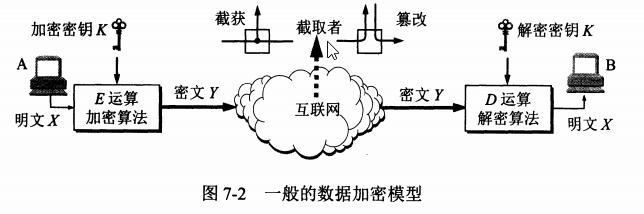

1. 安全威胁  
* 被动攻击 ：(截获)(流量分析)攻击者只观察和分析某一个协议数据单元而不干扰信息流
* 主动攻击  
    * 篡改 ：攻击者篡改网络上传送的报文
    * 恶意程序  
       * 计算机病毒
       * 计算机蠕虫  
       * 特洛伊木马 
       * 逻辑炸弹  
       * 后门入侵  
       * 流氓软件  
    * 拒绝服务Dos ：攻击者向某个服务器不断发送大量分组，使该服务器无法提供正常服务，甚至瘫痪
       * 分布式拒绝服务DDos ：若从互联网的成百上千个网站集中攻击一个网站   
    
2. 安全网络的目标  
* 保密性 ： 只有信息的发送方和接收方才能懂得所发送的信息的内容   
* 端点鉴别 ： 能够鉴别信息的发送方和接收方的真实身份  
* 信息的完整性 ： 确认收到的信息是完整的，也就是信息的内容没有被人篡改过  
* 运行的安全性  
   * 访问控制 ： 对访问网络的权限加以控制，规定每个用户的访问权限    
    
3. 数据加密模型   
       
   加密——密文Y=Ek(X);   
   解密——明文X=Dk(Y)=Dk(Ek(X))   
   加密密钥K和解密密钥K可以相同也可以不同