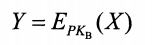
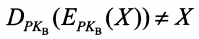
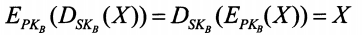

1. 对称加密   
* 加密和解密使用相同的密码体制   
* 数据加密标准DES——对称加密的一种   
   * DES过程
     * ①在加密前，将整个明文进行分组，每64位为一组
     * ②对每一组进行加密处理，产生一组64位的密文数据
     * ③将所有的密文串接起来，得到整个密文  
   * DES特点
     * DES使用的密钥64位(实际长度为56位，8位用于奇偶校验)  
     * DES的保密性仅取决于对密钥的保密，算法是公开的  
     * DES的问题是它的密钥长度问题   
   * 三种DNS  
     * 把一个64位的明文用一个密钥K1加密，然后用密钥K2解密，然后再用K1加密  
    
2. 非对称加密  
* 公钥和私钥  
   * 公钥(PK-Public Key): 所有人可见   
   * 私钥(SK-Secret Key): 仅自己可见   
   * 加密算法E和解密算法D 
* 加密解密过程   
   * ①B通过密钥对产生器，生成一对密钥，公钥PK和私钥SK    
       PK所有人都可见，SK仅自己可见
   * ②网络上任意一个主机想向B发送信息的话，用B的PK和加密算法E对明文X进行加密，得到密文Y，然后发送Y给B   
        
   * ③B接收到密文Y后，通过自己的SK和解密算法D对Y进行解密，得到明文X   
         
     
* 特点
   * PK与SK计算上不可能——不可能由PK推导出SK
   * PK只能用来加密，不能用来解密    
     
   * 对明文用D加密，然后用E解密==对明文用E加密，然后用D解密   
         
     

3. 对称加密和非对称加密的区别   
* 对称加密，双方使用相同的密码，可以实现**一对一**的**双向**保密通信   
* 非对称加密，公钥对所有人可见，可以实现**多对一**的**单向**保密通信