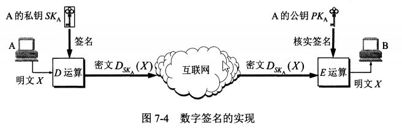
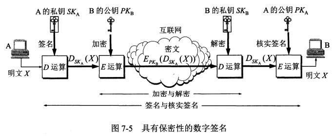

1. 数字签名必须实现的功能  
* 报文鉴别：接收者能够核实发送者对报文的签名   
* 报文的完整性：接收者确信收到的数据没有被篡改过   
* 不可否认：发送者事后不能抵赖对报文的签名  

2. 数字签名的实现  
* 非对称加密   
     
  * 该过程如果保证签名的三个功能  
     * 只有A持有私钥SKA，除了A意外没有人能够产生密文DSKA(X)  
       这样B就相信报文X是A发送的——报文鉴别   
     * 如果别人篡改了DSKA(X)，那么Ｂ对篡改过的报文进行解密，将会得到不可读的明文　　　　
       就知道报文被篡改了——报文的完整性
     * 若A要抵赖法国报文给B，B可把X和DSKA(X)交给公正的第三者  
       ——不可否认  
       
  * 该过程的缺点——报文X未保密，只要截获到密文DSKA(X)，就可以通过公钥解密报文，获取信息   
    
* 具有保密性的数字签名
    
   