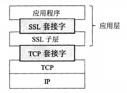
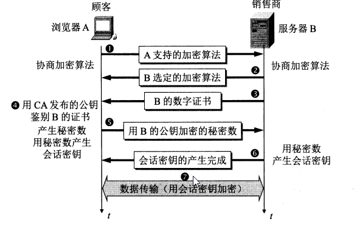

运输层的安全协议
* 安全套接字层(Secure Socket Layer SSL)
* 运输层安全(Transport Layer Sercurity TLS)

    
 

SSL提供三种服务
* 服务器鉴别
* 客户鉴别
* 加密会话 

SSL工作流程
   
* 0 建立TCP连接  
* 1 **协商加密算法**，游览器向服务器发送游览器的SSL版本号和一些可选的加密算法
* 2 服务器从中选定一个加密算法，并告知A
* 3 **服务器鉴别**，服务器向游览器发送包含其公钥的数字证书
* 4 浏览器使用该证书的认证机构CA公开发布的公钥对该证书进行验证
* 5 游览器随机产生一个密钥R，用服务器的公钥对密钥R进行加密后发送给服务器 
* 6 服务器用自己的私钥和约定好的加密算法解密得到密钥R
* 7 游览器和服务器通过密钥R进行数据传输