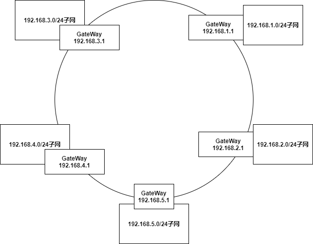
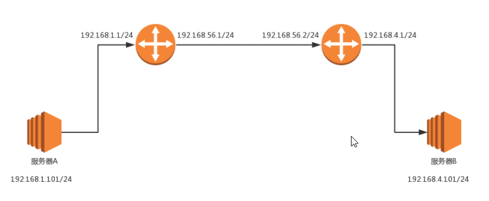
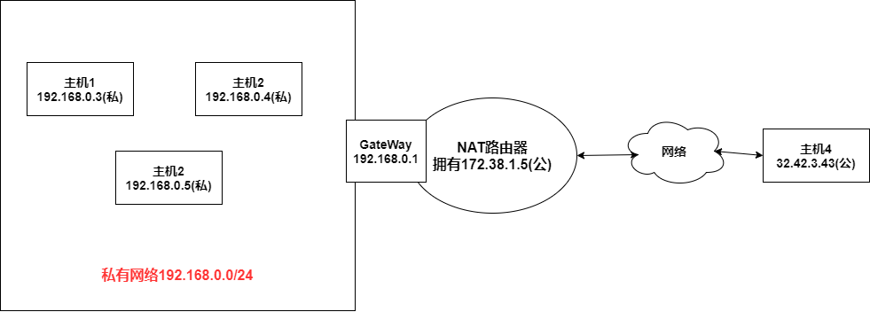

[toc]

### 1. IP

#### 1.1 ip addr命令

```java
root@test:~# ip addr
1: lo(loopback回环接口): <LOOPBACK,UP,LOWER_UP> mtu 65536 qdisc noqueue state UNKNOWN group default  //网络设备状态标识符 
    link/loopback 00:00:00:00:00:00 brd 00:00:00:00:00:00  //MAC地址
    inet 127.0.0.1/8 scope host lo      //IPv4地址
       valid_lft forever preferred_lft forever
    inet6 ::1/128 scope host    //Ipv6地址
       valid_lft forever preferred_lft forever
2: eth0: <BROADCAST,MULTICAST,UP,LOWER_UP> mtu 1500 qdisc pfifo_fast state UP group default qlen 1000   //网络设备状态标识符 
    link/ether fa:16:3e:c7:79:75 brd ff:ff:ff:ff:ff:ff //MAC地址
    inet 10.100.122.2/24 brd 10.100.122.255 scope global eth0 //IPv4地址
       valid_lft forever preferred_lft forever
    inet6 fe80::f816:3eff:fec7:7975/64 scope link    //Ipv6地址
       valid_lft forever preferred_lft forever
```

* IP地址是一个 **网卡**在网络世界的通讯地址（这里显示了2个网卡）

* **第一行**——网络设备设备状态标识符

  * **lo**：loopback回环接口，表示该网卡是用于主机自己与自己通信的，常用的地址为 **127.0.0.1**
  * **UP**：网卡处于启动的状态
  * **BROADCAST**：表示这个网卡有广播地址，可以发送广播包
  * **MULTICAST**：网卡可以发送多播包
  * **LOWER_UP**：表示L1是启动的(网线插着)

* **第二行**——MAC地址

* **第三行**——IPv4地址

  * 一开始IP分为ABCDE五种类型

  * 后来IP不够用了，采用  **无类型域间路由(CIDR)**

    * 10.100.122.2/24，前24位网络号，后8位主机号
    * 子网掩码——网络号都为1，主机号全为0(255.255.255.0)
    * 子网掩码&IP=网络号(10.100.122.0)
    * 主机号全为1——广播地址(子网中所有机器都能收到)

  * **IP**还分为 **公有地址**和 **私网地址**

    | 类型 | IP地址范围                | 最大主机数 | 私网IP范围                  |
    | ---- | ------------------------- | ---------- | --------------------------- |
    | A    | 0.0.0.0-127.255.255.255   | 1677214    | 10.0.0.0-10.255.255.255     |
    | B    | 128.0.0.0                 | 65534      | 172.16.0.0-172.31.255.255   |
    | C    | 192.0.0.0-223.255.255.255 | 254        | 192.168.0.0-192.168.255.255 |

    私网IP地址由所在子网的IT人员管理，可以重复（A子网中可以有私网IP1，B子网也可以有私网IP1）

    公有IP必须统一购买，供其他子网访问

    最常用的私网**IP192.168.0.X**

    * 私网网络的出口地址是GateWay的地址，**其IP的主机号一般为1或2**（192.168.0.1 or 192.168.0.2）

    * **192.168.0.255**是广播地址

      ```
      这就像每个小区有自己的楼编号和门牌号，你们小区可以叫6栋，我们小区也叫6栋，没有任何问题。但是一旦出了小区，就需要使用公有IP地址。就像人民路888号，是国家统一分配的，不能两个小区都叫人民路888号。
      ```

#### 1.2 IP的使用

假设主机1(IP1,MAC1)要向主机2(IP2,MAC2)发送消息

**前提**

* 每台Linux主机的网络文件中都会配置自己的**CIDR地址**，**子网掩码**，**广播地址**，**GateWayIP地址**
* Linux要求**CIDR地址**与**GateWayIP地址**在**同一网段**下

* 要想成功通信，除了需要目标的IP地址外，还需要目标的**MAC地址**

**过程**

1. 主机1检查IP2是否与自己的IP1在同一个网段
2. 如果是——**通过广播地址发送ARP请求，获得主机2的MAC2，然后填充到包中，进行发送**
3. 如果不是——**通过GateWayIP地址和ARP获得GateWay的MAC地址，填充到包中，将包发送给GateWay**，至于后面，就看GateWay如何处理了

### 2. 路由器

#### 2.1 路由器介绍



* 路由器是一个设备，由5个网卡或网口，每个连着一个子网(局域网)
* 每个网卡都是其连接着的子网的**GateWay**，该网卡的IP与其连接的子网的IP在同一网段下

#### 2.2 路由器类型

路由器分为——**转发路由**，**NAT路由**


#### 2.3 转发路由

经过转发路由，不会改变包的源IP和目标IP，但会改变源MAC和目标MAC，然后将包发到下一跳的目标

**下图全部使用公网IP进行通信，经过的都是转发路由**



* **第一个包**
  - 源MAC：服务器A的MAC
  - 目标MAC：192.168.1.1这个网口的MAC
  - 源IP：192.168.1.101
  - 目标IP：192.168.4.101
* **第二个包**
  - 源MAC：192.168.56.1的MAC地址
  - 目标MAC：192.168.56.2的MAC地址
  - 源IP：192.168.1.101
  - 目标IP：192.168.4.101
* **第三个包**
  - 源MAC：192.168.4.1的MAC地址
  - 目标MAC：192.168.4.101的MAC地址
  - 源IP：192.168.1.101
  - 目标IP：192.168.4.101


#### 2.4 NAT路由(现在基本都是这个)

**NAT(Net Address Translation)**

* 现在的网络时间中，公有IP非常珍贵，每台主机都处在一个私网网络中，被分配有一个私网IP

* **NAT转换表**中存储**私网IP与公有IP的映射**，配置有**NAT路由**中有一张**NAT转换表**

  

* 如果一台主机使用了私网IP，那么其与外界通信时，都必须将**私网IP转换为公有IP**

* NAT路由器必须至少有一个**公网IP**(可以有多个)

* NAT路由有**n个公网IP**时，私网网络内**同一时间**最多可以有**n台主机**接入（因为私网IP与公网IP一一对应）

  当主机较多时，每台主机分配一个私网IP，NAT路由会不断更新NAT转换表，让这些主机轮流使用公网IP

* 使用私网IP的主机与使用公网IP的主机的通信，只能由私网网络下的主机发起

  使用公网IP的主机要想向使用私网IP的主机发送信息，必须先由使用私网IP的主机发出信息，这样使用公网IP的主机才能知道使用私网IP的主机对应的公网IP，才能发送信息


**下面举个私网网络中的主机与使用公有IP的主机通信的例子**

**主机1的私网IP为192.168.0.3，其分配到的公有IP为172.38.1.5**



* **主机1向主机4发送消息**
  1. 主机1向向GateWay发送包（源IP为192.168.0.3(私)，目标IP为32.42.3.43(公) ）
  2. NAT路由器通过NAT映射表，将私有IP192.168.0.3映射为172.38.1.5
  3. NAT路由器发出包（源IP为172.38.1.5(公)，目标IP为32.42.3.43(公) ）

**主机4收到信息后，以为主机1的IP为172.38.1.5**

* **主机4向主机1发送消息**
  1. 主机4发出包（源IP为32.42.3.43(公)，目标IP为172.38.1.5(公) ）
  2. NAT路由器接受到包后，将公有IP172.38.1.5映射为私有IP192.168.0.3
  3. NAT路由将包发送到私有网友（源IP为32.42.3.42(公)，目标IP为192.168.0.3(私) ）


NAT分为 **静态NAT**和 **动态NAT**

* **静态NAT**

  公网IP与私网IP一一对应，不会改变

* **动态NAT**

  维护一个公网IP池，每有一台设备想接入网络，为其分配一个私网IP的同时，也会分配一个公网IP与其映射，使用完后将公网IP放回池中


### 3.DHCP(Dynamic Host Configuration Protocol动态主机配置协议)

IT人员只需要配置一段共享的IP地址。每一台新接入的机器都通过DHCP协议，来这个共享的IP地址里申请，然后自动配置好就可以了

#### 3.1 过程

一台机器开始加入网络

* **DHCP Discover**

  新来的机器使用**0.0.0.0作为源IP**，使用**广播IP255.255.255.255作为目标IP**来发送广播包

  广播包封装了UDP，UDP封装了BOOTP，告知自己的MAC地址，请求一个IP地址

  

* **DHCP Offer**

  DHCP Server使用 **广播IP255.255.255.255作为目标IP**来发送广播包，告知新人它被分配到的IP（还包括子网掩面，网关，IP地址租用期等信息）

  

  如果有多台DHCP Server，那么新人会收到多个Offer

* 新人会选择最先到达的Offer，再次以 **0.0.0.0作为源IP地址**，**广播地址255.255.255.255作为目标IP地址**，发送一个广播包（包中包含客户端的MAC地址、接受的租约中的IP地址、提供此租约的DHCP服务器地址等，并告诉所有DHCP Server它将接受哪一台服务器提供的IP地址，让其他DHCP Server撤销它们提供的IP）

  

* DHCP Server接收到客户机的DHCP request之后，会广播返回给客户机一个DHCP ACK消息包，表明已经接受客户机的选择，并将这一IP地址的合法租用信息和其他的配置信息都放入该广播包，发给客户机

  

* **IP的赎回与续租**

  IP地址的租期到了，会收回

  客户机会在租期过去50%的时候，直接向为其提供IP地址的DHCP Server发送DHCP request消息包。客户机接收到该服务器回应的DHCP ACK消息包，会根据包中所提供的新的租期以及其他已经更新的TCP/IP参数，更新自己的配置。这样，IP租用更新就完成了


### 4. ICMP(Internet Control Message Protocol)

#### 4.1 ICMP介绍

网络包在异常复杂的网络环境中传输时，常常会遇到各种各样的问题。当遇到问题的时候，总不能“死个不明不白”，要传出消息来，报告情况，这样才可以调整传输策略

ICMP报文是封装在IP包里面的。因为传输指令的时候，肯定需要源地址和目标地址，它的数据非常少


