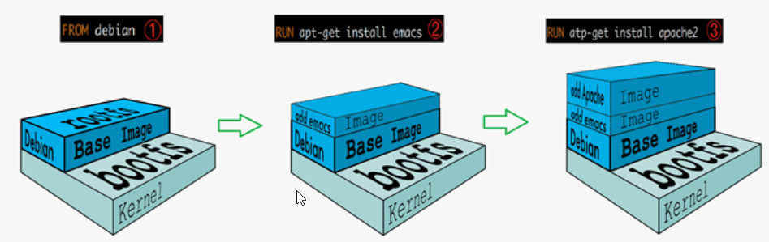
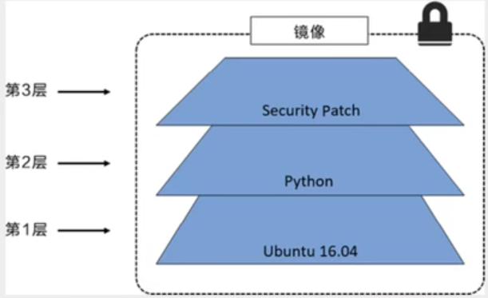

[toc]

### 1. UnionFS（联合文件系统）

UnionFS支持对文件系统的修改作为一次提交来一层层的叠加，同时可以将不同目录挂载到一虚拟文件系统下

Docker中镜像可以通过分层进行复用

### 2. Docker镜像加载原理

Docker镜像由一层一层的文件系统组成

bootfs主要包含了 bootloader和kernel

bootloader负责引导加载kernel，Linux刚启动的时会加载bootfs文件系统，Docker镜像的最底层是 **bootfs**，当BootLoader加载完后，整个内核就加载好了，此时系统会卸载bootfs

### 3. Docker镜像分层

Dcoker的镜像由多个镜像层组成

所有的Docker镜像都起始于一个基础镜像层，当进行修改或增加新内容时，会在基础镜像层之上，创建新的镜像层。

Docker镜像是只读的，创建容器时，会在镜像顶部添加容器层，容器层可写

