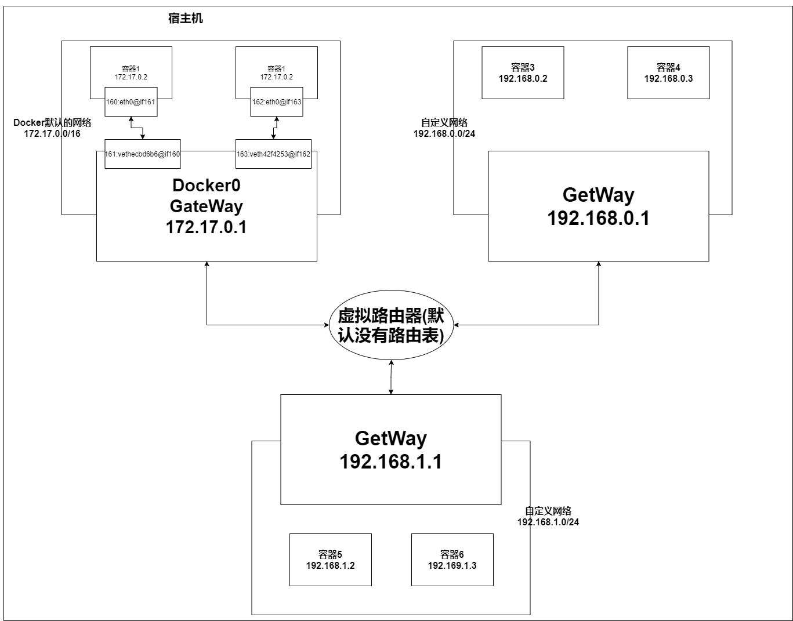
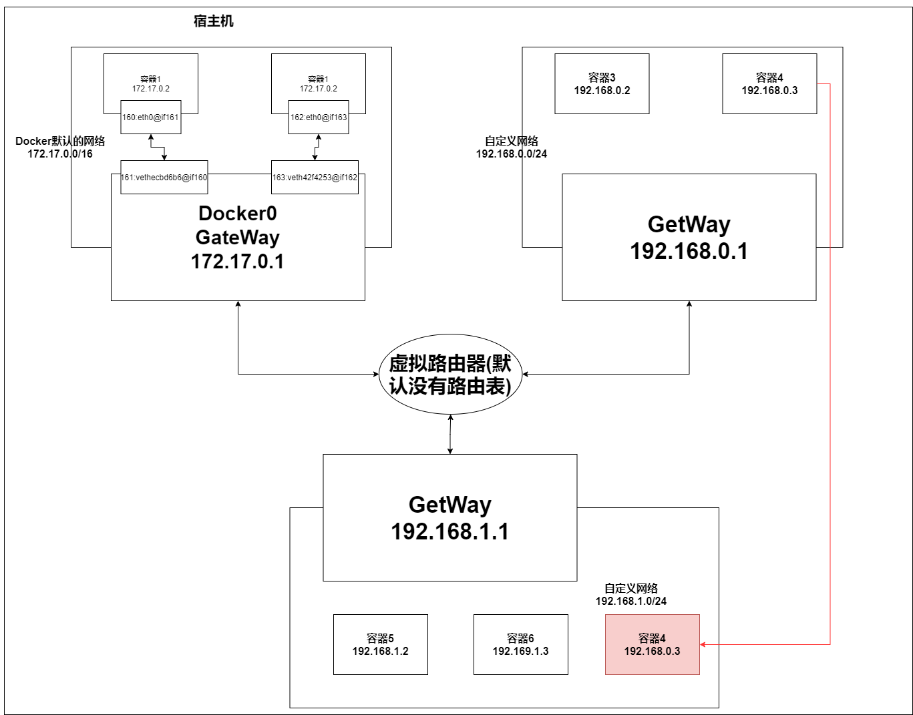

[toc]


### 1. Docker网络结构



#### 1.0 Docker网络模型介绍

Docker中可以设置多个不同的子网，**每个子网之间的容器默认是无法连通的（相当于路由器没有配置路由表）**

#### 1.1 网络模式

* bridge：桥接模式（docker默认）
* none：不配置网络
* host：与宿主机共享网络
* container：容器网络互联（用的少）


#### 1.2 Docker默认网络

* Docker有一个默认的网络，**名为bridge**，其**网关为 docker0**，采用 **桥接模式**，使用 **evth-pair技术**

* 如果我们创建容器的时候不通过 --net指定网络，那么容器默认分配到 Docker默认网络


#### 1.3 自定义网络

* **创建自定义网络并使用**

  ```
  创建一个192.168.0.0/24,以192.168.0.1为网关，bridge模式的网络
  docker network create --driver bridge --subnet 192.168.0.0/24 --gateway 192.168.0.1 mynet
  
  //使用自定义网络（直接启动容器，默认以 --net bridge启动容器）
  docker run -it -P --name centos01 --net 自定义网络ID centos
  ```

* **自定义网络的好处**
  * **在自定义网络中，容器之间可以通过 容器名进行通信（因为自定义网络中，维护了该网络下所有的容器的容器名与IP的映射关系）**
  * **不同的集群使用不同的网络，保证了集群之间的隔离**


#### 1.4 网络连通范围

* **docker默认网络**

  * 网络内的容器之间可以通过IP通信，但不能通过容器名通信，但可以通过 **--link**解决

    ```
    docker run -d -P --name centos03 --link centos02 centos
    这样centos02可以ping通centos01，但是centos01仍不能ping通centos02
    
    docker其实就是将--link指定的容器名，在hosts文件中添加了容器名与IP的映射
    ```

  * 容器可以与宿主机通信

  * 容器可以与所在网络的网关通信

  * 容器可以与其他网络的网关通信**（可以理解为这些网关连接着同一个没有路由表的路由器，所以可以与其他网络的网关通信，但是由于没有路由表，无法与其他网络中的容器通信）**

  * 容器不能与其他网络中的容器通信

* **自定义网络**

  跟docker默认网络基本相同，不同的在于，**同一个网络中的容器可以通过IP通信，也可以通过容器名通信（因为自定义网络中，维护了该网络下所有的容器的容器名与IP的映射关系）**


#### 1.5 网络连通

通过 **docker connect指令**，可以让A网络中的A1容器加入到B网络中，与B网络中的所有容器进行通信

其实就是给该容器同时分配了2个IP，让其同时加入A网络和B网络

```json
docker connect 自定义网络192.168.1.0  容器4

我们通过docker inspect 容器4，查看其信息
"Networks": {
    "mynet": {
    "IPAMConfig": {},
    "Links": null,
    "Aliases": [
    	"d1f2e912fa82"
    ],
    "NetworkID": "124efd95fe25347480e1891640d53fd9101605dc29ba56bddc65407f15d5234d",
    "EndpointID": "29fb21dd825bbef7ff3f1865283613ebe1afdc2e8fdb398cc3f61ac97faee150",
    "Gateway": "192.168.0.1",
    "IPAddress": "192.168.0.4",
    "IPPrefixLen": 24,
    "IPv6Gateway": "",
    "GlobalIPv6Address": "",
    "GlobalIPv6PrefixLen": 0,
    "MacAddress": "02:42:c0:a8:00:04",
    "DriverOpts": {}
 },
"mynet2": {
	"IPAMConfig": null,
	"Links": null,
	"Aliases": [
        "d1f2e912fa82"
	],
	"NetworkID": "a789e45129028121a54209595bde7495f28a4a7188eeadc78d1995fcd21463ca",
	"EndpointID": "617564b9473951e23efd9954d3d19596d818aea4ec2234854cd39736dac17b0f",
	"Gateway": "192.168.1.1",
	"IPAddress": "192.168.1.2",
	"IPPrefixLen": 24,
	"IPv6Gateway": "",
	"GlobalIPv6Address": "",
	"GlobalIPv6PrefixLen": 0,
	"MacAddress": "02:42:c0:a8:01:02",
	"DriverOpts": null
	}
}

//可以看到，该容器被分配了2个IP，同时加入两个网络
            
```





